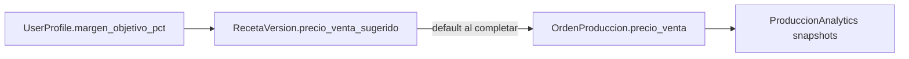

# BAKEBUDGE — Analytics de producción

Diseño de la capa de **estadísticas y análisis** para repostería: snapshots al completar órdenes, rankings de recetas/productos y márgenes de ganancia.

**Relacionado:**
- Modelos detallados: [`BAKEBUDGE_MODELS.md`](BAKEBUDGE_MODELS.md#produccionanalytics)
- Flujo operativo: [`flujos.md`](flujos.md#6-analytics-y-dashboard)
- Código: `apps/analytics/`, servicio `record_production_analytics`

---

## Origen del diseño (mapeo CODAS → BAKEBUDGE)

| Diseño ejemplo | Equivalente BAKEBUDGE | Nota |
|----------------|---------------------|------|
| `HeaderReceta` | [`Receta`](BAKEBUDGE_MODELS.md#receta) | Cabecera estable |
| `ProduccionHeader` | [`OrdenProduccion`](BAKEBUDGE_MODELS.md#ordenproduccion) | Orden de trabajo |
| `ClaseProducto` | [`ProductCategory`](BAKEBUDGE_MODELS.md#productcategory) | Categorías por usuario; snapshot `producto_categoria` = nombre de categoría |
| `receta_cantidad_base` | `RecetaVersion.rendimiento_cantidad` | Snapshot al completar |
| `receta_costo_base` | `RecetaVersion.costo_total` / `costo_por_porcion` | Desglose ampliado en snapshot |
| `produccion_cantidad` | `cantidad_lotes × rendimiento_cantidad` | Unidades producidas |
| `produccion_costo_total` | `OrdenProduccion.costo_estimado` | Congelado al pasar a `en_proceso` |

### Mejoras adoptadas

- **Dos tablas** en lugar de una: cabecera (por orden) + líneas (por producto/insumo) → habilita «productos más usados» sin recalcular desde recetas históricas.
- **Snapshots inmutables** (denormalizados): si se borra o renombra un `Producto`, las estadísticas históricas siguen siendo correctas.
- **FK con PROTECT** en orden/receta/versión (no CASCADE): no se pierden analytics al archivar entidades.
- **Sin `updated_by`** en el hecho analítico: registro de solo lectura tras creación (corrección excepcional por Master en v2).
- Una sola fecha de alta: `created_at` (sin duplicar `fecha_registro`).

---

## Decisión de precios (tres capas)



1. **`UserProfile.margen_objetivo_pct`** — ej. `40` = 40% sobre costo (default `40.00`).
2. **`RecetaVersion.precio_venta_sugerido`** — calculado: `costo_por_porcion × (1 + margen/100)`; editable manualmente.
3. **Al completar orden** — `precio_venta_unitario` / `precio_venta_total` (override opcional); si vacío, usar sugerido de la versión.
4. **Analytics** — guarda costo, sugerido y real para comparar márgenes.

---

## App `apps.analytics`

### `ProduccionAnalytics` (cabecera — 1 por orden completada)

**Tabla:** `analytics_produccionanalytics`  
**Trigger:** al pasar `OrdenProduccion` → `completada` (servicio `record_production_analytics`).

| Grupo | Campos |
|-------|--------|
| Relaciones | `owner`, `orden_produccion` (OneToOne), `receta` (PROTECT), `receta_version` (PROTECT) |
| Snapshot receta | `receta_nombre`, `receta_version_numero`, `rendimiento_cantidad`, `rendimiento_unidad` |
| Snapshot costos versión | `costo_ingredientes`, `costo_indirectos`, `costo_version_total`, `costo_version_por_porcion` |
| Producción | `cantidad_lotes`, `unidades_producidas`, `costo_produccion_total`, `costo_produccion_unitario` |
| Precios (3 capas) | `margen_objetivo_pct`, `precio_venta_sugerido_unitario`, `precio_venta_unitario`, `precio_venta_total` |
| Márgenes | `ganancia_estimada`, `ganancia_real`, `margen_real_pct`, `diferencia_costo`, `perdida` (si margen < 0) |
| Contexto | `moneda_codigo` (snapshot ISO), `orden_codigo`, `periodo_anio`, `periodo_mes` (índices) |
| Fechas | `fecha_produccion` (= `orden.fecha_completada`), `created_at` |

**Fórmulas:**

```
unidades_producidas         = cantidad_lotes × rendimiento_cantidad
costo_produccion_total      = orden.costo_estimado  (ya congelado)
costo_produccion_unitario   = costo_produccion_total / unidades_producidas
precio_venta_sugerido_u     = costo_version_por_porcion × (1 + margen_objetivo_pct / 100)
precio_venta_total          = precio_venta_unitario × unidades_producidas  (o override total)
ganancia_estimada           = (precio_sugerido_u - costo_produccion_unitario) × unidades
ganancia_real               = precio_venta_total - costo_produccion_total
margen_real_pct             = (ganancia_real / precio_venta_total) × 100  si precio > 0
perdida                     = |ganancia_real| si ganancia_real < 0, else null
```

### `ProduccionAnalyticsProducto` (detalle — N por orden)

**Tabla:** `analytics_produccionanalyticsproducto`  
**Propósito:** rankings de insumos (más usados, mayor costo, por categoría).

| Campo | Descripción |
|-------|-------------|
| `analytics` | FK → ProduccionAnalytics (CASCADE) |
| `producto` | FK → Producto (SET_NULL) |
| `producto_nombre`, `producto_categoria` | Snapshots |
| `cantidad_normalizada_total` | `RecetaIngrediente.cantidad_normalizada × cantidad_lotes` |
| `unidad_base` | De `Producto.unidad_base` al momento |
| `costo_unitario_snapshot` | `Producto.costo_por_unidad_base` al momento |
| `costo_linea_total` | `RecetaIngrediente.costo_linea × cantidad_lotes` |

**Índices recomendados:** `(owner, periodo_anio, periodo_mes)`, `(receta_id)`, `(receta_version_id)`, `(producto_id)`.

---

## Cambios en modelos existentes

### `UserProfile` ([detalle](BAKEBUDGE_MODELS.md#userprofile))

| Campo nuevo | Tipo | Default | Uso |
|-------------|------|---------|-----|
| `margen_objetivo_pct` | DecimalField(5,2) | `40.00` | Margen deseado para precio sugerido |

### `RecetaVersion` ([detalle](BAKEBUDGE_MODELS.md#recetaversion))

| Campo nuevo | Tipo | Uso |
|-------------|------|-----|
| `precio_venta_sugerido` | DecimalField(14,4) | Cache; recalcula con `cost_calculator` + margen del perfil |
| `margen_aplicado_pct` | DecimalField(5,2) | Margen usado al calcular el sugerido (snapshot de política) |

### `OrdenProduccion` ([detalle](BAKEBUDGE_MODELS.md#ordenproduccion))

| Campo nuevo | Tipo | Uso |
|-------------|------|-----|
| `precio_venta_unitario` | DecimalField(14,4) null | Override al completar |
| `precio_venta_total` | DecimalField(14,4) null | Override total (alternativa a unitario) |

Regla: al completar, si precios vacíos → usar `receta_version.precio_venta_sugerido` como unitario.

---

## Métricas del dashboard

Consultas sobre `ProduccionAnalytics` y `ProduccionAnalyticsProducto`. Consumidas por `apps.dashboard`.

| Métrica | Fuente |
|---------|--------|
| Recetas más producidas | `ProduccionAnalytics` GROUP BY `receta_id` — COUNT, SUM(`unidades_producidas`) |
| Versiones más productivas | GROUP BY `receta_version_id` |
| Productos más usados | `ProduccionAnalyticsProducto` SUM(`cantidad_normalizada_total`) |
| Mayor costo en insumos | SUM(`costo_linea_total`) por `producto_id` |
| Evolución costo por porción | AVG(`costo_produccion_unitario`) por `periodo_mes` |
| Margen real vs objetivo | AVG(`margen_real_pct`) vs `margen_objetivo_pct` |
| Órdenes con pérdida | WHERE `perdida` IS NOT NULL |
| Costo indirectos vs ingredientes | AVG ratio desde snapshots de cabecera |
| Tiempo estimado producción | SUM `RecetaPaso.tiempo_minutos` × lotes (v2; no en analytics v1) |

**Filtros UI:** rango de fechas, receta, categoría de producto. Solo órdenes **completadas** (canceladas no generan analytics).

---

## Flujo de negocio

```mermaid
sequenceDiagram
    participant U as Usuario
    participant OP as OrdenProduccion
    participant S as record_production_analytics
    participant PA as ProduccionAnalytics
    participant PAP as ProduccionAnalyticsProducto

    U->>OP: Completar orden (+ precio venta opcional)
    OP->>S: estado = completada
    S->>PA: Crear snapshot cabecera
    S->>PAP: Crear líneas por RecetaIngrediente x lotes
    Note over PA,PAP: Inmutable; alimenta dashboard
```

---

## Implementación

| Artefacto | Ubicación | Estado |
|-----------|-----------|--------|
| Modelos | `apps/analytics/models.py` | **Hecho** |
| Servicio snapshot | `apps/analytics/services/record_production.py` | **Hecho** |
| Servicio agregación | `apps/analytics/services/summary.py` | **Hecho** |
| Signal al completar orden | `apps/analytics/signals.py` | **Hecho** |
| Vista estadísticas | `apps/analytics/views/estadisticas_views.py` | **Hecho** |
| Template | `apps/analytics/templates/analytics/estadisticas_home.html` | **Hecho** |
| Precio sugerido en versión | `apps/recipes/services/cost_calculator.py` | **Hecho** |
| Admin solo lectura | `apps/analytics/admin.py` | **Hecho** |
| Tests | `apps/analytics/tests.py` | **Hecho** |

Registrado en `INSTALLED_APPS`: `apps.analytics` (ver [`arquitectura.md`](arquitectura.md)).

---

## Fuera de alcance v1

- `ResumenMensual` materializado (rollups precalculados).
- **`costo_real` vs estimado** — **Pendiente** (no prioritario; el sistema opera solo con `costo_estimado`; depende de inventario o captura de consumo real).
- Analytics de órdenes `cancelada`.
- Comparativa Master multi-usuario.

---

*Última actualización: Django v1 analytics implementado (2026-06-16).*
