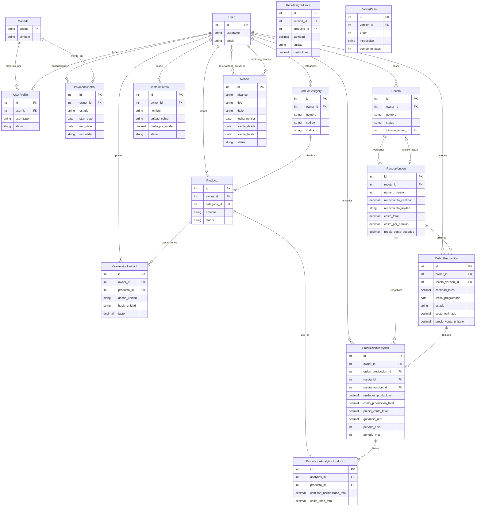
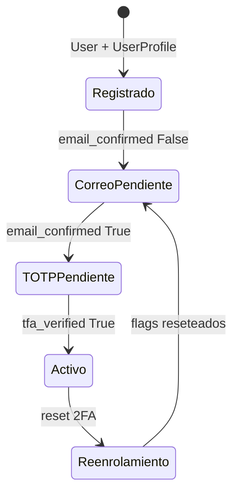
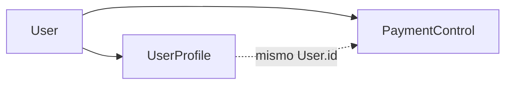
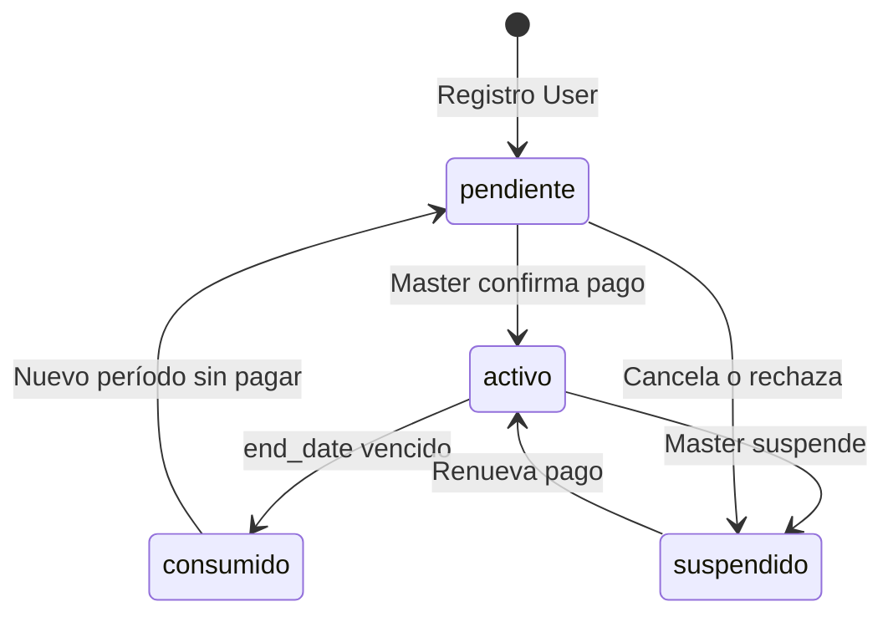
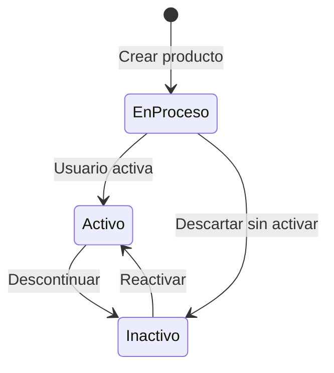
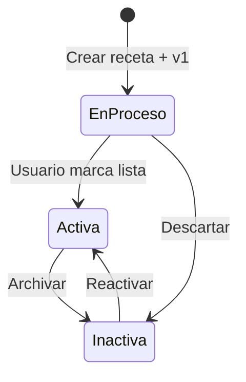
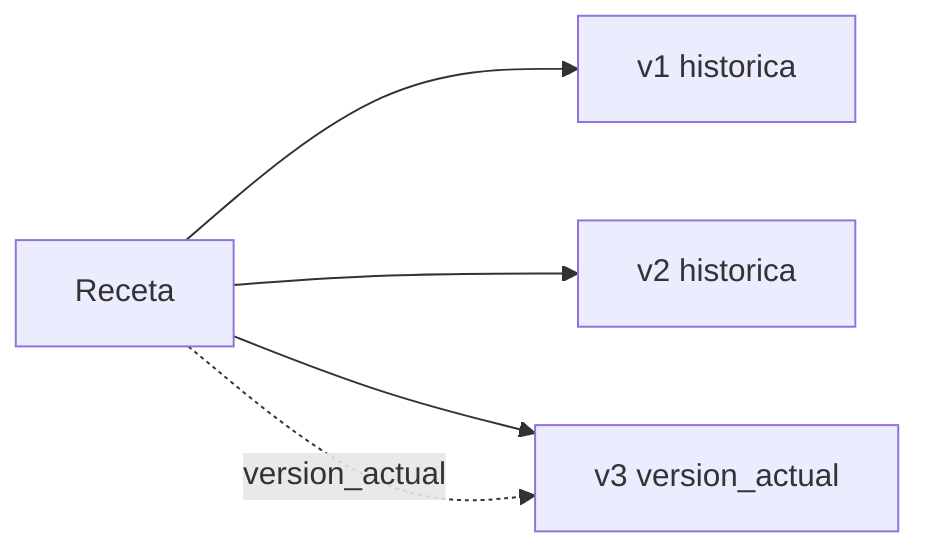
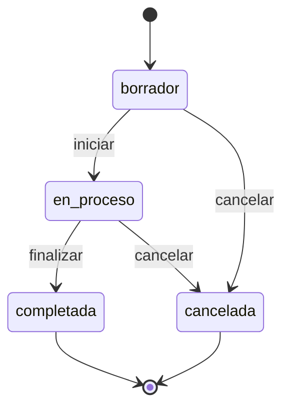
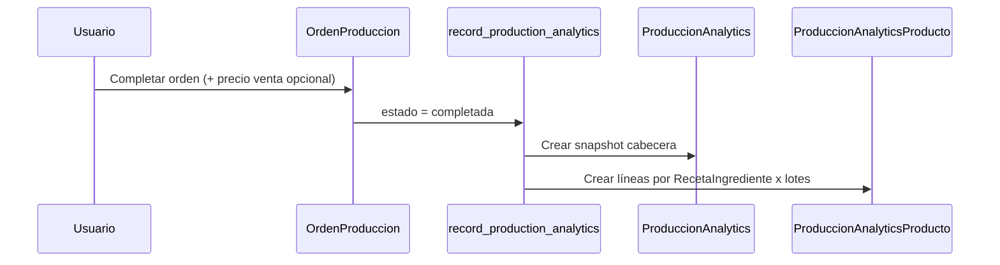

# BAKEBUDGE — Modelos y relaciones

Documento maestro de entidades de datos. Se irá ampliando conforme se definan nuevos modelos.

**Convenciones:**

- Stack de desarrollo v1: **Python**, **Django**, **PostgreSQL**, HTML/CSS/JS, DataTables — ver `[arquitectura.md](arquitectura.md#stack-de-desarrollo-v1)`.
- Apps bajo `apps/` (p. ej. `apps.accounts`, `apps.catalog`).
- Aislamiento por usuario: modelos de negocio llevan `owner → User` (salvo `UserProfile`, que es OneToOne; y entidades globales sin `owner`: `Noticia`, `MensajeContacto`).
- Referencia funcional de seguridad: `[BAKEBUDGE_SECURITY.md](BAKEBUDGE_SECURITY.md)`.

---

## Índice de modelos


| Modelo                                                      | App               | Estado        |
| ----------------------------------------------------------- | ----------------- | ------------- |
| [Moneda](#moneda)                                           | `apps.core`       | Implementado  |
| [UserProfile](#userprofile)                                 | `apps.accounts`   | Implementado  |
| [PaymentControl](#paymentcontrol)                           | `apps.billing`    | Implementado  |
| [ProductCategory](#productcategory)                         | `apps.catalog`    | Implementado  |
| [Producto](#producto)                                       | `apps.catalog`    | Implementado  |
| [CostoIndirecto](#costoindirecto)                           | `apps.catalog`    | Implementado  |
| [ConversionUnidad](#conversionunidad)                       | `apps.catalog`    | Implementado  |
| [Receta](#receta)                                           | `apps.recipes`    | Implementado  |
| [RecetaVersion](#recetaversion)                             | `apps.recipes`    | Implementado  |
| [RecetaCostoIndirecto](#recetacostoindirecto)               | `apps.recipes`    | Implementado  |
| [RecetaIngrediente](#recetaingrediente)                     | `apps.recipes`    | Implementado  |
| [RecetaPaso](#recetapaso)                                   | `apps.recipes`    | Implementado  |
| [OrdenProduccion](#ordenproduccion)                         | `apps.production` | Implementado  |
| [ProduccionAnalytics](#produccionanalytics)                 | `apps.analytics`  | Implementado  |
| [ProduccionAnalyticsProducto](#produccionanalyticsproducto) | `apps.analytics`  | Implementado  |
| [Noticia](#noticia)                                         | `apps.noticias`   | Implementado  |
| [MensajeContacto](#mensajecontacto)                         | `apps.public_site` | Implementado |


> Diseño funcional Noticias: `[BAKEBUDGE_NOTICIAS.md](BAKEBUDGE_NOTICIAS.md)`.  
> Diseño funcional analytics: `[BAKEBUDGE_ANALYTICS.md](BAKEBUDGE_ANALYTICS.md)`.  
> Reglas MensajeContacto: `[mensajecontacto-reglas.md](mensajecontacto-reglas.md)`.

---

## Diagrama de relaciones (actual)




---

## Moneda

**App:** `apps.core`  
**Tabla:** `core_moneda`  
**Tipo:** Catálogo de referencia **global** (no pertenece a un usuario; datos maestros del sistema).

Tabla con las monedas soportadas para mostrar y calcular costos. Se carga con datos iniciales (fixture o migración de datos) y se administra desde Django admin. Los usuarios eligen su moneda preferida en `UserProfile`.

### Relaciones


| Relación | Modelo        | Cardinalidad | Notas                                       |
| -------- | ------------- | ------------ | ------------------------------------------- |
| —        | `UserProfile` | 1:N          | Varios perfiles pueden usar la misma moneda |


### Campos


| Campo       | Tipo Django               | Null | Default | Descripción                                           |
| ----------- | ------------------------- | ---- | ------- | ----------------------------------------------------- |
| `codigo`    | CharField(3)              | No   | —       | **PK** — Código ISO 4217 (`COP`, `USD`, `MXN`, `EUR`) |
| `nombre`    | CharField(80)             | No   | —       | Nombre legible («Peso colombiano»)                    |
| `simbolo`   | CharField(10)             | No   | —       | Símbolo para UI (`$`, `US$`, `€`)                     |
| `decimales` | PositiveSmallIntegerField | No   | `2`     | Decimales al formatear montos                         |
| `activa`    | BooleanField              | No   | `True`  | Visible en selectores de perfil                       |
| `orden`     | PositiveSmallIntegerField | No   | `0`     | Orden en listas desplegables                          |


### Datos iniciales sugeridos (seed)


| codigo | nombre               | simbolo | decimales | activa |
| ------ | -------------------- | ------- | --------- | ------ |
| COP    | Peso colombiano      | $       | 0         | Sí     |
| USD    | Dólar estadounidense | US$     | 2         | Sí     |
| MXN    | Peso mexicano        | $       | 2         | Sí     |
| EUR    | Euro                 | €       | 2         | Sí     |
| ARS    | Peso argentino       | $       | 2         | Sí     |
| CLP    | Peso chileno         | $       | 0         | Sí     |
| PEN    | Sol peruano          | S/      | 2         | Sí     |


> Los decimales en `0` para COP/CLP son convención de visualización en repostería; los cálculos internos pueden usar más precisión (`DecimalField` en costos).

### Reglas de negocio

1. `codigo` es la clave primaria (estable, alineado con ISO 4217).
2. No eliminar monedas en uso: `UserProfile.moneda` usa `on_delete=PROTECT`.
3. Solo monedas con `activa=True` aparecen al configurar el perfil.
4. Ampliar el catálogo vía admin o migración de datos; no la crea el usuario final.
5. Todos los costos del usuario se **muestran** en su `UserProfile.moneda`; no hay conversión multi-moneda en v1.

### Carga de datos

- **Migración de datos** o **fixture** `core/fixtures/monedas.json` al desplegar.
- Comando opcional: `python manage.py loaddata monedas`.

---

## UserProfile

**App:** `apps.accounts`  
**Tabla:** `accounts_userprofile`  
**Relación:** OneToOne con `django.contrib.auth.models.User`  
**Acceso en código:** `user.profile` / `request.user.profile`

Extiende la cuenta Django con datos de negocio (repostería) y flags de seguridad (correo + 2FA). Se crea automáticamente al registrar un usuario (signal `post_save`).

### Relaciones


| Relación | Modelo        | Cardinalidad | Notas                                             |
| -------- | ------------- | ------------ | ------------------------------------------------- |
| `user`   | `auth.User`   | 1:1          | Obligatorio, `on_delete=CASCADE`                  |
| `moneda` | `core.Moneda` | N:1          | Moneda preferida para costos, `on_delete=PROTECT` |


### Campos — enlace


| Campo  | Tipo Django          | Null | Default | Descripción            |
| ------ | -------------------- | ---- | ------- | ---------------------- |
| `user` | OneToOneField → User | No   | —       | Cuenta Django asociada |


### Campos — negocio / repostería


| Campo                    | Tipo Django         | Null | Default    | Descripción                                                                      |
| ------------------------ | ------------------- | ---- | ---------- | -------------------------------------------------------------------------------- |
| `nombre_negocio`         | CharField(150)      | Sí   | `""`       | Nombre de la repostería o marca personal                                         |
| `moneda`                 | ForeignKey → Moneda | No   | `"COP"`    | Moneda para costos (FK a catálogo `core.Moneda`)                                 |
| `avatar`                 | ImageField          | Sí   | —          | Foto o logo opcional                                                             |
| `unidad_peso_default`    | CharField(10)       | No   | `"g"`      | Unidad por defecto para peso (`g`, `kg`)                                         |
| `unidad_volumen_default` | CharField(10)       | No   | `"ml"`     | Unidad por defecto para líquidos (`ml`, `L`)                                     |
| `unidad_conteo_default`  | CharField(10)       | No   | `"unidad"` | Unidad por defecto para piezas                                                   |
| `margen_objetivo_pct`    | DecimalField(5,2)   | No   | `40.00`    | Margen deseado (%) sobre costo para calcular precio de venta sugerido en recetas |


> Ver cadena de precios: `[RecetaVersion](#recetaversion)` → `[OrdenProduccion](#ordenproduccion)` → `[ProduccionAnalytics](#produccionanalytics)`.

### Campos — tipo de usuario


| Campo       | Tipo Django  | Null | Default | Descripción                                     |
| ----------- | ------------ | ---- | ------- | ----------------------------------------------- |
| `user_type` | CharField(1) | No   | `"U"`   | Rol del usuario en el sistema (ver tabla abajo) |


**Valores permitidos (`user_type`):**


| Código | Constante | Nombre | Descripción                                                         |
| ------ | --------- | ------ | ------------------------------------------------------------------- |
| `M`    | `MASTER`  | Master | Administrador del sistema; gestión global y supervisión             |
| `U`    | `USER`    | User   | Usuario estándar; gestiona solo sus recetas, productos y producción |


**Alcance por tipo (planificado):**


| Capacidad                        | Master (`M`)     | User (`U`)         |
| -------------------------------- | ---------------- | ------------------ |
| Registro público (`/registro/`)  | No               | No (v1 — solo Master) |
| Dashboard repostería (`/app/`)   | Sí (supervisión) | Sí (datos propios) |
| CRUD productos / recetas propios | Opcional         | Sí                 |
| Catálogo global (`Moneda`, etc.) | Sí               | No                 |
| Gestión de cuentas de usuario    | Sí               | No                 |
| Django admin                     | Sí               | No                 |


> El detalle de permisos por vista se definirá en implementación (decoradores `master_required`, etc.).
>
> **Pendiente:** pantallas y módulos exclusivos de Master en `/app/` — se documentarán al definir el dashboard.

### Campos — seguridad (correo y 2FA)


| Campo                | Tipo Django   | Null | Default | Descripción                                    |
| -------------------- | ------------- | ---- | ------- | ---------------------------------------------- |
| `email_confirmed`    | BooleanField  | No   | `False` | Correo verificado en onboarding                |
| `email_confirm_code` | CharField(6)  | Sí   | —       | Código enviado por correo (6 dígitos)          |
| `email_confirm_exp`  | DateTimeField | Sí   | —       | Caducidad del código (+5 min desde generación) |
| `totp_secret`        | CharField(64) | Sí   | —       | Secreto TOTP en base32 (pyotp)                 |
| `tfa_verified`       | BooleanField  | No   | `False` | 2FA completado al menos una vez                |
| `last_totp_reset`    | DateTimeField | Sí   | —       | Fecha/hora del último reset de autenticador    |


### Campos — control de cuenta


| Campo          | Tipo Django   | Null | Default | Descripción                             |
| -------------- | ------------- | ---- | ------- | --------------------------------------- |
| `status`       | CharField(1)  | No   | `"A"`   | `A` = activo, `I` = inactivo            |
| `locked_until` | DateTimeField | Sí   | —       | Bloqueo temporal tras intentos fallidos |
| `primer_acceso_app_completado` | BooleanField | No | `False` | `True` tras el primer ingreso a `/app/` post-seguridad; controla redirect a Noticias vs Dashboard |


### Campos — auditoría


| Campo        | Tipo Django   | Null | Default      | Descripción         |
| ------------ | ------------- | ---- | ------------ | ------------------- |
| `created_at` | DateTimeField | No   | auto_now_add | Alta del perfil     |
| `updated_at` | DateTimeField | No   | auto_now     | Última modificación |


### Propiedades y métodos (lógica, no columnas)


| Nombre                    | Retorno | Descripción                                                                                                                         |
| ------------------------- | ------- | ----------------------------------------------------------------------------------------------------------------------------------- |
| `is_security_complete`    | bool    | `email_confirmed` ∧ `tfa_verified` ∧ `totp_secret` no vacío                                                                         |
| `is_active_account`       | bool    | `status == "A"` y (`locked_until` es null o ya expiró)                                                                              |
| `is_master`               | bool    | `user_type == "M"`                                                                                                                  |
| `is_user`                 | bool    | `user_type == "U"`                                                                                                                  |
| `has_active_subscription` | bool    | Master: siempre `True`; User: existe `PaymentControl` con `estado=activo` y vigencia válida (ver [PaymentControl](#paymentcontrol)) |
| `can_access_app`          | bool    | `is_security_complete` ∧ `is_active_account` ∧ `has_active_subscription`                                                            |

> **Primer acceso (Conforme v1.2):** con `can_access_app` y `primer_acceso_app_completado = False`, el post-login redirige a `/app/noticias/`; luego el flag pasa a `True` y los ingresos siguientes van al Dashboard. Ver [`acceso-reglas.md`](acceso-reglas.md).


### Datos en `User` (Django auth, no en UserProfile)


| Campo                      | Uso en BAKEBUDGE                                     |
| -------------------------- | ---------------------------------------------------- |
| `username`                 | Login                                                |
| `email`                    | Verificación por correo y criterio de usuario activo |
| `password`                 | Contraseña (hash)                                    |
| `first_name` / `last_name` | Nombre personal (opcional)                           |
| `is_active`                | Activo a nivel Django                                |
| `date_joined`              | Fecha de registro                                    |


### Estados de seguridad




| Estado             | Condición                                                                    |
| ------------------ | ---------------------------------------------------------------------------- |
| Registrado         | Perfil recién creado, ambos flags en `False`                                 |
| Correo pendiente   | `email_confirmed = False`                                                    |
| TOTP pendiente     | `email_confirmed = True`, `tfa_verified = False`                             |
| Activo (seguridad) | `is_security_complete = True`                                                |
| Re-enrolamiento    | Tras reset 2FA: `email_confirmed`, `tfa_verified` y `totp_secret` reseteados |


### Reglas de negocio

1. Un `User` tiene exactamente un `UserProfile`.
2. Sin `User.email` no se puede completar el flujo de correo.
3. Acceso a `/app/` requiere `is_security_complete = True` y, para User, suscripción vigente (`can_access_app`).
4. `status = "I"` o `locked_until` vigente bloquea el login.
5. Tras reset 2FA: limpiar `email_confirm_code`, `email_confirm_exp`, `totp_secret`; poner `email_confirmed` y `tfa_verified` en `False`.
6. En **v1** no hay registro público: el Master crea cuentas (`user_type = "U"` o `"M"`). Si en el futuro se habilita `/registro/`, solo crearía `user_type = "U"`.
7. **Master** (`M`) solo se asigna vía `createsuperuser`, Django admin o acción de un Master existente; no hay auto-registro Master.
8. Un **User** nunca accede a funciones reservadas a Master, aunque tenga `is_staff` en Django (salvo política explícita futura).
9. **User** (`U`) requiere suscripción vigente (`PaymentControl`) para usar `/app/`; **Master** (`M`) queda exento del pago.
10. `UserProfile.status` controla bloqueo de cuenta; `PaymentControl.estado` controla el período de pago — son capas distintas (ver PaymentControl).

### Relación con billing


| Modelo        | Vínculo                                                                                 |
| ------------- | --------------------------------------------------------------------------------------- |
| `User`        | `PaymentControl.owner` → mismo `User` que `UserProfile.user`                            |
| `UserProfile` | Sin FK directa; acceso vía `user.payment_controls` o servicio `billing/subscription.py` |


Al registrarse un **User**, crear automáticamente un `PaymentControl` en estado `pendiente` (signal o servicio de registro).

### Diferencias respecto a CODAS


| Aspecto CODAS          | BAKEBUDGE                            |
| ---------------------- | ------------------------------------ |
| `user_type` (SU, etc.) | Solo `M` (Master) y `U` (User)       |
| FK `company`           | No aplica; datos aislados por `User` |


### Campos opcionales (fase posterior, no incluidos aún)


| Campo                  | Uso potencial                                                          |
| ---------------------- | ---------------------------------------------------------------------- |
| `telefono`             | Contacto / futuro SMS                                                  |
| `pais`                 | Localización; en v2 podría sugerir `moneda` por defecto al registrarse |
| `zona_horaria`         | Fechas de órdenes de producción                                        |
| `locale`               | Idioma de interfaz                                                     |
| `onboarding_completed` | Checklist: primer producto + primera receta                            |


---

## PaymentControl

**App:** `apps.billing`  
**Tabla:** `billing_paymentcontrol`  
**Basado en:** diseño propuesto por el equipo (revisado y alineado a BAKEBUDGE).

Registra **períodos de suscripción y pagos** de usuarios tipo **User** (`user_type = "U"`). Un usuario puede tener **varios registros** (historial); solo uno debería estar `activo` a la vez. Los **Master** no requieren filas de pago para operar.

### Relación con `accounts` / `UserProfile`




| Pregunta                              | Decisión                                                                                      |
| ------------------------------------- | --------------------------------------------------------------------------------------------- |
| ¿FK a `UserProfile` o a `User`?       | `**owner` → `User**` (consistente con `Producto.owner` y resto del sistema)                   |
| ¿OneToOne o histórico?                | **1:N** — varios `PaymentControl` por usuario (períodos y pagos pasados)                      |
| ¿Cómo sabe el perfil si puede entrar? | Propiedad `has_active_subscription` / `can_access_app` en lógica de perfil o servicio billing |
| ¿Master paga?                         | **No** — exento; solo aplica a `user_type = "U"`                                              |


**No duplicar** estado de pago en `UserProfile`: `status` (A/I) es bloqueo de cuenta; `PaymentControl.estado` es ciclo de suscripción.

### Relaciones


| Campo        | Modelo        | Cardinalidad | on_delete | Notas                                          |
| ------------ | ------------- | ------------ | --------- | ---------------------------------------------- |
| `owner`      | `auth.User`   | N:1          | CASCADE   | Usuario que paga / usa el servicio             |
| `moneda`     | `core.Moneda` | N:1          | PROTECT   | Moneda del monto pagado (opcional recomendado) |
| `created_by` | `auth.User`   | N:1          | PROTECT   | Quien registró el pago (típ. Master)           |
| `updated_by` | `auth.User`   | N:1          | PROTECT   | Última modificación (típ. Master)              |


### Campos — período y pago


| Campo             | Tipo Django         | Null | Default       | Descripción                               |
| ----------------- | ------------------- | ---- | ------------- | ----------------------------------------- |
| `owner`           | ForeignKey → User   | No   | —             | Usuario dueño de la suscripción           |
| `start_date`      | DateField           | Sí   | —             | Inicio del período pagado                 |
| `end_date`        | DateField           | Sí   | —             | Fin del período pagado                    |
| `payment_date`    | DateField           | Sí   | —             | Fecha en que se registró/confirmó el pago |
| `payment_method`  | CharField(20)       | Sí   | —             | Medio de pago (choices)                   |
| `payment_voucher` | CharField(50)       | Sí   | —             | Nº comprobante, referencia o nota         |
| `monto`           | DecimalField(12,2)  | Sí   | —             | Monto pagado (recomendado añadir)         |
| `moneda`          | ForeignKey → Moneda | Sí   | —             | Moneda del `monto`                        |
| `modalidad`       | CharField(1)        | No   | `"M"`         | `M` = Mensual, `A` = Anual                |
| `other_data`      | CharField(100)      | Sí   | —             | Datos adicionales del pago                |
| `estado`          | CharField(20)       | No   | `"pendiente"` | Estado del período (choices)              |


### Campos — auditoría


| Campo        | Tipo Django       | Null | Default      | Descripción                       |
| ------------ | ----------------- | ---- | ------------ | --------------------------------- |
| `created_at` | DateTimeField     | No   | auto_now_add | Alta del registro                 |
| `updated_at` | DateTimeField     | No   | auto_now     | Última modificación               |
| `created_by` | ForeignKey → User | Sí   | —            | Usuario que creó el registro      |
| `updated_by` | ForeignKey → User | Sí   | —            | Usuario que actualizó el registro |


### Choices

`**estado`:**


| Valor        | Etiqueta   | Significado                                           |
| ------------ | ---------- | ----------------------------------------------------- |
| `pendiente`  | Pendiente  | Registrado; esperando confirmación de pago por Master |
| `activo`     | Activo     | Período pagado y vigente; acceso a `/app/`            |
| `suspendido` | Suspendido | Sin acceso (impago, revisión, baja temporal)          |
| `consumido`  | Consumido  | Período finalizado; histórico                         |


`**payment_method`:**


| Valor           | Etiqueta      |
| --------------- | ------------- |
| `banco`         | Banco         |
| `transferencia` | Transferencia |
| `pagomovil`     | Pago móvil    |
| `efectivo`      | Efectivo      |
| `otros`         | Otros         |


`**modalidad`:**


| Valor | Etiqueta | Cálculo sugerido de `end_date` |
| ----- | -------- | ------------------------------ |
| `M`   | Mensual  | `start_date` + 1 mes           |
| `A`   | Anual    | `start_date` + 1 año           |


### Propiedades (lógica)


| Nombre       | Descripción                                            |
| ------------ | ------------------------------------------------------ |
| `is_vigente` | `estado == "activo"` y `start_date <= hoy <= end_date` |
| `is_expired` | `end_date` < hoy                                       |


### Flujo de estados




### Reglas de negocio

1. Solo **User** (`U`) necesita `PaymentControl` vigente para `/app/` (tras pasar seguridad 2FA).
2. Al **alta por Master** (v1), el Master crea el `PaymentControl` en Facturación — típicamente `activo` antes del primer login del User. *(Registro público deshabilitado en v1.)*
3. **Master** confirma pago: completa `payment_date`, `payment_method`, `monto`, calcula `start_date`/`end_date` según `modalidad`, pone `estado = activo`.
4. Máximo **un** registro `activo` vigente por `owner` (validar en `save()` o servicio).
5. Al vencer `end_date`, tarea programada o login check: `activo` → `consumido` y bloquear acceso hasta nuevo pago.
6. `created_by` / `updated_by`: típicamente un **Master** que registra el pago manual (transferencia, pago móvil, etc.).
7. Historial: no borrar registros `consumido`; son auditoría.

### Integración con acceso (`/app/`)

Orden de comprobación en middleware o decorador:

1. `@login_required`
2. `profile.is_security_complete` (2FA)
3. `profile.is_active_account` (`UserProfile.status`, `locked_until`)
4. `profile.has_active_subscription` (solo si `user_type == "U"`)

### Ajustes al diseño original (revisión)


| Tema                    | Original            | Recomendación BAKEBUDGE                        |
| ----------------------- | ------------------- | ---------------------------------------------- |
| Relación                | `owner` → User      | **Mantener** — correcto; no FK a UserProfile   |
| Cardinalidad            | Implícita histórica | **1:N** explícito con un solo `activo` vigente |
| `db_table`              | `"PaymentControl"`  | `billing_paymentcontrol` (convención Django)   |
| Typo choices            | `tranferencia`      | `transferencia`                                |
| `payment_voucher`       | 20 chars            | **50** chars (referencias bancarias largas)    |
| `other_data`            | 50 chars            | **100** chars                                  |
| Monto                   | No incluido         | Añadir `**monto`** + FK `**moneda**`           |
| Comprobante imagen      | No                  | Opcional fase 2: `voucher_image` ImageField    |
| OneToOne en docs viejos | `user` 1:1          | Descartado — usar histórico 1:N                |


### Ejemplo de ciclo (User)

1. María se registra → `UserProfile` (`U`) + `PaymentControl` (`pendiente`).
2. Completa 2FA → puede ver pantalla «Esperando confirmación de pago» (no `/app/` completo).
3. Master registra transferencia → `activo`, `start_date=hoy`, `end_date=+1 mes`, `created_by=master`.
4. María accede a `/app/`.
5. Al vencer mes → `consumido`; nueva fila `pendiente` o renovación por Master.

---

## ProductCategory

**App:** `apps.catalog`  
**Tabla:** `catalog_productcategory`  
**Modelo Django:** `ProductCategory`  
**Tipo:** Catálogo de **categorías de producto** (insumo, empaque, decoración, etc.) definido por cada usuario. Clasifica `[Producto](#producto)` en listados, filtros y analytics.

Sustituye el antiguo campo `Producto.categoria` (CharField con choices fijos). Cada usuario gestiona sus propias categorías; al registrarse se pueden crear **categorías predeterminadas** vía señal post-registro (ver reglas de negocio).

### Relaciones


| Campo   | Modelo      | Cardinalidad | on_delete | Notas                                    |
| ------- | ----------- | ------------ | --------- | ---------------------------------------- |
| `owner` | `auth.User` | N:1          | CASCADE   | Aislamiento por usuario                  |
| —       | `Producto`  | 1:N          | —         | Productos clasificados en esta categoría |


### Campos — identificación


| Campo         | Tipo Django       | Null | Default | Descripción                                                                                |
| ------------- | ----------------- | ---- | ------- | ------------------------------------------------------------------------------------------ |
| `owner`       | ForeignKey → User | No   | —       | Dueño del registro                                                                         |
| `nombre`      | CharField(50)     | No   | —       | Nombre visible (ej. «Insumo», «Empaque», «Decoración»)                                     |
| `codigo`      | CharField(30)     | Sí   | `""`    | Identificador estable por usuario (ej. `insumo`, `empaque`); útil para seeds y migraciones |
| `descripcion` | TextField         | Sí   | `""`    | Texto auxiliar en UI o ayuda contextual                                                    |


### Campos — presentación


| Campo   | Tipo Django               | Null | Default | Descripción                                     |
| ------- | ------------------------- | ---- | ------- | ----------------------------------------------- |
| `orden` | PositiveSmallIntegerField | No   | `0`     | Orden en selectores y filtros (menor = primero) |
| `color` | CharField(7)              | Sí   | `""`    | Color opcional para badge en UI (hex `#RRGGBB`) |


### Campos — estado (`status`)

Misma convención que `[Producto](#producto)`:


| Campo    | Tipo Django  | Null | Default | Descripción                              |
| -------- | ------------ | ---- | ------- | ---------------------------------------- |
| `status` | CharField(1) | No   | `"A"`   | `P` En proceso, `A` Activo, `I` Inactivo |


| Código | Constante    | Etiqueta   |
| ------ | ------------ | ---------- |
| `P`    | `EN_PROCESO` | En proceso |
| `A`    | `ACTIVO`     | Activo     |
| `I`    | `INACTIVO`   | Inactivo   |


### Campos — control


| Campo               | Tipo Django  | Null | Default | Descripción                                                                                   |
| ------------------- | ------------ | ---- | ------- | --------------------------------------------------------------------------------------------- |
| `es_predeterminada` | BooleanField | No   | `False` | `True` si fue creada por el sistema al registrar al usuario; no eliminable si tiene productos |


### Campos — auditoría


| Campo        | Tipo Django   | Null | Default      | Descripción         |
| ------------ | ------------- | ---- | ------------ | ------------------- |
| `created_at` | DateTimeField | No   | auto_now_add | Alta                |
| `updated_at` | DateTimeField | No   | auto_now     | Última modificación |


### Propiedades (lógica)


| Nombre      | Descripción                                                       |
| ----------- | ----------------------------------------------------------------- |
| `is_activo` | `status == "A"`                                                   |
| `is_usable` | `status == "A"` — elegible en selectores al crear/editar producto |


### Reglas de negocio

1. Todo `ProductCategory` pertenece a un único `owner`; querysets siempre filtran por `request.user`.
2. `**nombre` único por owner** (case-insensitive recomendado en validación).
3. Si `codigo` no está vacío, **único por owner** (permite referencias estables en seeds).
4. Al **registrar usuario**, señal opcional crea categorías iniciales:

  | codigo       | nombre     | orden |
  | ------------ | ---------- | ----- |
  | `insumo`     | Insumo     | 10    |
  | `empaque`    | Empaque    | 20    |
  | `decoracion` | Decoración | 30    |
  | `otro`       | Otro       | 40    |

   Todas con `es_predeterminada=True`, `status=A`.
5. No eliminar categoría con productos asociados (`on_delete=PROTECT` en `Producto.categoria`).
6. Categorías `**I` (Inactivo)** no aparecen en selectores nuevos; productos existentes conservan la FK.
7. El usuario puede crear **tantas categorías personalizadas** como necesite (ej. «Utensilios», «Lácteos»).

### Meta (Django)

```python
class Meta:
    db_table = "catalog_productcategory"
    ordering = ["orden", "nombre"]
    constraints = [
        models.UniqueConstraint(
            fields=["owner", "nombre"],
            name="catalog_productcategory_owner_nombre_uniq",
        ),
        models.UniqueConstraint(
            fields=["owner", "codigo"],
            condition=models.Q(codigo__gt=""),
            name="catalog_productcategory_owner_codigo_uniq",
        ),
    ]
    indexes = [
        models.Index(fields=["owner", "status"]),
    ]
```

### Ejemplo (modelo)

```python
class ProductCategory(models.Model):
    STATUS_TYPES = [
        ("P", "En proceso"),
        ("A", "Activo"),
        ("I", "Inactivo"),
    ]

    owner = models.ForeignKey(
        settings.AUTH_USER_MODEL,
        on_delete=models.CASCADE,
        related_name="product_categories",
    )
    nombre = models.CharField(max_length=50)
    codigo = models.CharField(max_length=30, blank=True, default="")
    descripcion = models.TextField(blank=True, default="")
    orden = models.PositiveSmallIntegerField(default=0)
    color = models.CharField(max_length=7, blank=True, default="")
    status = models.CharField(max_length=1, choices=STATUS_TYPES, default="A")
    es_predeterminada = models.BooleanField(default=False)
    created_at = models.DateTimeField(auto_now_add=True)
    updated_at = models.DateTimeField(auto_now=True)

    class Meta:
        db_table = "catalog_productcategory"
        # ... constraints e indexes arriba

    def __str__(self):
        return self.nombre
```

---

## Producto

**App:** `apps.catalog`  
**Tabla:** `catalog_producto`  
**Tipo:** Insumo, empaque u otro ítem con **costo unitario** usado en recetas y cálculo de costos de producción.

Cada usuario gestiona su propio catálogo de productos. El costo se normaliza a una **unidad base** para que las recetas calculen `costo_linea` de forma consistente.

### Relaciones


| Campo       | Modelo              | Cardinalidad | on_delete | Notas                                     |
| ----------- | ------------------- | ------------ | --------- | ----------------------------------------- |
| `owner`     | `auth.User`         | N:1          | CASCADE   | Aislamiento por usuario                   |
| `categoria` | `ProductCategory`   | N:1          | PROTECT   | Clasificación del producto; mismo `owner` |
| —           | `RecetaIngrediente` | 1:N          | —         | Futuro: uso en recetas                    |
| —           | `ConversionUnidad`  | 1:N          | —         | Conversiones opcionales por producto      |


### Campos — identificación


| Campo       | Tipo Django                  | Null | Default | Descripción                                              |
| ----------- | ---------------------------- | ---- | ------- | -------------------------------------------------------- |
| `owner`     | ForeignKey → User            | No   | —       | Dueño del registro                                       |
| `nombre`    | CharField(150)               | No   | —       | Nombre del insumo (ej. «Harina de trigo», «Mantequilla») |
| `categoria` | ForeignKey → ProductCategory | No   | —       | Categoría del catálogo del mismo `owner`                 |


> **Migración desde choices:** el antiguo `CharField` con valores `insumo`, `empaque`, `decoracion`, `otro` se reemplaza por FK a `[ProductCategory](#productcategory)`. Los registros existentes se migran a las categorías predeterminadas del owner según `codigo`.

**Validación:** `categoria.owner_id` debe coincidir con `producto.owner_id` (validar en modelo o vista al guardar).

### Campos — costo y unidad


| Campo                   | Tipo Django        | Null | Default | Descripción                                                           |
| ----------------------- | ------------------ | ---- | ------- | --------------------------------------------------------------------- |
| `unidad_base`           | CharField(20)      | No   | —       | Unidad en la que está expresado el costo — **valor tomado del catálogo del usuario** (ver abajo) |
| `costo_por_unidad_base` | DecimalField(12,4) | No   | `0`     | Precio de compra por `unidad_base` (en moneda del perfil del usuario) |


**Origen de `unidad_base` (no es lista fija):**

Al crear o editar un producto, el selector de **unidad base** se alimenta con los valores **`hacia_unidad` distintos** de [`ConversionUnidad`](#conversionunidad) del mismo `owner`. Es decir, las unidades destino que el usuario ya definió en sus reglas de conversión son las únicas bases válidas para expresar el costo del insumo.

| Origen UI | Queryset Django (referencia) |
|-----------|------------------------------|
| Alta / edición producto | `ConversionUnidad.objects.filter(owner=request.user).values_list("hacia_unidad", flat=True).distinct().order_by("hacia_unidad")` |

**Reglas:**

1. Si el usuario **no tiene** registros en `ConversionUnidad`, el formulario producto muestra aviso: debe crear al menos una conversión (p. ej. genérica `producto=null`: taza → g) antes de definir productos.
2. Al guardar producto, validar que `unidad_base` ∈ conjunto de `hacia_unidad` del owner.
3. Conversiones **por producto** (`producto` FK) exigen `hacia_unidad == producto.unidad_base`; por eso la unidad base elegida al crear debe existir como destino en el catálogo de conversiones del usuario.
4. Para piezas contables, el usuario crea conversión identidad (ej. `desde_unidad=unidad`, `hacia_unidad=unidad`, `factor=1`, `producto=null`).

> El usuario ve costos en la moneda de su `UserProfile.moneda`; no hay FK a Moneda en Producto.

### Campos — estado (`status`)


| Campo    | Tipo Django  | Null | Default | Descripción                        |
| -------- | ------------ | ---- | ------- | ---------------------------------- |
| `status` | CharField(1) | No   | `"P"`   | Estado del producto en el catálogo |


`**STATUS_TYPES`:**


| Código | Constante    | Etiqueta   | Significado                                                  |
| ------ | ------------ | ---------- | ------------------------------------------------------------ |
| `P`    | `EN_PROCESO` | En proceso | Alta reciente; faltan datos o revisión (costo, unidad, etc.) |
| `A`    | `ACTIVO`     | Activo     | Listo para usar en recetas y cálculos de costo               |
| `I`    | `INACTIVO`   | Inactivo   | No se ofrece en selectores nuevos; histórico preservado      |


```python
STATUS_TYPES = [
    ("P", "En proceso"),
    ("A", "Activo"),
    ("I", "Inactivo"),
]
status = models.CharField(
    max_length=1,
    choices=STATUS_TYPES,
    default="P",  # EN PROCESO
)
```

### Campos — información adicional


| Campo       | Tipo Django    | Null | Default | Descripción                               |
| ----------- | -------------- | ---- | ------- | ----------------------------------------- |
| `proveedor` | CharField(120) | Sí   | `""`    | Proveedor o marca (opcional)              |
| `notas`     | TextField      | Sí   | `""`    | Observaciones (marca, presentación, etc.) |


### Campos — auditoría


| Campo        | Tipo Django   | Null | Default      | Descripción         |
| ------------ | ------------- | ---- | ------------ | ------------------- |
| `created_at` | DateTimeField | No   | auto_now_add | Alta del producto   |
| `updated_at` | DateTimeField | No   | auto_now     | Última modificación |


### Propiedades (lógica)


| Nombre              | Descripción                                            |
| ------------------- | ------------------------------------------------------ |
| `is_activo`         | `status == "A"`                                        |
| `is_en_proceso`     | `status == "P"`                                        |
| `is_inactivo`       | `status == "I"`                                        |
| `usable_en_recetas` | `status == "A"` — elegible en selector de ingredientes |


### Reglas de negocio

1. Todo `Producto` pertenece a un único `owner`; querysets siempre filtran por `request.user`.
2. `categoria` debe pertenecer al **mismo owner** que el producto.
3. Al **crear**, `status` por defecto es `**P` (En proceso)** hasta que el usuario complete costo/unidad y marque Activo.
4. Solo productos `**A` (Activo)** aparecen por defecto al agregar ingredientes a una receta.
5. Productos `**I` (Inactivo)** no se eliminan; recetas existentes pueden mostrar aviso si el insumo quedó inactivo.
6. `**P` (En proceso)** visible en listado del catálogo con badge; no usable en recetas hasta pasar a Activo.
7. Cambiar `costo_por_unidad_base` en un producto usado en recetas dispara **recálculo** de costos en versiones afectadas (servicio futuro).
8. `costo_por_unidad_base` **> 0** al crear o editar (validar en vista/formulario); no negativo en modelo.

### Flujo de estado (producto)




### Ejemplo de uso en costos

Harina: `unidad_base=g`, `costo_por_unidad_base=0.0045` (4.500 COP/kg → 0.0045 por gramo si se normaliza a g).  
En `RecetaIngrediente`: 250 g harina → `costo_linea = 250 × 0.0045`.

### Relación con `UserProfile`


| Aspecto                 | Vínculo                                                                         |
| ----------------------- | ------------------------------------------------------------------------------- |
| Moneda de visualización | `owner.profile.moneda` — el costo se ingresa y muestra en esa moneda            |
| Unidad por defecto      | Sugerir `unidad_peso_default` / `unidad_volumen_default` al crear producto (UI) |


---

## CostoIndirecto

**App:** `apps.catalog`  
**Tabla:** `catalog_costoindirecto`  
**Tipo:** Catálogo libre de **gastos de producción no asociados a un insumo**. El usuario crea **tantos registros como necesite**, sin categorías predefinidas. Misma filosofía que `Producto`: **propios de cada usuario**, con `status` y costo por unidad de cobro.

Complementa a `Producto` en el cálculo total de una receta:

```
costo_total_receta = Σ ingredientes (Producto) + Σ gastos indirectos asignados
```

### Relaciones


| Campo   | Modelo                 | Cardinalidad | on_delete | Notas                            |
| ------- | ---------------------- | ------------ | --------- | -------------------------------- |
| `owner` | `auth.User`            | N:1          | CASCADE   | Aislamiento por usuario          |
| —       | `RecetaCostoIndirecto` | 1:N          | —         | Asignación a versiones de receta |


### Campos — identificación


| Campo    | Tipo Django       | Null | Default | Descripción                                                     |
| -------- | ----------------- | ---- | ------- | --------------------------------------------------------------- |
| `owner`  | ForeignKey → User | No   | —       | Dueño del registro                                              |
| `nombre` | CharField(50)     | No   | —       | Nombre libre del gasto (ej. «Gas horno», «Luz cocina», «Flete») |


> Sin campo `categoria`: el usuario nombra cada costo como prefiera; detalle adicional en `notas`.

### Campos — costo y unidad de cobro


| Campo              | Tipo Django        | Null | Default  | Descripción                                               |
| ------------------ | ------------------ | ---- | -------- | --------------------------------------------------------- |
| `unidad_cobro`     | CharField(15)      | No   | `"hora"` | Unidad en la que se expresa el costo                      |
| `costo_por_unidad` | DecimalField(12,4) | No   | `0`      | Precio por `unidad_cobro` (moneda del perfil del usuario) |


`**unidad_cobro` permitidas (v1):**


| Valor     | Uso típico en receta                                                |
| --------- | ------------------------------------------------------------------- |
| `hora`    | Gas/luz/maquinaria por tiempo de horneado o batido                  |
| `minuto`  | Procesos cortos                                                     |
| `lote`    | Costo fijo por tanda completa de la receta                          |
| `porcion` | Costo repartido por unidad vendida                                  |
| `mes`     | Prorrateo mensual (luz local) — cantidad = fracción usada en sesión |
| `fijo`    | Monto único al aplicar a la receta (cantidad = 1)                   |


### Campos — estado (`status`)

Misma filosofía que `[Producto](#producto)`:


| Campo    | Tipo Django  | Null | Default | Descripción                              |
| -------- | ------------ | ---- | ------- | ---------------------------------------- |
| `status` | CharField(1) | No   | `"P"`   | `P` En proceso, `A` Activo, `I` Inactivo |


### Campos — información adicional


| Campo   | Tipo Django | Null | Default | Descripción                                          |
| ------- | ----------- | ---- | ------- | ---------------------------------------------------- |
| `notas` | TextField   | Sí   | `""`    | Cómo se estimó el costo, factura de referencia, etc. |


### Campos — auditoría


| Campo        | Tipo Django   | Null | Default      | Descripción         |
| ------------ | ------------- | ---- | ------------ | ------------------- |
| `created_at` | DateTimeField | No   | auto_now_add | Alta                |
| `updated_at` | DateTimeField | No   | auto_now     | Última modificación |


### Propiedades (lógica)


| Nombre              | Descripción     |
| ------------------- | --------------- |
| `is_activo`         | `status == "A"` |
| `usable_en_recetas` | `status == "A"` |


### Reglas de negocio

1. Cada usuario define **todos los costos indirectos que necesite**; sin límite de cantidad ni taxonomía fija.
2. Default `**P` (En proceso)** al crear; pasa a `**A` (Activo)** cuando el usuario valida tarifa y unidad.
3. Solo costos `**A`** se ofrecen al armar una receta.
4. Moneda: misma convención que `Producto` — montos en `owner.profile.moneda`.
5. Cambiar `costo_por_unidad` recalcula versiones de receta que lo usen (servicio futuro).

### Ejemplos


| nombre        | unidad_cobro | costo_por_unidad | En receta (cantidad) | costo_linea |
| ------------- | ------------ | ---------------- | -------------------- | ----------- |
| Gas horno     | hora         | 3.500            | 0,5 h                | 1.750       |
| Flete semanal | lote         | 15.000           | 1                    | 15.000      |
| Luz cocina    | mes          | 80.000           | 0,02 (prorrateo)     | 1.600       |


---

## ConversionUnidad

**App:** `apps.catalog`  
**Tabla:** `catalog_conversionunidad`  
**Tipo:** Reglas de conversión para expresar cantidades de **ingredientes en recetas** en la `**unidad_base` del `Producto`**, y así calcular el costo correctamente.

El usuario define **tantas conversiones como necesite**, sin catálogo predefinido de unidades de receta (taza, cucharada, onza, etc. son texto libre en `desde_unidad`).

### Semántica del `factor`

```
1 × desde_unidad  =  factor × hacia_unidad
```

**Ejemplo:** `desde_unidad = "taza"`, `hacia_unidad = "g"`, `factor = 120`  
→ 1 taza = 120 g → 2,5 tazas = 300 g.

Si el ingrediente en receta usa la misma unidad que `Producto.unidad_base`, no hace falta conversión (`factor` implícito 1).

### Relaciones


| Campo      | Modelo              | Cardinalidad | on_delete | Notas                                               |
| ---------- | ------------------- | ------------ | --------- | --------------------------------------------------- |
| `owner`    | `auth.User`         | N:1          | CASCADE   | Aislamiento por usuario                             |
| `producto` | `Producto`          | N:1          | CASCADE   | Opcional (`null` = conversión genérica del usuario) |
| —          | `RecetaIngrediente` | —            | —         | Se aplica al calcular costo (servicio)              |


### Campos


| Campo          | Tipo Django           | Null | Default | Descripción                                                               |
| -------------- | --------------------- | ---- | ------- | ------------------------------------------------------------------------- |
| `owner`        | ForeignKey → User     | No   | —       | Dueño del registro                                                        |
| `producto`     | ForeignKey → Producto | Sí   | —       | Si se indica, conversión aplicable a ese insumo                           |
| `nombre`       | CharField(50)         | Sí   | `""`    | Etiqueta opcional en UI (ej. «Taza colmada»)                              |
| `desde_unidad` | CharField(20)         | No   | —       | Unidad usada en la receta (texto libre: taza, cdta, oz…)                  |
| `hacia_unidad` | CharField(20)         | No   | —       | Unidad destino; debe coincidir con `producto.unidad_base` si hay producto |
| `factor`       | DecimalField(12,6)    | No   | —       | Equivalencia según fórmula arriba                                         |
| `notas`        | TextField             | Sí   | `""`    | Origen de la medida, referencia, etc.                                     |


### Campos — auditoría


| Campo        | Tipo Django   | Null | Default      | Descripción         |
| ------------ | ------------- | ---- | ------------ | ------------------- |
| `created_at` | DateTimeField | No   | auto_now_add | Alta                |
| `updated_at` | DateTimeField | No   | auto_now     | Última modificación |


### Tipos de conversión


| `producto`                | Alcance                                                                                           | Ejemplo                              |
| ------------------------- | ------------------------------------------------------------------------------------------------- | ------------------------------------ |
| **Con producto**          | Solo ese insumo                                                                                   | Harina X: 1 taza → 120 g             |
| **Sin producto (`null`)** | Genérica del usuario; aplica si `hacia_unidad` = `producto.unidad_base` y coincide `desde_unidad` | 1 taza → 240 ml (líquidos genéricos) |


### Orden de resolución (cálculo de costo)

Al convertir cantidad de `RecetaIngrediente` a unidad base del producto:

1. Si `ingrediente.unidad == producto.unidad_base` → cantidad directa.
2. Conversión con `**producto` = ese insumo** y `desde_unidad` = unidad del ingrediente.
3. Conversión **genérica** (`producto` null) mismo `owner`, misma `desde_unidad`, `hacia_unidad` = `producto.unidad_base`.
4. Si no hay regla → **aviso** en UI y costo_linea no calculable hasta definir conversión.

### Reglas de negocio

1. Todo registro tiene `owner`; solo el dueño ve y edita sus conversiones.
2. Si `producto` está definido, validar `hacia_unidad == producto.unidad_base`.
3. `factor` > 0.
4. Evitar duplicados: unicidad recomendada `(owner, producto, desde_unidad)` — con `producto` null, `(owner, desde_unidad, hacia_unidad)`.
5. Cantidad ilimitada de conversiones por usuario.
6. No se usa `status`; basta con crear/editar/eliminar el registro.
7. Si cambia `factor` o `unidad_base` del producto, recalcular costos de recetas afectadas.
8. **`hacia_unidad` distintos** del owner conforman el catálogo selectable de `Producto.unidad_base` en formularios de alta/edición (ver [`Producto`](#producto)).

### Ejemplos


| producto     | desde_unidad | hacia_unidad | factor | Uso                                   |
| ------------ | ------------ | ------------ | ------ | ------------------------------------- |
| Harina trigo | taza         | g            | 120    | Receta pide 2 tazas → 240 g × costo/g |
| Mantequilla  | cucharada    | g            | 15     | 3 cdas → 45 g                         |
| null         | taza         | ml           | 240    | Genérica para líquidos en ml          |
| Huevo        | unidad       | unidad       | 1      | Pieza a pieza (unidad_base = unidad)  |


### Relación con `Producto` y recetas

```
RecetaIngrediente: 2.5 taza de Harina
    → ConversionUnidad: taza → g, factor 120
    → 300 g × producto.costo_por_unidad_base
```

---

## Receta

**App:** `apps.recipes`  
**Tabla:** `recipes_receta`  
**Tipo:** Cabecera de una **receta de repostería** del usuario. Agrupa identidad (nombre, imagen, estado) y apunta a la **versión vigente** (`version_actual`) con ingredientes, pasos y costos.

El detalle editable (ingredientes, pasos, rendimiento, costos) vive en `**RecetaVersion`** y modelos hijos; `Receta` es el contenedor estable que el usuario reconoce en listados.

### Relaciones


| Campo            | Modelo            | Cardinalidad | on_delete | Notas                                           |
| ---------------- | ----------------- | ------------ | --------- | ----------------------------------------------- |
| `owner`          | `auth.User`       | N:1          | CASCADE   | Aislamiento por usuario                         |
| `version_actual` | `RecetaVersion`   | N:1          | SET_NULL  | Versión publicada/vigente; nullable al crear    |
| —                | `RecetaVersion`   | 1:N          | —         | Historial de versiones (`receta` FK en versión) |
| —                | `OrdenProduccion` | —            | —         | Vía `RecetaVersion`                             |


### Campos — identificación


| Campo               | Tipo Django       | Null | Default | Descripción                                                      |
| ------------------- | ----------------- | ---- | ------- | ---------------------------------------------------------------- |
| `owner`             | ForeignKey → User | No   | —       | Dueño de la receta                                               |
| `nombre`            | CharField(100)    | No   | —       | Nombre de la receta (ej. «Torta de chocolate», «Galletas limón») |
| `descripcion_corta` | CharField(255)    | Sí   | `""`    | Resumen para listados y búsqueda                                 |
| `imagen`            | ImageField        | Sí   | —       | Foto del producto terminado (opcional)                           |


> Sin `categoria` predefinida: el usuario clasifica con `nombre`, `descripcion_corta` y `notas` libremente.

### Campos — estado (`status`)

Misma filosofía que `[Producto](#producto)`:


| Campo    | Tipo Django  | Null | Default | Descripción                        |
| -------- | ------------ | ---- | ------- | ---------------------------------- |
| `status` | CharField(1) | No   | `"P"`   | Estado de la receta en el catálogo |


| Código | Etiqueta   | Significado                                 |
| ------ | ---------- | ------------------------------------------- |
| `P`    | En proceso | Borrador; ingredientes o costos incompletos |
| `A`    | Activo     | Receta lista para producción y órdenes      |
| `I`    | Inactivo   | Archivada; no en listados por defecto       |


### Campos — versión vigente


| Campo            | Tipo Django                | Null | Default | Descripción                                        |
| ---------------- | -------------------------- | ---- | ------- | -------------------------------------------------- |
| `version_actual` | ForeignKey → RecetaVersion | Sí   | —       | Versión usada para costos y producción por defecto |


### Campos — información adicional


| Campo   | Tipo Django | Null | Default | Descripción                                          |
| ------- | ----------- | ---- | ------- | ---------------------------------------------------- |
| `notas` | TextField   | Sí   | `""`    | Notas internas (tips, variaciones, cliente habitual) |


### Campos — auditoría


| Campo        | Tipo Django   | Null | Default      | Descripción         |
| ------------ | ------------- | ---- | ------------ | ------------------- |
| `created_at` | DateTimeField | No   | auto_now_add | Alta                |
| `updated_at` | DateTimeField | No   | auto_now     | Última modificación |


### Propiedades (lógica)


| Nombre                 | Descripción                    |
| ---------------------- | ------------------------------ |
| `is_activa`            | `status == "A"`                |
| `is_en_proceso`        | `status == "P"`                |
| `is_inactiva`          | `status == "I"`                |
| `tiene_version_actual` | `version_actual_id` no es null |


### Reglas de negocio

1. Cada `Receta` pertenece a un `owner`; listados y CRUD filtran por `request.user`.
2. Al **crear** receta: `status = P`; se crea `**RecetaVersion` v1** y se asigna a `version_actual` (servicio o signal; detalle en RecetaVersion).
3. **Costos y rendimiento** se leen de `version_actual`, no se duplican en `Receta`.
4. Nueva versión al cambiar ingredientes/pasos de forma que deba preservarse historial de costos; `version_actual` apunta a la última publicada.
5. Solo recetas `**A`** se ofrecen por defecto al crear **órdenes de producción**; aviso si `P`.
6. `**I` (Inactivo):** no borrado físico; historial y versiones se conservan.
7. Imagen y nombre son de la receta; las versiones pueden tener `notas_cambio` propias.

### Flujo de estado




### Relación con costos

```
Receta (cabecera)
    └── version_actual → RecetaVersion
            ├── RecetaIngrediente → Producto + ConversionUnidad
            ├── RecetaCostoIndirecto → CostoIndirecto
            └── costo_total, costo_por_porcion (en versión)
```

### Ejemplo de ciclo

1. Usuario crea «Brownie clásico» → `Receta` (`P`) + `RecetaVersion` v1.
2. Agrega ingredientes y costos indirectos en v1; calcula costo por porción.
3. Marca receta `**A` (Activo)** → disponible para producción.
4. Cambia precio de chocolate → nueva **v2**; `version_actual` → v2; v1 queda en historial.

---

## RecetaVersion

**App:** `apps.recipes`  
**Tabla:** `recipes_recetaversion`  
**Tipo:** **Snapshot versionado** de una receta: rendimiento, ingredientes, pasos, costos indirectos y totales calculados en un momento dado.

Preserva el **historial de costos** cuando cambian precios de insumos o la formulación. La versión apuntada por `Receta.version_actual` es la que se usa para producción y listados de costo vigente.

### Relaciones


| Campo    | Modelo                 | Cardinalidad | on_delete | Notas                                         |
| -------- | ---------------------- | ------------ | --------- | --------------------------------------------- |
| `receta` | `Receta`               | N:1          | CASCADE   | Receta padre                                  |
| —        | `RecetaIngrediente`    | 1:N          | —         | Líneas de insumo                              |
| —        | `RecetaPaso`           | 1:N          | —         | Instrucciones ordenadas                       |
| —        | `RecetaCostoIndirecto` | 1:N          | —         | Gastos indirectos asignados                   |
| —        | `OrdenProduccion`      | 1:N          | —         | Órdenes de producción basadas en esta versión |


**Aislamiento por usuario:** vía `receta.owner` (no hay `owner` directo en la versión).

### Campos — identificación de versión


| Campo            | Tipo Django          | Null | Default | Descripción                                                        |
| ---------------- | -------------------- | ---- | ------- | ------------------------------------------------------------------ |
| `receta`         | ForeignKey → Receta  | No   | —       | Receta a la que pertenece                                          |
| `numero_version` | PositiveIntegerField | No   | —       | Secuencial por receta: 1, 2, 3…                                    |
| `notas_cambio`   | TextField            | Sí   | `""`    | Motivo del cambio (ej. «Subió precio mantequilla», «Menos azúcar») |


Unicidad: `(receta, numero_version)`.

### Campos — rendimiento


| Campo                  | Tipo Django        | Null | Default       | Descripción                                         |
| ---------------------- | ------------------ | ---- | ------------- | --------------------------------------------------- |
| `rendimiento_cantidad` | DecimalField(12,4) | No   | `1`           | Cuántas unidades rinde esta versión                 |
| `rendimiento_unidad`   | CharField(30)      | No   | `"porciones"` | Texto libre: porciones, moldes, unidades, bandejas… |


**Ejemplos:** `12` porciones · `1` molde · `24` galletas.

### Campos — costos (cache calculado)

Recalculados por `cost_calculator` al guardar ingredientes, indirectos o rendimiento:


| Campo                | Tipo Django        | Null | Default | Descripción                             |
| -------------------- | ------------------ | ---- | ------- | --------------------------------------- |
| `costo_ingredientes` | DecimalField(14,4) | No   | `0`     | Σ `RecetaIngrediente.costo_linea`       |
| `costo_indirectos`   | DecimalField(14,4) | No   | `0`     | Σ `RecetaCostoIndirecto.costo_linea`    |
| `costo_total`        | DecimalField(14,4) | No   | `0`     | `costo_ingredientes + costo_indirectos` |
| `costo_por_porcion`  | DecimalField(14,4) | No   | `0`     | `costo_total / rendimiento_cantidad`    |


### Campos — precio de venta (cache)

Recalculados por `cost_calculator` junto con los costos:


| Campo                   | Tipo Django        | Null | Default | Descripción                                                                         |
| ----------------------- | ------------------ | ---- | ------- | ----------------------------------------------------------------------------------- |
| `precio_venta_sugerido` | DecimalField(14,4) | No   | `0`     | Precio sugerido por unidad de rendimiento                                           |
| `margen_aplicado_pct`   | DecimalField(5,2)  | No   | `40.00` | Margen usado al calcular el sugerido (copia de `owner.profile.margen_objetivo_pct`) |


```
precio_venta_sugerido = costo_por_porcion × (1 + margen_aplicado_pct / 100)
```

Editable manualmente en UI; al recalcular costos se actualiza salvo que el usuario haya fijado override (política en servicio).

> Montos en la moneda de `receta.owner.profile.moneda`. No se guardan snapshots de moneda en la versión (v1).

### Campos — auditoría


| Campo        | Tipo Django   | Null | Default      | Descripción                     |
| ------------ | ------------- | ---- | ------------ | ------------------------------- |
| `created_at` | DateTimeField | No   | auto_now_add | Fecha de creación de la versión |
| `updated_at` | DateTimeField | No   | auto_now     | Último recálculo o edición      |


### Propiedades (lógica)


| Nombre              | Descripción                           |
| ------------------- | ------------------------------------- |
| `es_version_actual` | `receta.version_actual_id == self.pk` |
| `etiqueta`          | Ej. «v3» o «Versión 3» para UI        |


### Reglas de negocio

1. Al crear `Receta`, se genera **v1** con `numero_version = 1` y se asigna a `receta.version_actual`.
2. `**numero_version`** = max existente + 1 al crear nueva versión (servicio `create_new_version`).
3. **Nueva versión** cuando el usuario lo solicita o al guardar cambios que invaliden el historial de costos (política en UI: «¿Crear nueva versión?»).
4. Versiones anteriores **no se modifican**; son lectura histórica salvo corrección excepcional por Master (futuro).
5. Tras crear vN, actualizar `receta.version_actual` → vN.
6. `rendimiento_cantidad` > 0; si es 0, `costo_por_porcion` no se calcula (error de validación).
7. Recalcular costos cache cuando cambie un `Producto`, `CostoIndirecto` o `ConversionUnidad` usado en esta versión (job o al abrir receta).

### Cálculo de costos

```
costo_ingredientes = Σ RecetaIngrediente.costo_linea
costo_indirectos   = Σ RecetaCostoIndirecto.costo_linea
costo_total        = costo_ingredientes + costo_indirectos
costo_por_porcion  = costo_total / rendimiento_cantidad
```

Servicio: `apps/recipes/services/cost_calculator.py`.

### Flujo de versionado




### Crear nueva versión (comportamiento previsto)

1. Usuario en `version_actual` (ej. v2) elige «Nueva versión».
2. Se crea v3 copiando ingredientes, pasos e indirectos de v2 (editable).
3. `receta.version_actual` → v3; v1 y v2 intactas.
4. Usuario documenta `notas_cambio` en v3.

---

## RecetaIngrediente

**App:** `apps.recipes`  
**Tabla:** `recipes_recetaingrediente`  
**Tipo:** Línea de **insumo** (`Producto`) en una `**RecetaVersion`**, con cantidad en la unidad de la receta y costo de línea calculado.

Es el vínculo entre el catálogo de productos y la formulación de la receta. Usa `[ConversionUnidad](#conversionunidad)` para expresar el costo en la `unidad_base` del producto.

### Relaciones


| Campo      | Modelo          | Cardinalidad | on_delete | Notas                |
| ---------- | --------------- | ------------ | --------- | -------------------- |
| `version`  | `RecetaVersion` | N:1          | CASCADE   | Versión de la receta |
| `producto` | `Producto`      | N:1          | PROTECT   | Insumo del catálogo  |


Validar: `version.receta.owner == producto.owner`.

### Campos — formulación


| Campo      | Tipo Django                | Null | Default | Descripción                                               |
| ---------- | -------------------------- | ---- | ------- | --------------------------------------------------------- |
| `version`  | ForeignKey → RecetaVersion | No   | —       | Versión padre                                             |
| `producto` | ForeignKey → Producto      | No   | —       | Insumo (`Producto.status = A` al agregar)                 |
| `cantidad` | DecimalField(12,4)         | No   | —       | Cantidad usada en la receta                               |
| `unidad`   | CharField(20)              | No   | —       | Unidad en la receta (texto libre: g, taza, cdta, unidad…) |
| `orden`    | PositiveIntegerField       | No   | `0`     | Orden en la lista de ingredientes                         |
| `notas`    | CharField(100)             | Sí   | `""`    | Aclaración (ej. «tamizada», «a temperatura ambiente»)     |


Unicidad obligatoria: `unique_together = ('version', 'producto')` — **no** se puede repetir el mismo producto en la misma versión. Si el insumo aparece en varios momentos de la elaboración, **sumar cantidades** en una sola línea o usar `notas` para aclarar usos distintos.

### Campos — cálculo (cache)


| Campo                  | Tipo Django        | Null | Default | Descripción                                             |
| ---------------------- | ------------------ | ---- | ------- | ------------------------------------------------------- |
| `cantidad_normalizada` | DecimalField(14,6) | Sí   | —       | Cantidad en `producto.unidad_base` (tras conversión)    |
| `costo_linea`          | DecimalField(14,4) | No   | `0`     | `cantidad_normalizada × producto.costo_por_unidad_base` |


### Algoritmo de `costo_linea`

```
1. Si unidad == producto.unidad_base → cantidad_normalizada = cantidad
2. Si no → buscar ConversionUnidad (ver orden en ConversionUnidad)
3. cantidad_normalizada = cantidad × factor  (según regla 1×desde = factor×hacia)
4. costo_linea = cantidad_normalizada × producto.costo_por_unidad_base
5. Si no hay conversión → costo_linea no calculable; flag/aviso en UI
```

Implementación: `apps/recipes/services/cost_calculator.py` + `unit_converter.py` (opcional).

### Reglas de negocio

1. Solo `Producto` con `**status = A**` al agregar a recetas nuevas.
2. Si el producto pasa a `**I**` después, la línea se mantiene pero se muestra **aviso** al abrir la receta.
3. `cantidad` > 0.
4. `producto` y `version` deben pertenecer al **mismo `owner`**.
5. Al guardar línea o cambiar precio del producto → recalcular `costo_linea` y totales de `RecetaVersion`.
6. Al copiar versión (v2 → v3), copiar también las líneas de ingrediente.
7. `unidad` en texto libre; normalizar en comparaciones (minúsculas, trim) al buscar conversión.
8. **Un producto por versión:** `Meta.unique_together = ('version', 'producto')` — Django rechaza duplicados; la UI debe validar antes de guardar y mostrar mensaje claro.

### Meta (Django)

```python
class Meta:
    unique_together = [('version', 'producto')]
    ordering = ['orden', 'id']
```

> En Django reciente, equivalente: `UniqueConstraint(fields=['version', 'producto'], name='...')`.

### Ejemplo


| producto | cantidad | unidad | unidad_base | conversión     | costo/g | costo_linea  |
| -------- | -------- | ------ | ----------- | -------------- | ------- | ------------ |
| Harina   | 2,5      | taza   | g           | 1 taza = 120 g | 0,0045  | 300 g → 1,35 |
| Huevo    | 3        | unidad | unidad      | —              | 500     | 1.500        |


### Relación con totales de versión

Tras recalcular todas las líneas:

```
RecetaVersion.costo_ingredientes = Σ RecetaIngrediente.costo_linea
```

Luego se suman indirectos y `costo_total` (ver `[RecetaVersion](#recetaversion)`).

---

## RecetaPaso

**App:** `apps.recipes`  
**Tabla:** `recipes_recetapaso`  
**Tipo:** **Paso de elaboración** ordenado dentro de una `**RecetaVersion`**. Describe qué hacer en la cocina; **no participa en el cálculo de costos**.

Complementa a `[RecetaIngrediente](#recetaingrediente)` (qué usar) con el procedimiento (cómo hacerlo). Al crear una nueva versión, los pasos se copian junto con ingredientes e indirectos.

### Relaciones


| Campo     | Modelo          | Cardinalidad | on_delete | Notas                |
| --------- | --------------- | ------------ | --------- | -------------------- |
| `version` | `RecetaVersion` | N:1          | CASCADE   | Versión de la receta |


**Aislamiento por usuario:** vía `version.receta.owner` (sin `owner` directo).

### Campos


| Campo            | Tipo Django                | Null | Default | Descripción                                      |
| ---------------- | -------------------------- | ---- | ------- | ------------------------------------------------ |
| `version`        | ForeignKey → RecetaVersion | No   | —       | Versión padre                                    |
| `orden`          | PositiveIntegerField       | No   | —       | Número de paso: 1, 2, 3… (único por versión)     |
| `instruccion`    | TextField                  | No   | —       | Texto del paso (mezclar, hornear, enfriar, etc.) |
| `tiempo_minutos` | PositiveIntegerField       | Sí   | —       | Duración estimada del paso; opcional             |


Unicidad obligatoria: `unique_together = ('version', 'orden')` — no dos pasos con el mismo número en la misma versión.

### Meta (Django)

```python
class Meta:
    unique_together = [('version', 'orden')]
    ordering = ['orden', 'id']
```

### Reglas de negocio

1. `instruccion` no vacía (trim).
2. `orden` ≥ 1; la UI asigna el siguiente libre al agregar y permite reordenar (actualizar `orden` de los afectados).
3. `tiempo_minutos`, si se indica, debe ser > 0.
4. **Sin impacto en costos:** no actualiza `costo_ingredientes`, `costo_indirectos` ni `costo_total` de la versión.
5. Al copiar versión (v2 → v3), copiar pasos conservando `orden` e `instruccion` (editable en v3).
6. Una versión puede tener **cero pasos** mientras `Receta.status = P` (borrador); para pasar a `**A`** se recomienda al menos un paso o documentar en `notas_cambio` de la versión.
7. La imagen de la receta terminada vive en `[Receta.imagen](#receta)`; no hay imagen por paso en v1.

### Ejemplo


| orden | instruccion                                          | tiempo_minutos |
| ----- | ---------------------------------------------------- | -------------- |
| 1     | Precalentar el horno a 180 °C.                       | 10             |
| 2     | Mezclar harina, azúcar y huevos hasta integrar.      | 5              |
| 3     | Hornear 25–30 min hasta que al pinchar salga limpio. | 30             |
| 4     | Dejar enfriar sobre rejilla antes de decorar.        | —              |


### Uso en producción

`[OrdenProduccion](#ordenproduccion)` referencia `RecetaVersion`; el operario ve ingredientes + pasos de esa versión al ejecutar la orden.

---

## RecetaCostoIndirecto

**App:** `apps.recipes`  
**Tabla:** `recipes_recetacostoindirecto`  
**Tipo:** Línea que asigna un `[CostoIndirecto](#costoindirecto)` del catálogo a una `**RecetaVersion`**, con cantidad y costo calculado.

### Relaciones


| Campo             | Modelo           | Cardinalidad | on_delete | Notas                                |
| ----------------- | ---------------- | ------------ | --------- | ------------------------------------ |
| `version`         | `RecetaVersion`  | N:1          | CASCADE   | Versión de la receta                 |
| `costo_indirecto` | `CostoIndirecto` | N:1          | PROTECT   | Gasto del catálogo del mismo `owner` |


Validar: `version.receta.owner == costo_indirecto.owner`.

### Campos


| Campo             | Tipo Django                 | Null | Default | Descripción                                                          |
| ----------------- | --------------------------- | ---- | ------- | -------------------------------------------------------------------- |
| `version`         | ForeignKey → RecetaVersion  | No   | —       | Versión padre                                                        |
| `costo_indirecto` | ForeignKey → CostoIndirecto | No   | —       | Gasto indirecto (`status = A`)                                       |
| `cantidad`        | DecimalField(12,4)          | No   | —       | Unidades de cobro (horas, lotes, etc.)                               |
| `costo_linea`     | DecimalField(14,4)          | No   | `0`     | `cantidad × costo_indirecto.costo_por_unidad` (calculado al guardar) |
| `orden`           | PositiveIntegerField        | No   | `0`     | Orden de visualización en la receta                                  |
| `notas`           | CharField(100)              | Sí   | `""`    | Aclaración puntual de esta línea                                     |


### Reglas de negocio

1. Solo `CostoIndirecto` con `status = A` al agregar (salvo aviso si estaba en receta y pasó a inactivo).
2. `cantidad` ≥ 0; unidad implícita = `costo_indirecto.unidad_cobro`.
3. Al guardar o recalcular versión, actualizar `costo_linea` y propagar a `RecetaVersion.costo_indirectos` / `costo_total`.

### Cálculo total de receta (v1)

```
costo_ingredientes = Σ RecetaIngrediente.costo_linea
costo_indirectos   = Σ RecetaCostoIndirecto.costo_linea
costo_total        = costo_ingredientes + costo_indirectos
costo_por_porcion  = costo_total / rendimiento_cantidad
```

Servicio: `apps/recipes/services/cost_calculator.py` (ingredientes + indirectos).

---

## OrdenProduccion

**App:** `apps.production`  
**Tabla:** `production_ordenproduccion`  
**Tipo:** **Orden de trabajo** para elaborar una receta en una cantidad dada (lotes). Registra programación, estado del ciclo y **costo estimado** según los costos cacheados de la versión elegida.

No descuenta inventario ni registra consumo real de insumos en v1; es planificación y seguimiento operativo con referencia de costo.

### Relaciones


| Campo            | Modelo          | Cardinalidad | on_delete | Notas                                                       |
| ---------------- | --------------- | ------------ | --------- | ----------------------------------------------------------- |
| `owner`          | `auth.User`     | N:1          | CASCADE   | Aislamiento por usuario                                     |
| `receta_version` | `RecetaVersion` | N:1          | PROTECT   | Versión de receta a producir; no borrar versión con órdenes |


Validar: `owner == receta_version.receta.owner`.

### Campos — identificación y planificación


| Campo              | Tipo Django                | Null | Default | Descripción                                                          |
| ------------------ | -------------------------- | ---- | ------- | -------------------------------------------------------------------- |
| `owner`            | ForeignKey → User          | No   | —       | Dueño de la orden                                                    |
| `receta_version`   | ForeignKey → RecetaVersion | No   | —       | Formulación y costos de referencia                                   |
| `codigo`           | CharField(20)              | Sí   | —       | Referencia legible (ej. `OP-2025-0042`); auto-generado si vacío      |
| `cantidad_lotes`   | DecimalField(12,4)         | No   | `1`     | Multiplicador del rendimiento de la versión (1 = una tanda completa) |
| `fecha_programada` | DateField                  | Sí   | —       | Día previsto de elaboración                                          |
| `notas`            | TextField                  | Sí   | `""`    | Observaciones (cliente, entrega, variaciones)                        |


`**cantidad_lotes`:** `1` produce el rendimiento de la versión (`rendimiento_cantidad` × `rendimiento_unidad`). `2` = doble tanda; `0,5` = media tanda (ej. 6 porciones si la receta rinde 12).

### Campos — estado y costo


| Campo                   | Tipo Django        | Null | Default      | Descripción                                                       |
| ----------------------- | ------------------ | ---- | ------------ | ----------------------------------------------------------------- |
| `estado`                | CharField(20)      | No   | `"borrador"` | Ciclo de vida de la orden (choices)                               |
| `costo_estimado`        | DecimalField(14,4) | No   | `0`          | Cache: `cantidad_lotes × receta_version.costo_total`              |
| `precio_venta_unitario` | DecimalField(14,4) | Sí   | —            | Precio de venta por unidad de rendimiento (override al completar) |
| `precio_venta_total`    | DecimalField(14,4) | Sí   | —            | Precio total de la orden (alternativa a unitario)                 |


Montos en la moneda de `owner.profile.moneda` (misma convención que `[RecetaVersion](#recetaversion)`).

`**estado` (choices):**


| Valor        | Etiqueta   | Significado                                                                      |
| ------------ | ---------- | -------------------------------------------------------------------------------- |
| `borrador`   | Borrador   | Planificación; editable; costo se recalcula al cambiar lotes o costos de versión |
| `en_proceso` | En proceso | Producción iniciada; **congela** `costo_estimado` como snapshot                  |
| `completada` | Completada | Orden finalizada con éxito                                                       |
| `cancelada`  | Cancelada  | Orden anulada; no cuenta en métricas activas                                     |


### Campos — fechas de ciclo


| Campo              | Tipo Django   | Null | Default | Descripción                                      |
| ------------------ | ------------- | ---- | ------- | ------------------------------------------------ |
| `fecha_inicio`     | DateTimeField | Sí   | —       | Momento en que pasa a `en_proceso`               |
| `fecha_completada` | DateTimeField | Sí   | —       | Momento en que pasa a `completada` o `cancelada` |


### Campos — auditoría


| Campo        | Tipo Django   | Null | Default      | Descripción         |
| ------------ | ------------- | ---- | ------------ | ------------------- |
| `created_at` | DateTimeField | No   | auto_now_add | Alta de la orden    |
| `updated_at` | DateTimeField | No   | auto_now     | Última modificación |


### Propiedades (lógica)


| Nombre                    | Descripción                                                                   |
| ------------------------- | ----------------------------------------------------------------------------- |
| `receta`                  | `receta_version.receta`                                                       |
| `rendimiento_esperado`    | `cantidad_lotes × receta_version.rendimiento_cantidad` + unidad de la versión |
| `costo_por_porcion_orden` | `costo_estimado / rendimiento_esperado` (si rendimiento > 0)                  |


### Cálculo de `costo_estimado`

```
costo_estimado = cantidad_lotes × receta_version.costo_total
```

Servicio: `apps/production/services/order_cost.py` (o método en modelo que delegue a `cost_calculator`).

- En `**borrador`:** recalcular al guardar si cambian `cantidad_lotes` o los costos de `receta_version`.
- Al pasar a `**en_proceso`:** guardar snapshot en `costo_estimado` y **no** actualizar aunque cambien precios del catálogo después.
- Al pasar a `**completada`:** si `precio_venta_unitario` y `precio_venta_total` están vacíos → usar `receta_version.precio_venta_sugerido` como unitario; disparar `[record_production_analytics](#produccionanalytics)` (solo órdenes completadas; canceladas no generan analytics).

### Transiciones de estado




En v1 **no** se reabre una orden `completada` ni `cancelada`.

### Reglas de negocio

1. `cantidad_lotes` > 0.
2. `receta_version.receta.owner` debe coincidir con `owner`.
3. Al crear desde listado de recetas, preseleccionar `receta.version_actual` si existe.
4. Recomendado: `Receta.status = A` y versión con costos calculados; aviso si receta en `P` o `costo_total = 0`.
5. `codigo` único por `owner` (recomendado); generar secuencial en servicio al crear.
6. Varias órdenes pueden apuntar a la misma `receta_version` el mismo día.
7. No modificar `receta_version` ni `cantidad_lotes` en estados `en_proceso`, `completada` o `cancelada` (salvo corrección excepcional por Master, futuro).
8. Vista de detalle: ingredientes, pasos y costos de la versión enlazada + `rendimiento_esperado` de la orden.

### Ejemplo


| Campo                        | Valor                                    |
| ---------------------------- | ---------------------------------------- |
| Receta                       | Torta chocolate, v2                      |
| `cantidad_lotes`             | 2                                        |
| `rendimiento_esperado`       | 24 porciones (si v2 rinde 12)            |
| `receta_version.costo_total` | 18,50                                    |
| `costo_estimado`             | 37,00                                    |
| `fecha_programada`           | 2025-06-20                               |
| `estado`                     | `borrador` → `en_proceso` → `completada` |


### Extensiones futuras (fuera de v1)

| Extensión | Estado | Notas |
|-----------|--------|-------|
| **`costo_real` vs `costo_estimado`** | **Pendiente** | No prioritario; no afecta el funcionamiento v1. Requiere captura de consumo real (inventario o cantidades al completar). Hoy solo existe `costo_estimado` congelado al iniciar producción. |
| Descuento de stock en `Producto` | Pendiente | Ligado a `costo_real` e inventario. |
| Líneas `OrdenProduccionIngrediente` | Pendiente | Cantidades reales por insumo; complemento de `costo_real`. |

---

## ProduccionAnalytics

**App:** `apps.analytics`  
**Tabla:** `analytics_produccionanalytics`  
**Tipo:** **Snapshot inmutable** de una orden de producción **completada**. Alimenta el dashboard de estadísticas (costos, márgenes, rankings de recetas).

Se crea una sola vez al pasar `[OrdenProduccion](#ordenproduccion)` → `completada` (servicio `record_production_analytics`). **No se edita** tras la creación (v1).

### Relaciones


| Campo              | Modelo            | Cardinalidad | on_delete | Notas                                       |
| ------------------ | ----------------- | ------------ | --------- | ------------------------------------------- |
| `owner`            | `auth.User`       | N:1          | CASCADE   | Aislamiento por usuario                     |
| `orden_produccion` | `OrdenProduccion` | 1:1          | PROTECT   | Orden origen; no borrar orden con analytics |
| `receta`           | `Receta`          | N:1          | PROTECT   | Receta al momento de completar              |
| `receta_version`   | `RecetaVersion`   | N:1          | PROTECT   | Versión usada en la producción              |


### Campos — snapshot receta y versión


| Campo                   | Tipo Django          | Null | Default | Descripción                            |
| ----------------------- | -------------------- | ---- | ------- | -------------------------------------- |
| `receta_nombre`         | CharField(100)       | No   | —       | Nombre de la receta al completar       |
| `receta_version_numero` | PositiveIntegerField | No   | —       | Número de versión (1, 2, 3…)           |
| `rendimiento_cantidad`  | DecimalField(12,4)   | No   | —       | Rendimiento de la versión al completar |
| `rendimiento_unidad`    | CharField(30)        | No   | —       | Unidad de rendimiento                  |


### Campos — snapshot costos de versión


| Campo                       | Tipo Django        | Null | Default | Descripción                     |
| --------------------------- | ------------------ | ---- | ------- | ------------------------------- |
| `costo_ingredientes`        | DecimalField(14,4) | No   | `0`     | Σ ingredientes de la versión    |
| `costo_indirectos`          | DecimalField(14,4) | No   | `0`     | Σ indirectos de la versión      |
| `costo_version_total`       | DecimalField(14,4) | No   | `0`     | Costo total de una tanda        |
| `costo_version_por_porcion` | DecimalField(14,4) | No   | `0`     | Costo por unidad de rendimiento |


### Campos — producción


| Campo                       | Tipo Django        | Null | Default | Descripción                                    |
| --------------------------- | ------------------ | ---- | ------- | ---------------------------------------------- |
| `cantidad_lotes`            | DecimalField(12,4) | No   | —       | Lotes producidos                               |
| `unidades_producidas`       | DecimalField(14,4) | No   | —       | `cantidad_lotes × rendimiento_cantidad`        |
| `costo_produccion_total`    | DecimalField(14,4) | No   | —       | `orden.costo_estimado` (congelado)             |
| `costo_produccion_unitario` | DecimalField(14,4) | No   | —       | `costo_produccion_total / unidades_producidas` |


### Campos — precios (tres capas)


| Campo                            | Tipo Django        | Null | Default | Descripción                               |
| -------------------------------- | ------------------ | ---- | ------- | ----------------------------------------- |
| `margen_objetivo_pct`            | DecimalField(5,2)  | No   | —       | Margen del perfil al completar            |
| `precio_venta_sugerido_unitario` | DecimalField(14,4) | No   | `0`     | Sugerido por porción al completar         |
| `precio_venta_unitario`          | DecimalField(14,4) | No   | `0`     | Precio real por unidad (orden o sugerido) |
| `precio_venta_total`             | DecimalField(14,4) | No   | `0`     | Ingreso total de la orden                 |


### Campos — márgenes


| Campo               | Tipo Django        | Null | Default | Descripción                                                |
| ------------------- | ------------------ | ---- | ------- | ---------------------------------------------------------- |
| `ganancia_estimada` | DecimalField(14,4) | No   | `0`     | Según precio sugerido                                      |
| `ganancia_real`     | DecimalField(14,4) | No   | `0`     | `precio_venta_total - costo_produccion_total`              |
| `margen_real_pct`   | DecimalField(7,4)  | Sí   | —       | `(ganancia_real / precio_venta_total) × 100` si precio > 0 |
| `diferencia_costo`  | DecimalField(14,4) | No   | `0`     | `precio_venta_total - costo_produccion_total`              |
| `perdida`           | DecimalField(14,4) | Sí   | —       | `                                                          |


### Campos — contexto e índices


| Campo              | Tipo Django               | Null | Default      | Descripción                         |
| ------------------ | ------------------------- | ---- | ------------ | ----------------------------------- |
| `moneda_codigo`    | CharField(3)              | No   | —            | ISO 4217 del `owner.profile.moneda` |
| `orden_codigo`     | CharField(20)             | Sí   | —            | Copia de `orden.codigo`             |
| `periodo_anio`     | PositiveSmallIntegerField | No   | —            | Año de `fecha_produccion`           |
| `periodo_mes`      | PositiveSmallIntegerField | No   | —            | Mes (1–12)                          |
| `fecha_produccion` | DateTimeField             | No   | —            | `orden.fecha_completada`            |
| `created_at`       | DateTimeField             | No   | auto_now_add | Alta del registro analítico         |


### Fórmulas

```
unidades_producidas       = cantidad_lotes × rendimiento_cantidad
costo_produccion_total    = orden.costo_estimado
costo_produccion_unitario = costo_produccion_total / unidades_producidas
precio_venta_sugerido_u   = costo_version_por_porcion × (1 + margen_objetivo_pct / 100)
precio_venta_total        = precio_venta_unitario × unidades_producidas  (o override en orden)
ganancia_estimada         = (precio_sugerido_u - costo_produccion_unitario) × unidades_producidas
ganancia_real             = precio_venta_total - costo_produccion_total
margen_real_pct           = (ganancia_real / precio_venta_total) × 100  si precio > 0
perdida                   = |ganancia_real| si ganancia_real < 0
```

Servicio: `apps/analytics/services/record_production.py`.

### Reglas de negocio

1. Solo se crea si `orden.estado == completada`.
2. Órdenes `cancelada` **no** generan registro.
3. Unicidad: una fila por `orden_produccion` (OneToOne).
4. Registro **inmutable** tras creación (v1).
5. `owner` debe coincidir con `orden.owner`.

### Meta (Django)

```python
class Meta:
    indexes = [
        models.Index(fields=["owner", "periodo_anio", "periodo_mes"]),
        models.Index(fields=["owner", "receta"]),
        models.Index(fields=["owner", "receta_version"]),
    ]
    ordering = ["-fecha_produccion"]
```

---

## ProduccionAnalyticsProducto

**App:** `apps.analytics`  
**Tabla:** `analytics_produccionanalyticsproducto`  
**Tipo:** **Línea de insumo** escalada por lotes en un snapshot analítico. Permite rankings: productos más usados, mayor costo, por categoría.

### Relaciones


| Campo       | Modelo                | Cardinalidad | on_delete | Notas                                            |
| ----------- | --------------------- | ------------ | --------- | ------------------------------------------------ |
| `analytics` | `ProduccionAnalytics` | N:1          | CASCADE   | Cabecera del snapshot                            |
| `producto`  | `Producto`            | N:1          | SET_NULL  | Referencia viva; nullable si se elimina producto |


`owner` se obtiene vía `analytics.owner` (no duplicar FK).

### Campos


| Campo                        | Tipo Django                      | Null | Default | Descripción                                                   |
| ---------------------------- | -------------------------------- | ---- | ------- | ------------------------------------------------------------- |
| `analytics`                  | ForeignKey → ProduccionAnalytics | No   | —       | Snapshot padre                                                |
| `producto`                   | ForeignKey → Producto            | Sí   | —       | Insumo del catálogo                                           |
| `producto_nombre`            | CharField(150)                   | No   | —       | Snapshot del nombre                                           |
| `producto_categoria`         | CharField(50)                    | No   | —       | Snapshot de `Producto.categoria.nombre` al completar la orden |
| `cantidad_normalizada_total` | DecimalField(14,6)               | No   | —       | `RecetaIngrediente.cantidad_normalizada × cantidad_lotes`     |
| `unidad_base`                | CharField(10)                    | No   | —       | Unidad base del producto al completar                         |
| `costo_unitario_snapshot`    | DecimalField(12,4)               | No   | —       | `Producto.costo_por_unidad_base` al completar                 |
| `costo_linea_total`          | DecimalField(14,4)               | No   | —       | `RecetaIngrediente.costo_linea × cantidad_lotes`              |


### Reglas de negocio

1. Una línea por `RecetaIngrediente` de la versión al completar la orden.
2. Si `producto` se elimina después, la línea conserva snapshots textuales y cantidades.
3. Agregaciones: `SUM(cantidad_normalizada_total)` → más usado; `SUM(costo_linea_total)` → mayor impacto en costo.

### Meta (Django)

```python
class Meta:
    indexes = [
        models.Index(fields=["analytics", "producto"]),
    ]
```

---

## Noticia

**App:** `apps.noticias`  
**Tabla:** `noticias_noticia`  
**Modelo Django:** `Noticia`  
**Tipo:** Comunicaciones del sistema visibles en `/app/noticias/`. **No** llevan `owner` de negocio: las publica un **Master**; la audiencia depende de `alcance` (pública o personal).

Referencia UI: `apps/noticias/templates/noticias/feed.html`. Diseño funcional ampliado: [`BAKEBUDGE_NOTICIAS.md`](BAKEBUDGE_NOTICIAS.md).

### Relaciones


| Campo / relación | Modelo      | Cardinalidad | on_delete | Notas                                                          |
| ---------------- | ----------- | ------------ | --------- | -------------------------------------------------------------- |
| `destinatarios`  | `auth.User` | N:M          | —         | Solo si `alcance = P`; usuarios que ven la noticia personal    |
| `created_by`     | `auth.User` | N:1          | PROTECT   | Master (o usuario autorizado) que creó el registro             |
| `updated_by`     | `auth.User` | N:1          | PROTECT   | Master última edición                                          |


Tabla intermedia M2M sugerida: `noticias_noticia_destinatarios` (`noticia_id`, `user_id`).

### Campos — alcance y audiencia


| Campo           | Tipo Django                    | Null | Default | Descripción                                                                 |
| --------------- | ------------------------------ | ---- | ------- | --------------------------------------------------------------------------- |
| `alcance`       | CharField(1)                   | No   | `"G"`   | `G` = **Global** (pública, todos los usuarios) · `P` = **Personal**         |
| `destinatarios` | ManyToManyField → User         | —    | —       | Obligatorio ≥1 usuario si `alcance = P`; vacío si `alcance = G`             |


### Campos — clasificación y contenido


| Campo            | Tipo Django   | Null | Default | Descripción                                                                 |
| ---------------- | ------------- | ---- | ------- | --------------------------------------------------------------------------- |
| `tipo`           | CharField(20) | No   | —       | Etiqueta libre para badge UI (máx. 20). Ej.: `Nueva`, `Mejora`, `Aviso`, `Mantenimiento`, `Otras` |
| `titulo`         | CharField(200) | No  | —       | Título en tarjeta y detalle (`<h2>` en prototipo)                             |
| `detalle`        | TextField     | No   | —       | Cuerpo completo de la noticia                                               |
| `resumen`        | CharField(300) | Sí  | `""`    | Texto corto para listado; si vacío, truncar `detalle` en vista               |


> **`tipo`:** texto libre ingresado por el Master (no choices fijos en BD). Validar longitud ≤ 20 en vista.

### Campos — fechas


| Campo            | Tipo Django | Null | Default | Descripción                                                                 |
| ---------------- | ----------- | ---- | ------- | --------------------------------------------------------------------------- |
| `fecha_noticia`  | DateField   | No   | —       | Fecha de referencia mostrada en la tarjeta (ej. «10 jun 2026»)               |
| `visible_desde`  | DateField   | No   | —       | Inicio del periodo de visibilidad (inclusive)                               |
| `visible_hasta`  | DateField   | No   | —       | Fin del periodo de visibilidad (inclusive). Fuera del rango → no se muestra  |


Ejemplo: `visible_desde = 2026-01-01`, `visible_hasta = 2026-01-15` — visible solo entre esas fechas (zona horaria del servidor o `TIME_ZONE` del proyecto).

### Campos — estado (`status`)


| Campo    | Tipo Django  | Null | Default | Descripción                                      |
| -------- | ------------ | ---- | ------- | ------------------------------------------------ |
| `status` | CharField(1) | No   | `"A"`   | `A` Activo · `I` Inactivo                        |


| Código | Constante  | Etiqueta  |
| ------ | ---------- | --------- |
| `A`    | `ACTIVO`   | Activo    |
| `I`    | `INACTIVO` | Inactivo  |


Solo noticias **activas** y dentro del rango de visibilidad aparecen en el feed del usuario.

### Campos — presentación y enlaces


| Campo             | Tipo Django    | Null | Default | Descripción                                              |
| ----------------- | -------------- | ---- | ------- | -------------------------------------------------------- |
| `destacada`       | BooleanField   | No   | `False` | Si `True`, priorizar al inicio del listado               |
| `orden`           | PositiveSmallIntegerField | No | `0` | Desempate dentro del mismo día / tipo (menor = primero)  |
| `enlace_interno`  | CharField(200) | Sí   | `""`    | Ruta `/app/...` opcional (ej. «Ir a Estadísticas →»)     |
| `enlace_externo`  | URLField       | Sí   | —       | URL externa opcional                                     |


### Campos — auditoría


| Campo        | Tipo Django       | Null | Default      | Descripción         |
| ------------ | ----------------- | ---- | ------------ | ------------------- |
| `created_by` | ForeignKey → User | No   | —            | Autor del alta      |
| `updated_by` | ForeignKey → User | Sí   | —            | Última edición      |
| `created_at` | DateTimeField     | No   | auto_now_add | Alta                |
| `updated_at` | DateTimeField     | No   | auto_now     | Última modificación |


### Propiedades (lógica)


| Propiedad / método        | Tipo | Descripción                                                                 |
| ------------------------- | ---- | --------------------------------------------------------------------------- |
| `is_visible_hoy`          | bool | `status == A` y `visible_desde ≤ hoy ≤ visible_hasta`                       |
| `visible_para(user)`      | bool | `is_visible_hoy` ∧ (`alcance == G` ∨ `user ∈ destinatarios`)                |


### Reglas de negocio

1. Solo **Master** (`user_type = M`) crea, edita y desactiva noticias (CRUD administración).
2. **`alcance = G`:** visible a todo usuario con `can_access_app`; `destinatarios` debe estar vacío.
3. **`alcance = P`:** visible solo a usuarios listados en `destinatarios`; al menos un destinatario obligatorio.
4. **`visible_hasta` ≥ `visible_desde`** (validar en vista o `clean()` del modelo).
5. **`fecha_noticia`** puede estar dentro o fuera del rango de visibilidad; es la fecha mostrada, no el filtro de vigencia.
6. Listado usuario: filtrar `status = A`, rango de fechas vigente y regla de alcance/destinatarios; orden `-destacada`, `-fecha_noticia`, `orden`.
7. No borrado físico en v1: pasar a `status = I` para archivar.
8. Master en gestión ve todas las noticias (activas e inactivas); usuarios estándar solo las visibles para ellos.

### Consulta de visibilidad (referencia)

```python
from django.db.models import Q
from django.utils import timezone

hoy = timezone.localdate()
qs = Noticia.objects.filter(
    status="A",
    visible_desde__lte=hoy,
    visible_hasta__gte=hoy,
).filter(
    Q(alcance="G") | Q(alcance="P", destinatarios=request.user)
).distinct()
```

### Meta (Django)

```python
class Meta:
    indexes = [
        models.Index(fields=["status", "visible_desde", "visible_hasta"]),
        models.Index(fields=["alcance", "fecha_noticia"]),
        models.Index(fields=["-destacada", "-fecha_noticia"]),
    ]
    ordering = ["-destacada", "-fecha_noticia", "orden"]
    constraints = [
        models.CheckConstraint(
            check=models.Q(visible_hasta__gte=models.F("visible_desde")),
            name="noticia_rango_visible_valido",
        ),
    ]
```

### Ejemplo (modelo)

| Campo           | Valor ejemplo                                      |
| --------------- | -------------------------------------------------- |
| `alcance`       | `G`                                                |
| `tipo`          | `Nueva`                                            |
| `titulo`        | Estadísticas de producción ya disponibles          |
| `detalle`       | Consulta recetas más producidas, insumos…          |
| `fecha_noticia` | 2026-06-10                                         |
| `visible_desde` | 2026-06-01                                         |
| `visible_hasta` | 2026-06-30                                         |
| `status`        | `A`                                                |
| `enlace_interno`| `/app/estadisticas/`                               |

Noticia **personal** para un User:

| Campo           | Valor                                              |
| --------------- | -------------------------------------------------- |
| `alcance`       | `P`                                                |
| `destinatarios` | `[user_repostera_ana]`                             |
| `tipo`          | `Aviso`                                            |
| `titulo`        | Tu suscripción vence en 7 días                     |

---

## MensajeContacto

**App:** `apps.public_site`  
**Tabla:** `public_site_mensajecontacto`  
**Modelo Django:** `MensajeContacto`  
**Tipo:** Solicitudes enviadas desde el formulario público `/contacto/`. **No** lleva `owner`: es dato global del sistema. Solo el **Master** consulta y gestiona desde `/app/admin/mensajes-contacto/`.

Referencia UI pública: [`apps/public_site/templates/public_site/contacto.html`](../apps/public_site/templates/public_site/contacto.html).  
Reglas funcionales: [`mensajecontacto-reglas.md`](mensajecontacto-reglas.md).

### Relaciones

Sin `ForeignKey` ni `ManyToMany` en v1. Entidad independiente.

### Campos — solicitante y contenido

| Campo     | Tipo Django      | Null | Default | Descripción                                      |
| --------- | ---------------- | ---- | ------- | ------------------------------------------------ |
| `nombre`  | CharField(150)   | No   | —       | Nombre del visitante (formulario público)        |
| `email`   | EmailField       | No   | —       | Correo de contacto                               |
| `mensaje` | TextField        | No   | —       | Texto libre; máx. sugerido 5000 caracteres en vista |

### Campos — estado y fechas

| Campo        | Tipo Django            | Null | Default        | Descripción                                           |
| ------------ | ---------------------- | ---- | -------------- | ----------------------------------------------------- |
| `estado`     | CharField(1)           | No   | `"P"`          | `P` = Pendiente · `L` = Leído                         |
| `created_at` | DateTimeField          | No   | `auto_now_add` | Fecha y hora de envío                                 |
| `leido_at`   | DateTimeField          | Sí   | —              | Se asigna al marcar `estado = L` (Master en detalle)  |
| `ip_origen`  | GenericIPAddressField  | Sí   | —              | IP del `request` al enviar; opcional v1, auditoría    |

| Código | Constante    | Etiqueta UI |
| ------ | ------------ | ----------- |
| `P`    | `PENDIENTE`  | Pendiente   |
| `L`    | `LEIDO`      | Leído       |

### Propiedades (lógica)

| Propiedad / método | Tipo | Descripción                          |
| ------------------ | ---- | ------------------------------------ |
| `is_pendiente`     | bool | `estado == "P"`                      |
| `marcar_leido()`   | —    | `estado = L`, `leido_at = timezone.now()` |

### Reglas de negocio

1. **Alta:** solo vía `POST` público en `/contacto/`; `estado = P` por defecto.
2. El envío **no** crea `User` ni dispara registro automático ([`acceso-reglas.md`](acceso-reglas.md)).
3. Solo **Master** (`user_type = M`) accede al listado, detalle y eliminación.
4. El texto de `nombre`, `email` y `mensaje` **no se edita** tras el alta.
5. **Marcar leído:** en detalle Master; `leido_at` obligatorio cuando `estado = L`.
6. **Eliminación:** borrado físico v1 (sin archivo ni soft delete).
7. Listado Master: orden `-created_at`; filtro opcional por `estado`.

### Validaciones (vista pública)

| Campo     | Regla                                              |
| --------- | -------------------------------------------------- |
| `nombre`  | Obligatorio; `strip()`; longitud ≤ 150             |
| `email`   | Obligatorio; formato email válido                  |
| `mensaje` | Obligatorio; longitud ≥ 10 y ≤ 5000 (sugerido)   |

### Meta (Django)

```python
class Meta:
    db_table = "public_site_mensajecontacto"
    indexes = [
        models.Index(fields=["estado", "-created_at"]),
        models.Index(fields=["-created_at"]),
    ]
    ordering = ["-created_at"]
    verbose_name = "Mensaje de contacto"
    verbose_name_plural = "Mensajes de contacto"
```

### Ejemplo (modelo)

| Campo        | Valor ejemplo                                              |
| ------------ | ---------------------------------------------------------- |
| `nombre`     | Ana García                                                 |
| `email`      | ana@ejemplo.com                                            |
| `mensaje`    | Me interesa solicitar acceso para mi negocio de repostería. |
| `estado`     | `P`                                                        |
| `created_at` | 2026-06-19 14:30:00                                        |
| `leido_at`   | `null`                                                     |
| `ip_origen`  | `192.168.1.10` (opcional)                                  |

---

## Métricas del dashboard

Consultas sobre `[ProduccionAnalytics](#produccionanalytics)` y `[ProduccionAnalyticsProducto](#produccionanalyticsproducto)`. Consumidas por `apps.dashboard`.


| Métrica                         | Consulta                                                                       |
| ------------------------------- | ------------------------------------------------------------------------------ |
| Recetas más producidas          | `ProduccionAnalytics` GROUP BY `receta_id` — COUNT, SUM(`unidades_producidas`) |
| Versiones más productivas       | GROUP BY `receta_version_id`                                                   |
| Productos más usados            | `ProduccionAnalyticsProducto` SUM(`cantidad_normalizada_total`)                |
| Mayor costo en insumos          | SUM(`costo_linea_total`) por `producto_id`                                     |
| Evolución costo por porción     | AVG(`costo_produccion_unitario`) por `periodo_mes`                             |
| Margen real vs objetivo         | AVG(`margen_real_pct`) vs `margen_objetivo_pct`                                |
| Órdenes con pérdida             | WHERE `perdida` IS NOT NULL                                                    |
| Ratio indirectos / ingredientes | AVG(`costo_indirectos / costo_ingredientes`) en cabecera                       |


**Filtros UI:** rango de fechas, receta, categoría de producto. Solo datos de órdenes completadas.




---

## Modelos v1 — resumen

Todos los modelos de datos de la primera versión están definidos en este documento, incluida la capa **analytics** (`ProduccionAnalytics`, `ProduccionAnalyticsProducto`).

**Extensiones posibles (pendientes, no prioritarias):** `ResumenMensual` materializado, inventario, **`costo_real` en órdenes** (vs `costo_estimado` — sin impacto en el sistema v1), dashboard Master multi-usuario.

---

*Última actualización: 2026-06-16 — modelos v1 implementados en Django; UI recetas/producción/estadísticas conforme v1 ([`fase-1b-landing.md`](fase-1b-landing.md)).*