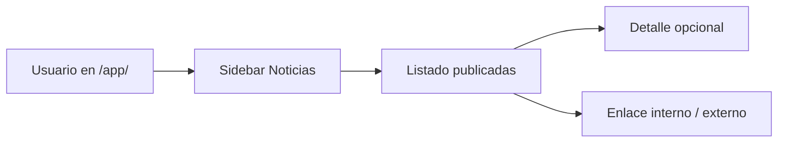
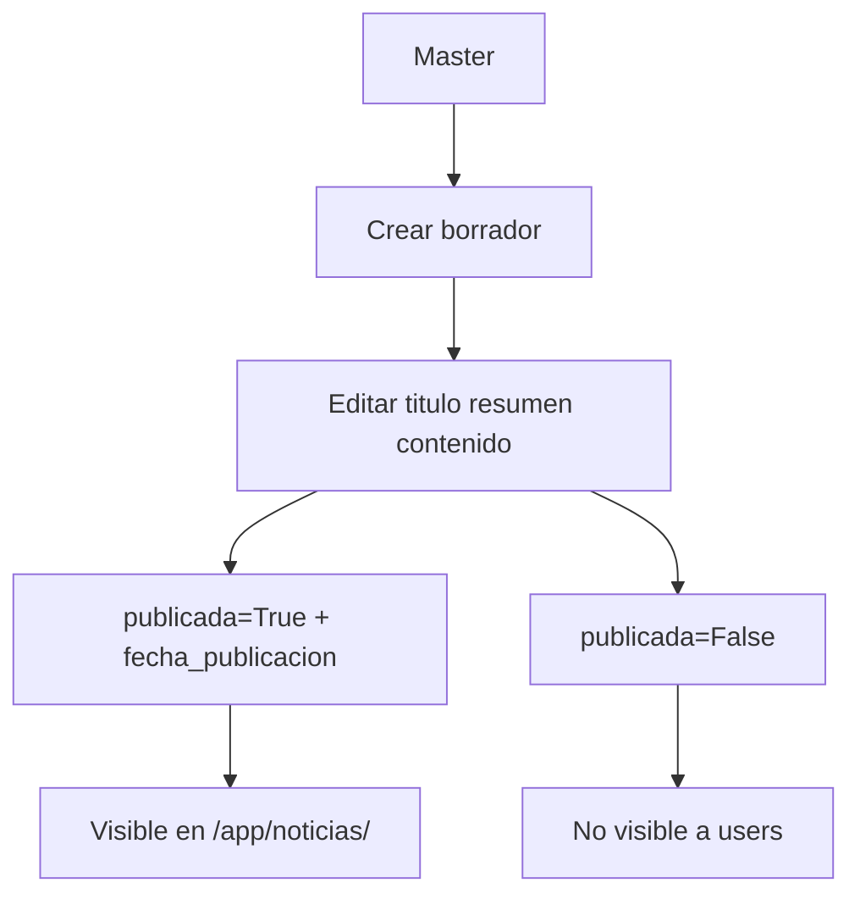

# BAKEBUDGE — Noticias del sistema

Diseño funcional de la app **`apps.noticias`**: comunicaciones a usuarios autenticados sobre mejoras, nuevas funciones y avisos.

**Estado:** **Conforme v1.2** — diseño funcional e implementación Django aprobados; **Copiar** (v1.1) y **primer acceso → Noticias** (v1.2) confirmados (2026-06-20). Checklist: [`administracion-noticias-checklist-conforme.md`](administracion-noticias-checklist-conforme.md).

**Relacionado:** [`ui-ux.md`](ui-ux.md), [`flujos.md`](flujos.md), [`roadmap.md`](roadmap.md), template `apps/noticias/templates/noticias/feed.html`.

---

## Propósito

| Pregunta | Respuesta |
|----------|-----------|
| ¿Qué es? | Feed de noticias **globales** visibles en `/app/noticias/` para usuarios con acceso al sistema |
| ¿Para quién? | Usuarios **User** (`U`) y **Master** (`M`) autenticados |
| ¿Quién publica? | Solo **Master** (crear, editar, publicar, archivar) |
| ¿Primer ingreso? | Tras completar seguridad (correo + 2FA), el **primer acceso** redirige aquí — **Conforme v1.1** (2026-06-20). Siguientes ingresos → Dashboard. Ver [`acceso-reglas.md`](acceso-reglas.md) |
| ¿Aislamiento por owner? | **No** — las noticias son del producto BAKEBUDGE, no por cuenta de repostería |

Distinto del blog público de Fase 5 (marketing/SEO en landing).

---

## App Django

| Elemento | Valor |
|----------|-------|
| App | `apps.noticias` |
| URL usuario | `/app/noticias/` |
| URL Master (CRUD) | `/app/noticias/gestion/` o Django admin en v1 |
| Template lectura | `noticias/noticia_list.html` |
| Template detalle (opcional v1) | `noticias/noticia_detail.html` |

---

## Modelo `Noticia`

**Tabla:** `noticias_noticia`

| Campo | Tipo | Notas |
|-------|------|-------|
| `titulo` | CharField(200) | Título visible en listado |
| `slug` | SlugField(220) | Único; para URL detalle (opcional v1) |
| `resumen` | CharField(300) | Texto corto en tarjeta |
| `contenido` | TextField | Cuerpo completo (HTML permitido o texto plano) |
| `tipo` | CharField(20) | `nueva_funcion`, `mejora`, `aviso`, `mantenimiento` |
| `publicada` | BooleanField | Default `False`; solo `True` visible a usuarios |
| `fecha_publicacion` | DateTimeField | Orden del feed; default al publicar |
| `destacada` | BooleanField | Opcional: pin arriba del listado |
| `enlace_interno` | CharField(200) | Opcional: ruta `/app/...` relacionada |
| `enlace_externo` | URLField | Opcional |
| `created_by` | FK → User | Master que creó |
| `updated_by` | FK → User | Master última edición |
| `created_at` | DateTimeField | auto_now_add |
| `updated_at` | DateTimeField | auto_now |

**Índices:** `(publicada, -fecha_publicacion)`, `(tipo)`.

### Tipos (`tipo`)

| Código | Etiqueta UI | Uso |
|--------|-------------|-----|
| `nueva_funcion` | Nueva función | Lanzamiento de módulo o feature |
| `mejora` | Mejora | Cambio que mejora UX o cálculos |
| `aviso` | Aviso | Recordatorios, buenas prácticas |
| `mantenimiento` | Mantenimiento | Ventanas de downtime, migraciones |

---

## Modelo opcional v2: `NoticiaLectura`

Registro por usuario de noticias leídas (badge “nuevo” en sidebar). **Fuera de alcance v1**; documentado para extensión futura.

| Campo | Tipo |
|-------|------|
| `usuario` | FK → User |
| `noticia` | FK → Noticia |
| `leida_en` | DateTimeField |

---

## Flujos

### Primer acceso post-seguridad — **Conforme v1.2**

1. Usuario completa wizard login → correo → 2FA (`apps.security`).
2. Si `primer_acceso_app_completado = False` → redirect **`/app/noticias/`** (no Dashboard).
3. Master debe tener publicadas noticias de bienvenida / primeros pasos (global o personal).
4. Flag marcado `True`; próximos ingresos → Dashboard.

Ver [`acceso-reglas.md`](acceso-reglas.md) · [`acceso-checklist-conforme.md`](acceso-checklist-conforme.md).

### Lectura (User / Master)

1. Usuario autenticado con `can_access_app` entra a `/app/noticias/`.
2. Vista lista `Noticia` con `publicada=True`, orden `-fecha_publicacion`, `-destacada`.
3. Tarjeta muestra: tipo (badge), fecha, título, resumen, enlace si existe.
4. v1: listado completo en una página; detalle solo si el contenido es largo.

### Publicación (Master)

1. Master crea noticia en borrador (`publicada=False`).
2. Revisa contenido y tipo.
3. Al publicar: `publicada=True`, `fecha_publicacion=now()`.
4. Despublicar: `publicada=False` (histórico conservado).

---

## Funciones / servicios (implementación futura)

| Función | Ubicación | Descripción |
|---------|-----------|-------------|
| `list_noticias_publicadas()` | `apps/noticias/services/queries.py` | Queryset para usuarios |
| `publish_noticia(noticia, user)` | `apps/noticias/services/publish.py` | Valida Master, setea fechas |
| `get_noticias_recientes(limit=5)` | queries | Widget opcional en dashboard |
| Decorador `@master_required` | `apps/core/decorators.py` | CRUD gestión |

**Formularios:** HTML puro en templates; vistas procesan `request.POST` (sin `django.forms`). Ver [`ui-ux.md`](ui-ux.md).

---

## UI / prototipo

- Sidebar: **Noticias** (entre Estadísticas y Perfil).
- Template: `apps/noticias/templates/noticias/feed.html` — tarjetas con badges por tipo.
- Perfil: `apps/accounts/templates/accounts/perfil.html`.

---

## Implementación Django v1 / v1.1

- [x] Crear app `apps.noticias` + migraciones
- [x] Modelo `Noticia` según tabla anterior
- [x] Vista listado `/app/noticias/` (User + Master)
- [x] CRUD Master en `/app/administracion/noticias/`
- [x] Acción **Copiar** — clona registro y destinatarios; abre edición del clon (v1.1)
- [x] Integración **primer acceso → Noticias** vía `apps.security` (v1.2)
- [x] Templates Django desde prototipo HTML
- [x] Tests automatizados visibilidad y copiar (15 casos)
- [ ] (Opcional) Widget “últimas noticias” en dashboard
- [ ] (v2) `NoticiaLectura` + contador no leídas en sidebar

Checklist: [`administracion-noticias-checklist-conforme.md`](administracion-noticias-checklist-conforme.md)

---

## Fuera de alcance

- Noticias por usuario/owner (no aplica).
- RSS público o SEO (Fase 5 — blog marketing).
- Notificaciones push o email masivo (futuro).
