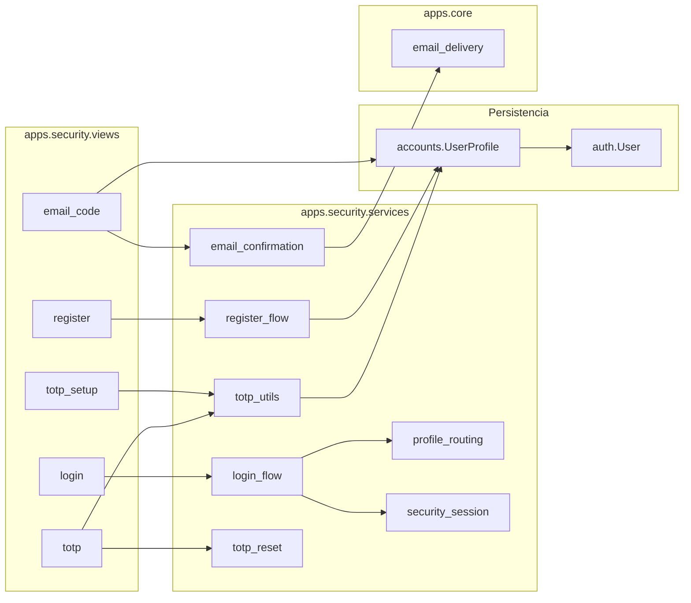

# BAKEBUDGE — Guía de implementación: login, registro, correo y 2FA

Documento **técnico** para implementar en BAKEBUDGE el flujo de validación de usuario: **registro** → credenciales → código por correo → TOTP (autenticador) → dashboard autenticado (`/app/`).

Basado en el patrón probado de CODAS, adaptado a usuarios individuales sin multi-empresa.

**Contrato funcional (mensajes y pasos):** [`BAKEBUDGE_SECURITY.md`](BAKEBUDGE_SECURITY.md)  
**Campos de modelo:** [`modelos.md`](modelos.md) (`UserProfile` en `apps.accounts`)  
**Referencia origen:** [`CODAS_SECURITY.md`](CODAS_SECURITY.md), [`CODAS_SECURITY_PORTABLE_GUIDE.md`](CODAS_SECURITY_PORTABLE_GUIDE.md)

---

## 1. Qué incluye el paquete

| Capa | App / módulo | Responsabilidad |
|------|--------------|-----------------|
| **Wizard HTTP** | `apps.security` | Login, registro, correo, QR/TOTP, reset 2FA, cancelar |
| **Perfil** | `apps.accounts` | `UserProfile` con flags de negocio + seguridad |
| **Correo** | `apps.core/services/email_delivery.py` | Envío transaccional (consola / Resend / SMTP) |
| **Destino** | `apps.dashboard` | Home autenticado `/app/` |
| **Pública** | `apps.public_site` | Landing, links a login/registro |
| **Settings** | `config/settings/` | `LOGIN_URL`, correo, apps |

### Flujos cubiertos

1. **Registro público** — crea cuenta; onboarding en primer login  
2. **Usuario nuevo** — correo (5 min) + alta TOTP con QR  
3. **Usuario activo** — solo TOTP tras contraseña  
4. **Rama intermedia** — correo confirmado, falta TOTP → salta al QR  
5. **Cambio / actualización 2FA** — reset y repetir ciclo completo  

---

## 2. Arquitectura



**Estado entre pasos:** sesión `security_pending_user_id` (`apps/security/services/security_session.py`).  
**Sin `login()` completo** hasta TOTP válido.  
**Redirección final:** `dashboard:home` → `/app/`.

---

## 3. Estructura de archivos a crear

### 3.1 App `apps/security`

```
apps/
└── security/
    ├── apps.py              # name = "apps.security"
    ├── urls.py
    ├── views.py
    ├── services/
    │   ├── __init__.py
    │   ├── login_flow.py
    │   ├── register_flow.py
    │   ├── email_confirmation.py
    │   ├── profile_routing.py
    │   ├── security_session.py
    │   ├── totp_utils.py
    │   └── totp_reset.py
    ├── templates/security/
    │   ├── login.html
    │   ├── register.html
    │   ├── email_code.html
    │   ├── totp_setup.html
    │   ├── totp.html
    │   └── actualizar_2fa.html
    └── tests.py
```

### 3.2 Campos de seguridad en `apps.accounts.UserProfile`

Además de campos de negocio (ver [`modelos.md`](modelos.md)):

| Campo | Tipo | Default | Uso |
|-------|------|---------|-----|
| `email_confirmed` | BooleanField | `False` | Paso correo OK |
| `email_confirm_code` | CharField(6), null | — | Código enviado |
| `email_confirm_exp` | DateTimeField, null | — | Caducidad +5 min |
| `totp_secret` | CharField(64), null | — | Secreto pyotp |
| `tfa_verified` | BooleanField | `False` | TOTP verificado |
| `last_totp_reset` | DateTimeField, null | — | Auditoría |
| `status` | CharField(1) | `'A'` | A=activo, I=inactivo |
| `locked_until` | DateTimeField, null | — | Bloqueo temporal |

**Propiedad útil:**

```python
@property
def is_security_complete(self):
    return self.email_confirmed and self.tfa_verified and bool(self.totp_secret)
```

### 3.3 Correo

```
apps/core/services/email_delivery.py
config/settings/_email.py
```

### 3.4 URLs

```python
# config/urls.py
path("", include("apps.public_site.urls")),
path("", include("apps.security.urls")),
path("app/", include("apps.dashboard.urls")),
```

| URL | Vista | Nombre |
|-----|-------|--------|
| `/ingresar/` | `login` | `security:login` |
| `/registro/` | `register` | `security:register` |
| `/seguridad/correo/` | `email_code` | `security:email_code` |
| `/seguridad/totp-config/` | `totp_setup` | `security:totp_setup` |
| `/seguridad/totp/` | `totp` | `security:totp` |
| `/seguridad/actualizar-2fa/` | `actualizar_2fa` | `security:actualizar_2fa` |
| `/app/seguridad/cuenta/` | `cuenta_seguridad` | `accounts:cuenta_seguridad` |
| `/seguridad/cancelar/` | `cancel` | `security:cancel` |

---

## 4. Dependencias Python

Añadir a `requirements.txt`:

```text
pyotp>=2.9,<3
qrcode>=7.4,<9
Pillow>=10.0,<12
resend>=2.0,<3          # producción (API HTTPS)
django-environ>=0.11
```

---

## 5. Configuración Django

### 5.1 `INSTALLED_APPS`

```python
INSTALLED_APPS = [
    # ...
    "apps.core",
    "apps.accounts",
    "apps.security",
    "apps.public_site",
    "apps.dashboard",
    "apps.catalog",
    "apps.recipes",
    "apps.production",
]
```

### 5.2 Auth redirects

```python
LOGIN_URL = "/ingresar/"
LOGIN_REDIRECT_URL = "/app/"
LOGOUT_REDIRECT_URL = "/"
```

### 5.3 Correo local vs producción

| Entorno | Comportamiento |
|---------|----------------|
| **local** | `EMAIL_DELIVERY=console` → código en terminal |
| **producción** | Resend + dominio verificado |

Variables (`.env.example`):

```ini
EMAIL_DELIVERY=console
RESEND_API_KEY=
DEFAULT_FROM_EMAIL=BAKEBUDGE <noreply@tudominio.com>
```

---

## 6. Routing tras contraseña correcta

Lógica en `apps/security/services/profile_routing.py`:

| Condición | Siguiente pantalla |
|-----------|-------------------|
| Sin `User.email` | Error: contacte soporte |
| `email_confirmed` + `tfa_verified` + `totp_secret` | `security:totp` (activo) |
| `email_confirmed` + not `tfa_verified` | `security:totp_setup` (QR) |
| not `email_confirmed` | `security:email_code` |
| Resto | `security:totp_setup` |

Tras TOTP correcto → `login(request, user)` + redirect según `post_login_routing`:

- `primer_acceso_app_completado = False` → `noticias:feed`
- `True` → `dashboard:home`

---

## 7. Decorador / middleware para zona privada

```python
# apps/core/decorators.py o apps/security/decorators.py
def security_complete_required(view_func):
    @login_required
    def wrapper(request, *args, **kwargs):
        profile = request.user.profile
        if not profile.is_security_complete:
            return redirect(resolve_security_step(profile))
        return view_func(request, *args, **kwargs)
    return wrapper
```

Aplicar en todas las vistas de `apps.dashboard`, `apps.catalog`, `apps.recipes`, `apps.production`.

---

## 8. Checklist de implementación

### Fase 1 — Código base

- [ ] Crear app `apps/security/` con estructura § 3.1  
- [ ] Extender `apps.accounts.UserProfile` con campos § 3.2  
- [ ] Signal `post_save` en `User` → crear `UserProfile`  
- [ ] `apps/core/services/email_delivery.py` + `config/settings/_email.py`  
- [ ] Dependencias § 4  
- [ ] URLs § 3.4  
- [ ] Plantillas con estilo pastel ([`ui-ux.md`](ui-ux.md))  
- [ ] Issuer TOTP: `"BAKEBUDGE"` en `totp_utils.py`  
- [ ] Asunto correo: *«Tu código BAKEBUDGE»*  

### Fase 2 — Base de datos

- [ ] `makemigrations` / `migrate`  
- [ ] Usuario de prueba con email válido  

Estados **onboarding forzado:**

```text
email_confirmed = False
tfa_verified = False
totp_secret = NULL
```

Estados **usuario activo:**

```text
email_confirmed = True
tfa_verified = True
totp_secret = <secreto base32>
User.email = <correo válido>
```

### Fase 3 — Correo

- [ ] Local: consola  
- [ ] Producción: Resend + dominio  
- [ ] Probar Gmail / Outlook  

### Fase 4 — Pruebas funcionales

| # | Escenario | Resultado esperado |
|---|-----------|-------------------|
| 1 | Registro nuevo | User + Profile → login → correo → QR → TOTP → `/app/` |
| 2 | Usuario activo | Password → TOTP → `/app/` |
| 3 | Código correo incorrecto | Error + reenvío / cancelar |
| 4 | TOTP incorrecto | Reintento |
| 5 | Reset 2FA | Vuelve a correo + QR |
| 6 | Sin email en User | Error antes de enviar |
| 7 | Sin UserProfile | Error perfil |
| 8 | Acceso `/app/` sin 2FA | Redirige al paso pendiente |

---

## 9. Personalización BAKEBUDGE

| Elemento | Ubicación | Valor BAKEBUDGE |
|----------|-----------|-----------------|
| Issuer TOTP | `totp_utils.py` | `BAKEBUDGE` |
| Asunto correo | `email_confirmation.py` | *Código de verificación BAKEBUDGE* |
| Login URL | settings | `/ingresar/` |
| Dashboard | settings | `/app/` |
| Estilos | `security/*.html` | Tokens pastel de [`ui-ux.md`](ui-ux.md) |
| Copys login | templates | Tono cercano repostería |

---

## 10. Diferencias respecto a CODAS

| Aspecto | CODAS | BAKEBUDGE |
|---------|-------|-----------|
| Usuarios | Tipos (SU, etc.), multi-módulo | Individuales, mismo dashboard |
| Registro | Admin / backoffice | Público desde landing |
| Destino login | `/panel/` | `/app/` |
| Perfil | `apps.userprofile` (CODAS) | `apps.accounts.UserProfile` |
| Empresa | Modelo `Company` | No aplica |
| Datos | Por perfil/empresa | Aislados por `owner=request.user` |

---

## 11. Limitaciones conocidas

1. Código de correo en texto plano en BD; valorar hash en v2.  
2. Reset 2FA solo exige contraseña; correo como segundo factor al re-enrolar.  
3. Resend sandbox sin dominio: solo email de cuenta Resend.  
4. SMTP bloqueado en algunos PaaS free → usar Resend.  

---

## 12. Orden recomendado de implementación

1. Scaffold Django + carpeta `apps/` + `apps.accounts.UserProfile` (negocio + seguridad).  
2. `apps/core/email_delivery` + settings correo.  
3. App `apps/security` (registro + login wizard).  
4. App `apps/dashboard` mínima (`/app/`).  
5. `apps/public_site` landing con links Entrar/Registro.  
6. Decorador `security_complete_required` en apps privadas.  
7. Pruebas funcionales § 8.  

---

*Guía de implementación — seguridad BAKEBUDGE. Adaptada desde CODAS, jun/2026.*
