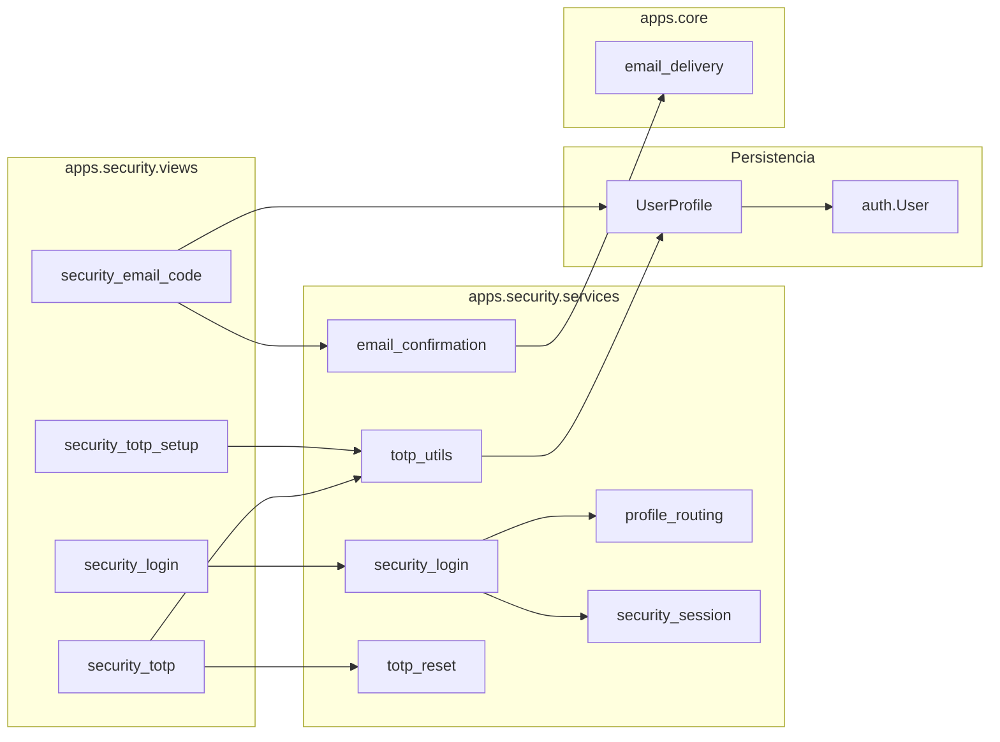

# CODAS — Guía portable: login, correo y doble factor (2FA)

Documento **base modelo** para instalar en **otro proyecto Django** el mismo flujo de validación de usuario que CODAS: credenciales → código por correo → TOTP (autenticador) → panel autenticado.

**Contrato funcional (mensajes y pasos):** [`CODAS_SECURITY.md`](CODAS_SECURITY.md)  
**Campos de modelo:** [`CODAS_MODELS.md`](CODAS_MODELS.md) (`UserProfile`)  
**Correo (Resend / SMTP):** [`codas/settings/_email.py`](../codas/settings/_email.py), [`.env.example`](../.env.example), checklist Railway § D.3 en [`CODAS_DEPLOYMENT_RAILWAY_CHECKLIST.md`](CODAS_DEPLOYMENT_RAILWAY_CHECKLIST.md)

---

## 1. Qué incluye el paquete

| Capa | Responsabilidad |
|------|-----------------|
| **`apps.security`** | Wizard HTTP: login, correo, QR/TOTP, reset 2FA |
| **`apps.userprofile`** | Modelo `UserProfile` con flags y secretos de seguridad |
| **`apps.core.services.email_delivery`** | Envío transaccional (Resend HTTPS o SMTP legacy) |
| **Settings** | `LOGIN_URL`, correo, apps en `INSTALLED_APPS` |
| **Plantillas** | Tailwind + `core/base.html` (login público) |

Flujos cubiertos (ver diagramas en `CODAS_SECURITY.md`):

1. **Usuario nuevo** — correo (5 min) + alta TOTP con QR  
2. **Usuario activo** — solo TOTP tras contraseña  
3. **Rama intermedia** — correo ya confirmado, falta TOTP → salta al QR  
4. **Cambio / actualización 2FA** — reset y repetir ciclo completo  

---

## 2. Arquitectura (resumen)



**Estado entre pasos:** clave de sesión `security_pending_user_id` (`security_session.py`).  
**No hay `login()` completo** hasta que TOTP es válido (setup o activo).  
**Redirección final:** `dashboard:home` (`/panel/`) — adaptar en vistas si el nuevo proyecto usa otra URL.

---

## 3. Inventario de archivos a copiar

### 3.1 App `security` (copiar carpeta completa)

```
apps/security/
├── __init__.py          (si existe)
├── apps.py
├── admin.py
├── models.py            (vacío o mínimo; lógica en userprofile)
├── urls.py
├── views.py
├── utils.py             (si existe)
├── services/
│   ├── __init__.py
│   ├── actualizar_2fa.py
│   ├── email_confirmation.py
│   ├── profile_routing.py
│   ├── security_login.py
│   ├── security_session.py
│   ├── totp_reset.py
│   └── totp_utils.py
├── templates/security/
│   ├── security_login.html
│   ├── security_email_code.html
│   ├── security_totp_setup.html
│   ├── security_totp.html
│   └── security_actualizar_2fa.html
└── tests.py             (opcional; recomendado)
```

### 3.2 Perfil de usuario (mínimo indispensable)

Opción **A — Copiar app `userprofile`** (recomendado si el nuevo proyecto también gestiona perfiles en panel).

Opción **B — Solo campos de seguridad** en un modelo propio (p. ej. `AccountProfile`) con los mismos nombres y tipos:

| Campo | Tipo | Uso en 2FA |
|-------|------|------------|
| `user` | OneToOne → `AUTH_USER_MODEL` | Enlace Django User |
| `email_confirmed` | Boolean, default `False` | Paso correo completado |
| `email_confirm_code` | Char(6), null | Código enviado |
| `email_confirm_exp` | DateTime, null | Caducidad (+5 min) |
| `totp_secret` | Char(64), null | Secreto pyotp |
| `tfa_verified` | Boolean, default `False` | TOTP verificado |
| `last_totp_reset` | DateTime, null | Auditoría reset §9 |
| `status` | Char (A/I) | Bloqueo cuenta inactiva |
| `locked_until` | DateTime, null | Bloqueo temporal (opcional) |

Referencia completa: [`apps/userprofile/models.py`](../apps/userprofile/models.py).

**Importante:** `apps.security` importa `UserProfile` desde `apps.userprofile.models`. Al portar, unificar imports o crear alias en el nuevo modelo.

### 3.3 Correo transaccional

```
apps/core/services/email_delivery.py
codas/settings/_email.py          → renombrar paquete settings si aplica
```

### 3.4 Plantillas base (login público)

`security/*.html` extienden `core/base.html`. Copiar o adaptar:

```
templates/core/base.html
static/css/tailwind.css           (o equivalente visual)
```

### 3.5 URLs raíz

Fragmento de [`codas/urls.py`](../codas/urls.py):

```python
path("", include("apps.security.urls")),
```

Rutas públicas (`apps/security/urls.py`):

| URL | Vista | Nombre |
|-----|-------|--------|
| `/ingresar/` | `security_login` | `security:security_login` |
| `/seguridad/correo/` | `security_email_code` | `security:security_email_code` |
| `/seguridad/totp-config/` | `security_totp_setup` | `security:security_totp_setup` |
| `/seguridad/totp/` | `security_totp` | `security:security_totp` |
| `/seguridad/actualizar-2fa/` | `security_actualizar_2fa` | `security:security_actualizar_2fa` |
| `/seguridad/cancelar/` | `security_cancel` | `security:security_cancel` |

---

## 4. Dependencias Python

En [`requirements.txt`](../requirements.txt):

```text
pyotp>=2.9,<3
qrcode>=7.4,<9
Pillow>=10.0,<12
resend>=2.0,<3          # producción Railway Free / API HTTPS
python-dotenv>=1.0,<2   # si usa .env como CODAS
```

SMTP clásico no requiere `resend`; Railway Free bloquea SMTP saliente — usar Resend (ver § 7).

---

## 5. Configuración Django

### 5.1 `INSTALLED_APPS`

```python
INSTALLED_APPS = [
    # ...
    "apps.core",
    "apps.userprofile",   # o su equivalente
    "apps.security",
    "apps.dashboard",     # destino post-login; opcional otro nombre
]
```

### 5.2 Auth redirects

En `settings/base.py` (CODAS):

```python
LOGIN_URL = "/ingresar/"
LOGIN_REDIRECT_URL = "/panel/"
```

Vistas protegidas con `@login_required` redirigen a `LOGIN_URL` si no hay sesión.

### 5.3 Producción — correo obligatorio

[`codas/settings/production.py`](../codas/settings/production.py):

```python
from ._email import build_email_settings, validate_email_settings_for_production

globals().update(build_email_settings(require_smtp=True))
validate_email_settings_for_production()
```

**No** definir `EMAIL_BACKEND` en `.env`; lo asigna `_email.py`.

### 5.4 Local — consola o Resend

[`codas/settings/local.py`](../codas/settings/local.py):

```python
globals().update(build_email_settings(require_smtp=False))
```

Sin credenciales → correo en consola del `runserver` (útil para ver el código 2FA en desarrollo).

---

## 6. Rutas tras contraseña correcta

Lógica en [`apps/security/services/profile_routing.py`](../apps/security/services/profile_routing.py):

| Condición | Siguiente pantalla |
|-----------|-------------------|
| Sin `User.email` | Error: contacte administrador |
| `email_confirmed` + `tfa_verified` + `totp_secret` | `security_totp` (activo) |
| `email_confirmed` + not `tfa_verified` | `security_totp_setup` (QR) |
| not `email_confirmed` | `security_email_code` |
| Resto | `security_totp_setup` |

Tras TOTP correcto → `login(request, user)` + `redirect("dashboard:home")`.

**Adaptar en nuevo proyecto:** buscar `dashboard:home` en `views.py` y sustituir por la URL name del home autenticado.

---

## 7. Correo en producción (Resend + dominio)

Configuración validada en CODAS (jun/2026):

| Pieza | Valor |
|-------|--------|
| DNS | **Cloudflare** — `codassystem.com` |
| Resend | Dominio **Verified** |
| Railway variables | `EMAIL_DELIVERY=resend`, `RESEND_API_KEY`, `DEFAULT_FROM_EMAIL=CODAS <noreply@codassystem.com>` |

Flujo de envío del código 2FA:

1. `security_email_code` (GET) → `issue_new_email_code(profile)`  
2. `send_email_confirmation` → `send_codas_mail` → SDK Resend o SMTP  
3. Usuario recibe código de 6 dígitos (caduca 5 min)

**Modo prueba Resend:** `onboarding@resend.dev` solo entrega al correo de la cuenta Resend. Producción real requiere dominio verificado.

Variables ejemplo (`.env` / Railway):

```ini
EMAIL_DELIVERY=resend
RESEND_API_KEY=re_...
DEFAULT_FROM_EMAIL=CODAS <noreply@tudominio.com>
```

Documentación detallada: § D.3 y § J.6 en [`CODAS_DEPLOYMENT_RAILWAY_CHECKLIST.md`](CODAS_DEPLOYMENT_RAILWAY_CHECKLIST.md).

---

## 8. Checklist de instalación en proyecto nuevo

### Fase 1 — Código

- [ ] Copiar `apps/security/` completa  
- [ ] Copiar o crear modelo con campos § 3.2  
- [ ] Copiar `apps/core/services/email_delivery.py` y `codas/settings/_email.py`  
- [ ] Añadir dependencias § 4  
- [ ] Registrar apps en `INSTALLED_APPS`  
- [ ] Incluir URLs § 3.5  
- [ ] Copiar/adaptar plantillas `security/` y `core/base.html`  
- [ ] Ajustar imports `UserProfile` si el modelo tiene otro nombre/app  
- [ ] Cambiar `issuer` en `totp_utils.build_provisioning_uri` (default `"CODAS"`)  
- [ ] Cambiar asunto/cuerpo en `email_confirmation.send_email_confirmation`  
- [ ] Redirigir post-login a la URL del nuevo proyecto  

### Fase 2 — Base de datos

- [ ] `python manage.py makemigrations`  
- [ ] `python manage.py migrate`  
- [ ] Crear usuarios con `User.email` **no vacío** y fila `UserProfile`  

Estados iniciales para **forzar onboarding**:

```text
email_confirmed = False
tfa_verified = False
totp_secret = NULL
```

Estados para **usuario activo** (solo TOTP en login):

```text
email_confirmed = True
tfa_verified = True
totp_secret = <secreto base32>
User.email = <correo válido>
```

### Fase 3 — Correo

- [ ] Local: `EMAIL_DELIVERY=console` o Resend con API key de prueba  
- [ ] Producción: Resend + dominio verificado (§ 7)  
- [ ] Probar envío a Gmail, Hotmail u otro proveedor  

### Fase 4 — Pruebas funcionales

| # | Escenario | Resultado esperado |
|---|-----------|-------------------|
| 1 | Usuario nuevo, password OK | Pantalla correo → código → QR → TOTP → panel |
| 2 | Usuario activo | Password → TOTP → panel (sin correo ni QR) |
| 3 | Código correo incorrecto | Mensaje validación + reenvío / cancelar |
| 4 | TOTP incorrecto | Reintento en misma pantalla |
| 5 | Reset 2FA desde TOTP activo | Vuelve a correo + QR |
| 6 | Actualizar 2FA (pantalla dedicada) | Credenciales + ciclo completo |
| 7 | Usuario sin email | Error antes de enviar correo |
| 8 | Sin `UserProfile` | Error de perfil no configurado |

Tests de referencia: [`apps/security/tests.py`](../apps/security/tests.py) (si existen casos).

---

## 9. Integración con el resto del panel

Patrón usado en CODAS para vistas `@login_required`:

```python
try:
    request.user.profile
except UserProfile.DoesNotExist:
    return redirect("security:security_login")
```

Apps que lo aplican: `dashboard`, `userprofile`, `company`, `table_design`, etc.

En el nuevo proyecto, repetir el decorador o middleware que exija perfil antes del panel.

---

## 10. Personalización habitual

| Elemento | Archivo | Notas |
|----------|---------|--------|
| Textos de error login | `services/security_login.py` | Constantes `MSG_*` |
| Caducidad código correo | `services/email_confirmation.py` | `timedelta(minutes=5)` |
| Issuer TOTP en app autenticador | `services/totp_utils.py` | Parámetro `issuer` |
| Mensajes TOTP/correo en UI | `views.py` | `MSG_TOTP_INVALID`, `MSG_EMAIL_INVALID` |
| Clave sesión wizard | `services/security_session.py` | `SESSION_PENDING_USER_ID` |
| Estilos login | `templates/security/*.html` | Tailwind / clases CODAS |

---

## 11. Limitaciones y decisiones conocidas

1. **Código de correo en texto plano** en BD (`email_confirm_code`); valorar hash en implementaciones futuras (`CODAS_SECURITY.md` § 6).  
2. **Reset 2FA** solo exige contraseña, no TOTP anterior; el correo actúa como segundo factor al re-enrolar (§ 9.4).  
3. **Resend sandbox** sin dominio propio: solo el email de la cuenta Resend recibe códigos.  
4. **Railway Free:** SMTP bloqueado; usar Resend.  
5. Al portar, **eliminar `print` de depuración** en `security_login.py` si aún existen en el repo origen.  
6. La plantilla de correo muestra «Se envió…» solo si el envío fue exitoso (`email_sent` en contexto).

---

## 12. Mapa rápido servicio → vista

| Servicio | Vista que lo usa |
|----------|------------------|
| `process_security_login_step` | `security_login` |
| `process_security_actualizar_2fa_step` | `security_actualizar_2fa` |
| `issue_new_email_code`, `send_email_confirmation`, `verify_submitted_email_code` | `security_email_code` |
| `generate_totp_secret`, `verify_totp_code`, QR | `security_totp_setup` |
| `verify_totp_code`, `apply_profile_2fa_reset` | `security_totp` |
| `set_pending_user`, `get_pending_user_id`, `clear_security_flow` | Todas las vistas del wizard |

---

## 13. Orden recomendado al clonar desde CODAS

1. Crear repo/carpeta nuevo (§ guía separación de proyectos).  
2. Copiar bloques § 3 en el orden: `userprofile` (modelo) → `core/email_delivery` → `_email.py` → `security`.  
3. Ajustar `INSTALLED_APPS`, URLs, `LOGIN_*`.  
4. Migrar BD y crear superusuario de prueba con email.  
5. Probar flujo en local con `EMAIL_DELIVERY=console`.  
6. Configurar Resend + dominio antes del deploy público.  
7. Mantener [`CODAS_SECURITY.md`](CODAS_SECURITY.md) como contrato; actualizar **este documento** si cambia el inventario de archivos.

---

*Guía portable — login, validación por correo y 2FA TOTP. Basada en `apps.security` y despliegue Resend (`codassystem.com`) de CODAS, jun/2026.*
