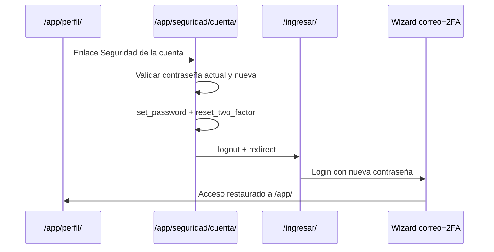

# Seguridad de la cuenta — cambio de contraseña + reset 2FA

**Estado:** **Conforme v1** (2026-06-20) — implementación y validación manual aprobadas.

Flujo autogestionado para usuarios **logueados en `/app/`** que desean cambiar contraseña y reiniciar correo + autenticador 2FA.

**Checklist:** [`cuenta-seguridad-checklist-conforme.md`](cuenta-seguridad-checklist-conforme.md)  
**Reglas acceso:** [`acceso-reglas.md`](acceso-reglas.md#seguridad-de-la-cuenta-desde-perfil)  
**Perfil:** [`perfil-reglas.md`](perfil-reglas.md)  
**Servicio reset 2FA:** `apps/security/services/totp_reset.py`  
**Implementación:** `apps/accounts/views.cuenta_seguridad`

```bash
cd BAKEBUDGE
.venv\Scripts\python.exe manage.py runserver
# http://127.0.0.1:8000/app/seguridad/cuenta/  (desde Perfil → Seguridad de la cuenta)
```

---

## Cuándo usar

| Flujo | URL | Contexto |
|-------|-----|----------|
| **Seguridad de la cuenta** (este doc) | `/app/seguridad/cuenta/` | Usuario logueado en `/app/`; cambia contraseña + resetea 2FA |
| **Actualizar 2FA** (wizard) | `/seguridad/actualizar-2fa/` | Usuario en sesión parcial (`pending_user`) durante login/TOTP |

---

## Secuencia

1. Usuario en **Perfil** → enlace **Seguridad de la cuenta**.
2. Pantalla `/app/seguridad/cuenta/` con advertencia, datos readonly y formulario.
3. **POST** valida identidad y nueva contraseña.
4. Transacción atómica: `set_password` + `reset_two_factor`.
5. `logout` + limpiar `security_session`.
6. Redirect a `/ingresar/` con mensaje informativo.
7. Re-login con nueva contraseña → wizard estándar: correo → TOTP → `/app/` (**Dashboard**; el flag `primer_acceso_app_completado` no se resetea).



---

## Pantalla

### Datos readonly

- `username`, `email`, `nombre_negocio`

### Formulario

| Campo | Validación |
|-------|------------|
| Contraseña actual | `authenticate()` — obligatoria |
| Nueva contraseña | Mín. 8; `validate_password()`; ≠ anterior; ≠ username |
| Confirmar nueva | Debe coincidir |
| Checkbox confirmación | Obligatorio |

### Efecto en `UserProfile` (solo tras POST exitoso)

| Campo | Valor |
|-------|-------|
| `email_confirmed` | `False` |
| `email_confirm_code` / `email_confirm_exp` | `NULL` |
| `totp_secret` | `NULL` |
| `tfa_verified` | `False` |
| `last_totp_reset` | `now()` |

**No se modifican:** `status`, `locked_until`, `user_type`, datos de negocio, moneda, unidades, `primer_acceso_app_completado`.

---

## Criterios de aceptación (v1)

- [x] Master/User logueado accede desde Perfil a `/app/seguridad/cuenta/`.
- [x] Contraseña actual incorrecta → error; no resetea ni cierra sesión.
- [x] Nueva contraseña inválida (igual anterior o username) → error.
- [x] POST exitoso → reset 2FA, logout, redirect login.
- [x] Re-login completa wizard correo + TOTP y restaura acceso a `/app/`.
- [x] Datos de negocio en Perfil se conservan.
- [x] Validación manual con usuario nuevo — **OK** (2026-06-20).

---

## Archivos

| Archivo | Rol |
|---------|-----|
| `apps/accounts/views.py` | Vista `cuenta_seguridad` |
| `apps/accounts/services/cuenta_seguridad_helpers.py` | Parseo, validación, aplicación |
| `apps/accounts/templates/accounts/cuenta_seguridad.html` | Template |
| `apps/accounts/static/accounts/css/cuenta_seguridad.css` | Estilos banner/acciones |
| `apps/accounts/tests.py` | Tests validación y vista |

---

## Fuera de alcance v1

- Recuperación de contraseña sin sesión («olvidé mi contraseña») → soporte
- Invalidar sesiones en otros dispositivos
- Cambio de email o username desde esta pantalla
- Avatar

---

## Registro

| Fecha | Evento |
|-------|--------|
| 2026-06-20 | Implementación v1 — flujo acordado con usuario |
| 2026-06-20 | Validación manual (usuario nuevo) — **Conforme**, probado y confirmado por usuario |
