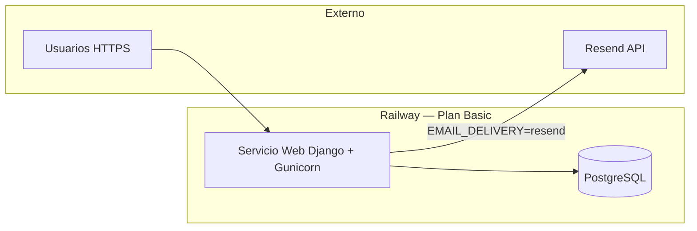

# Plan de tareas — Despliegue BAKEBUDGE en Railway + Resend

> **Plataforma:** [Railway](https://docs.railway.com/) — Plan **Basic**  
> **Correo producción:** [Resend](https://resend.com/docs/dashboard/emails/introduction)  
> **Última actualización:** 2026-06-26  
> **Estado:** **En producción** — fase de **prueba de envíos de correo** (Bloque C); deploy y Postgres OK

Documento maestro de tareas para llevar BAKEBUDGE de entorno local a producción. Cada bloque tiene checklist verificable; no marcar **Hecho** hasta probar en Railway.

**Referencias oficiales:**


| Tema                                | Enlace                                                                                                           |
| ----------------------------------- | ---------------------------------------------------------------------------------------------------------------- |
| Railway — guía Django               | [https://docs.railway.com/guides/django](https://docs.railway.com/guides/django)                                 |
| Railway — variables entre servicios | [https://docs.railway.com/guides/variables](https://docs.railway.com/guides/variables)                           |
| Railway — dominios públicos         | [https://docs.railway.com/guides/public-networking](https://docs.railway.com/guides/public-networking)           |
| Resend — introducción               | [https://resend.com/docs/dashboard/emails/introduction](https://resend.com/docs/dashboard/emails/introduction)   |
| Resend — Django + Anymail           | [https://resend.com/docs/send-with-django](https://resend.com/docs/send-with-django)                             |
| Resend — dominios                   | [https://resend.com/docs/dashboard/domains/introduction](https://resend.com/docs/dashboard/domains/introduction) |


**Docs internas:** `[setup.md](setup.md)` · `[arquitectura.md](arquitectura.md)` · `[BAKEBUDGE_SECURITY_PORTABLE_GUIDE.md](BAKEBUDGE_SECURITY_PORTABLE_GUIDE.md)` · `[roadmap.md](roadmap.md)`

---


## Resumen de arquitectura en Railway (v1)




| Servicio Railway | Rol v1                              | Notas                                     |
| ---------------- | ----------------------------------- | ----------------------------------------- |
| **Web**          | HTTP, Django, Gunicorn, WhiteNoise  | Un solo servicio; sin Celery/Redis en v1  |
| **PostgreSQL**   | BD persistente                      | Plugin Railway; `DATABASE_URL` automática |
| **Resend**       | Correo transaccional (2FA, códigos) | Fuera de Railway; API HTTPS               |


**Fuera de alcance v1 deploy:** Celery, Redis, workers, almacenamiento S3 para `media/` (ver bloque H).

---


## Variables Railway — producción actual

**Referencia operativa** (servicio Web, 2026-06-26). Valores reales solo en Railway → **Variables** (no commitear secretos).


| Variable                 | Rol                                                                      |
| ------------------------ | ------------------------------------------------------------------------ |
| `DATABASE_URL`           | Conexión PostgreSQL — `${{Postgres.DATABASE_URL}}`                       |
| `DJANGO_SETTINGS_MODULE` | `config.settings.production`                                             |
| `SECRET_KEY`             | Clave Django (sesiones, CSRF, firmas) — secret Railway                   |
| `EMAIL_DELIVERY`         | `resend` — activa Anymail + Resend en `production.py`                    |
| `RESEND_API_KEY`         | API key Resend — secret Railway                                          |
| `DEFAULT_FROM_EMAIL`     | Remitente verificado en Resend (ej. `BAKEBUDGE <noreply@tudominio.com>`) |


**Plantilla Raw Editor** (sustituir placeholders; pegar en Railway → servicio Web → Variables):

```env
DATABASE_URL=${{Postgres.DATABASE_URL}}
DJANGO_SETTINGS_MODULE=config.settings.production
SECRET_KEY=generar-clave-larga-unica
EMAIL_DELIVERY=resend
RESEND_API_KEY=re_xxxxxxxx
DEFAULT_FROM_EMAIL=BAKEBUDGE <noreply@tudominio.com>
```

Generar `SECRET_KEY` en local:

```powershell
python -c "from django.core.management.utils import get_random_secret_key; print(get_random_secret_key())"
```


### Diferencia con otros proyectos (ej. CODAS)

BakeBudge usa **nombres estándar de** `django-environ` en `config/settings/base.py`. **No** copiar variables de CODAS:


| Variable CODAS              | ¿BakeBudge?                                    |
| --------------------------- | ---------------------------------------------- |
| `DJANGO_SECRET_KEY`         | Usar `**SECRET_KEY**`                          |
| `DJANGO_ALLOWED_HOSTS`      | Usar `**ALLOWED_HOSTS**` (opcional; ver abajo) |
| `LICENSE_SECRET_KEY`        | **No aplica** — módulo licencias solo CODAS    |
| `codas.settings.production` | `**config.settings.production**`               |


### Opcionales recomendadas (no en el listado mínimo actual)

El deploy puede funcionar sin ellas gracias a `RAILWAY_PUBLIC_DOMAIN` en `production.py` (Railway la inyecta). Añadir antes de **dominio custom** o si aparecen errores 400 / CSRF:


| Variable               | Valor ejemplo                   |
| ---------------------- | ------------------------------- |
| `DEBUG`                | `False`                         |
| `ALLOWED_HOSTS`        | `tu-app.up.railway.app`         |
| `CSRF_TRUSTED_ORIGINS` | `https://tu-app.up.railway.app` |
| `SECURE_SSL_REDIRECT`  | `True` (default en código)      |


### Fase actual: prueba de correo (Bloque C)

- [ ] Dominio del remitente (`DEFAULT_FROM_EMAIL`) **Verified** en Resend Dashboard
- [ ] Login `/ingresar/` → usuario con email real → código 6 dígitos en bandeja (no en logs)
- [ ] Resend Dashboard → **Emails** muestra envío exitoso
- [ ] Logs Railway sin error Anymail/Resend al enviar
- [ ] Reenvío de código y reset 2FA (si aplica)

Con `EMAIL_DELIVERY=console` (local o fallback), los códigos van a **logs/consola**, no al buzón.

---


## Estado actual del repo (gap analysis)


| Ítem                                   | Local                      | Producción                           | Acción                              |
| -------------------------------------- | -------------------------- | ------------------------------------ | ----------------------------------- |
| `gunicorn`                             | ✓ `requirements.txt`       | Requerido                            | **Hecho** (Bloque B)                |
| `whitenoise`                           | ✓                          | Requerido (estáticos)                | **Hecho** (Bloque B)                |
| `django-anymail[resend]`               | ✓                          | Requerido                            | **Hecho** (B + C código)            |
| `config/settings/production.py`        | ✓ completo                 | WhiteNoise, CSRF, Anymail            | **Hecho** (Bloque B)                |
| `config/wsgi.py`                       | ✓ `production` por defecto | Railway                              | **Hecho** (Bloque B)                |
| `apps/core/services/email_delivery.py` | `console` + `send_mail`    | Anymail vía `EMAIL_DELIVERY=resend`  | **Hecho** (sin cambio código)       |
| `Procfile` / `railway.toml`            | ✓                          | Release migrate + collectstatic      | **Hecho** (Bloque B)                |
| `collectstatic` + migrate en deploy    | Manual local               | `preDeployCommand` en `railway.toml` | **Hecho** (Bloque B)                |
| `CSRF_TRUSTED_ORIGINS`                 | Opcional local             | Dominio Railway + custom             | **Hecho** (Bloque B)                |
| `ALLOWED_HOSTS`                        | localhost                  | Opcional — `RAILWAY_PUBLIC_DOMAIN`   | Añadir si dominio custom (Bloque F) |
| Variables Railway producción           | `.env.example`             | 6 vars documentadas (§ arriba)       | **En uso** (2026-06-26)             |


---


## Bloque A — Cuentas y acceso (preparación)

**Responsable:** operador / dueño del proyecto  
**Depende de:** nada

- [x] **A1** Cuenta Railway activa con **Plan Basic** y método de pago configurado.


### A2 — Repo GitHub

**Repositorio:** [IrvingSAP/BAKEBUDGE_Railway](https://github.com/IrvingSAP/BAKEBUDGE_Railway)  
**Rama de deploy:** `main`  
**Raíz del repo:** carpeta `BAKEBUDGE/` (donde están `manage.py`, `Procfile`, `railway.toml`) — no la carpeta padre `BakeBudge/`.

- [x] Repo creado en GitHub
- [x] Código subido a `main` (seguir pasos abajo)


#### A2.1 — `.gitignore` (antes de `git add`)

El archivo `.gitignore` debe existir **antes** de `git init` / `git add`. En este proyecto ya está en la raíz del repo.

**No deben subirse a GitHub:**


| Excluido                                  | Motivo                      |
| ----------------------------------------- | --------------------------- |
| `.venv/`, `venv/`                         | Entorno virtual local       |
| `.env`, `.env.*` (excepto `.env.example`) | Secretos y BD local         |
| `clves.txt`, `claves.txt`                 | Notas con contraseñas       |
| `media/`, `staticfiles/`                  | Datos y estáticos generados |
| `__pycache__/`, `*.pyc`                   | Bytecode Python             |
| `.vscode/`, `.cursor/`                    | Config IDE local            |


Tras `git add .`, comprobar con `git status` que **no** aparecen `.env`, `.venv/` ni `clves.txt`.

#### A2.2 — Identidad Git (primer commit)

Si Git responde `Author identity unknown`, configurar nombre y email **una vez**:

```powershell
cd C:\IACursor\BakeBudge\BAKEBUDGE

# Solo este repositorio (recomendado):
git config user.name "Tu Nombre"
git config user.email "tu-email@ejemplo.com"

# O global para todos los repos en la PC:
# git config --global user.name "Tu Nombre"
# git config --global user.email "tu-email@ejemplo.com"
```

Usar el email de GitHub o el noreply: `usuario@users.noreply.github.com` (Settings → Emails).

#### A2.3 — Inicializar y subir código

```powershell
cd C:\IACursor\BakeBudge\BAKEBUDGE

git init
git branch -M main
git remote add origin https://github.com/IrvingSAP/BAKEBUDGE_Railway.git

git add .
git status
# Verificar: NO deben listarse .env, .venv/, clves.txt

git commit -m "Initial commit: BAKEBUDGE Django v1 + deploy Railway (Bloque B)"
git push -u origin main
```

**Si el remoto ya existe** (segundo intento): `git remote set-url origin https://github.com/IrvingSAP/BAKEBUDGE_Railway.git`

**Si GitHub ya tiene README inicial** y `push` rechaza por historiales distintos:

```powershell
git pull origin main --rebase
git push -u origin main
```

**Autenticación push:** Personal Access Token, Git Credential Manager o GitHub CLI (`gh auth login`) — no commitear tokens en el repo.

**Windows — codificación UTF-8:** `requirements.txt`, `Procfile` y `railway.toml` deben guardarse en **UTF-8** (no UTF-16). Si Railway falla con `Invalid requirement` y caracteres `\x00` en el log, re-guardar el archivo como UTF-8 y volver a hacer push.

#### A2.4 — Verificación

- [x] En GitHub → repo → se ven `manage.py`, `apps/`, `config/`, `requirements.txt`, `Procfile`, `railway.toml`
- [x] En GitHub **no** aparecen `.env`, `.venv/`, `clves.txt`
- [x] Rama por defecto = `main`

- [x] **A3** Conectar Railway ↔ repositorio (Deploy from GitHub repo) — [guía](https://docs.railway.com/guides/django#deploy-from-a-github-repo).
- [ ] **A4** Cuenta [Resend](https://resend.com/) creada; API key generada en Dashboard → API Keys.
- [ ] **A5** Dominio de envío decidido (ej. `tudominio.com` → remitente `noreply@tudominio.com`).
- [x] **A6** (Opcional v1) Dominio público de la app (subdominio `app.tudominio.com` o dominio Railway `*.up.railway.app`).

**Criterio de cierre A:** proyecto Railway vacío creado + repo conectado + API key Resend en mano (no commitear la key).

---


## Bloque B — Preparar el código para Railway

**Responsable:** desarrollo  
**Depende de:** A  
**Referencia Railway:** [Deploy Django](https://docs.railway.com/guides/django)

### B.1 Dependencias

- [x] **B1** Añadir a `requirements.txt`:
  - `gunicorn` — servidor WSGI producción
  - `whitenoise` — estáticos (`apps/*/static/`, DataTables, CSS modal)
  - `django-anymail[resend]` **o** `resend` (ver Bloque C; Anymail integra con `send_mail` existente)
- [x] **B2** Verificar que `psycopg2-binary` y `django-environ` siguen pinneados.


### B.2 Settings producción

- [ ] **B3** Completar `config/settings/production.py`:
  - `DEBUG = False`
  - `EMAIL_BACKEND` según estrategia Resend (Bloque C)
  - `SECURE_*` ya presentes — mantener
  - `CSRF_TRUSTED_ORIGINS` = lista con URL HTTPS del servicio (dominio Railway + custom)
  - `SECURE_PROXY_SSL_HEADER = ("HTTP_X_FORWARDED_PROTO", "https")` (Railway termina TLS)
- [x] **B4** `config/wsgi.py`: usar `config.settings.production` vía variable de entorno (no hardcodear `local`):
  ```python
  os.environ.setdefault("DJANGO_SETTINGS_MODULE", "config.settings.production")
  ```
- [x] **B5** WhiteNoise en `base.py` o `production.py`:
  - Middleware tras `SecurityMiddleware`: `whitenoise.middleware.WhiteNoiseMiddleware`
  - Tras deploy: `python manage.py collectstatic --noinput`


### B.3 Comandos de arranque (Railway)

- [x] **B6** Crear `Procfile` o configurar en Railway → Settings → Deploy:
  ```text
  web: gunicorn config.wsgi:application --bind 0.0.0.0:$PORT
  ```

- [x] **B7** **Release command** (Railway → Deploy → Release / Pre-deploy):
  ```bash
  python manage.py migrate --noinput && python manage.py collectstatic --noinput
  ```

- [x] **B8** (Opcional) `railway.toml` con `buildCommand` / `startCommand` si se prefiere config en repo.


### B.4 Variables documentadas

- [x] **B9** `.env.example` con bloque **producción Railway** — alineado a variables en uso (6 vars mínimas + opcionales)

**Criterio de cierre B:** `manage.py check --settings=config.settings.production` OK en local con `.env` de prueba; `collectstatic` genera `staticfiles/` sin error.

---


## Bloque C — Integración Resend (correo 2FA)

**Responsable:** desarrollo + operador (dominio)  
**Depende de:** A4, A5  
**Referencia:** [Send with Django](https://resend.com/docs/send-with-django)

### C.1 Dominio y remitente

- [ ] **C1** En Resend Dashboard → **Domains** → añadir dominio de envío; configurar registros DNS (SPF, DKIM) — [guía dominios](https://resend.com/docs/dashboard/domains/introduction).
- [ ] **C2** Esperar estado **Verified** antes del go-live público.
- [ ] **C3** Modo prueba (solo desarrollo): remitente `onboarding@resend.dev` entrega **solo** al email de la cuenta Resend — no sirve para usuarios reales.


### C.2 Código correo

Estrategia recomendada (alineada con Resend + código actual):

- [ ] **C4** Instalar `django-anymail[resend]` y en `production.py`:
  ```python
  INSTALLED_APPS += ["anymail"]
  EMAIL_BACKEND = "anymail.backends.resend.EmailBackend"
  ANYMAIL = {"RESEND_API_KEY": env("RESEND_API_KEY")}
  ```
- [ ] **C5** Mantener `apps/core/services/email_delivery.py`:
  - `EMAIL_DELIVERY=console` → terminal (local)
  - `EMAIL_DELIVERY=resend` (o distinto de `console`) → `send_mail(...)` vía backend Anymail
- [ ] **C6** Flujos que deben probarse en staging:
  - Código correo registro / confirmación email (`apps/security/services/email_confirmation.py`)
  - Reenvío código (`resend` action en login)
  - Reset 2FA por correo (si aplica)


### C.3 Railway — variables Resend

- [x] **C7** Variables de correo configuradas en producción (ver § **Variables Railway — producción actual**):
  - `EMAIL_DELIVERY` = `resend`
  - `RESEND_API_KEY` = secret Resend
  - `DEFAULT_FROM_EMAIL` = remitente con dominio verificado en Resend
- [ ] **C8** **Prueba en curso:** flujo `/ingresar/` → código en bandeja real; ver checklist en § Variables Railway

**Criterio de cierre C:** login de prueba recibe código 2FA en bandeja real (no consola); logs Railway sin error de Anymail/Resend.

---


## Bloque D — Servicios Railway

**Responsable:** operador  
**Depende de:** A, B  
**Referencia:** [Variables](https://docs.railway.com/guides/variables)

### D.1 PostgreSQL

- [ ] **D1** En el proyecto Railway: **Add PostgreSQL** (canvas → Create → Database).
- [ ] **D2** En servicio Web → Variables → referenciar BD:
  - `DATABASE_URL` = `${{Postgres.DATABASE_URL}}`  
  (django-environ ya parsea esta URL en `base.py`)


### D.2 Servicio Web

- [ ] **D3** Root directory del repo: carpeta `BAKEBUDGE/` si el monorepo incluye nivel superior; si el repo es solo Django, raíz con `manage.py`.
- [x] **D4** Variables en producción (Raw Editor) — **6 en uso** (2026-06-26):

  | Variable                 | Valor / origen                                                                                                         | En Railway |
  | ------------------------ | ---------------------------------------------------------------------------------------------------------------------- | ---------- |
  | `DATABASE_URL`           | `${{Postgres.DATABASE_URL}}`                                                                                           | ✓          |
  | `DJANGO_SETTINGS_MODULE` | `config.settings.production`                                                                                           | ✓          |
  | `SECRET_KEY`             | Generar (`python -c "from django.core.management.utils import get_random_secret_key; print(get_random_secret_key())"`) | ✓          |
  | `EMAIL_DELIVERY`         | `resend`                                                                                                               | ✓          |
  | `RESEND_API_KEY`         | secret Resend                                                                                                          | ✓          |
  | `DEFAULT_FROM_EMAIL`     | remitente verificado en Resend                                                                                         | ✓          |

  **Opcionales** (recomendadas antes de dominio custom): `DEBUG=False`, `ALLOWED_HOSTS`, `CSRF_TRUSTED_ORIGINS` — ver § Variables Railway.

- [ ] **D5** **Networking** → Generate Domain (URL `*.up.railway.app`) — [public networking](https://docs.railway.com/guides/public-networking).
- [ ] **D6** (Opcional) Custom domain + CNAME hacia Railway.


### D.3 Primer deploy

- [ ] **D7** Deploy manual o push a rama conectada; revisar **Build logs** y **Deploy logs**.
- [ ] **D8** Confirmar release: migraciones aplicadas (`django_migrations` en Postgres).
- [ ] **D9** Confirmar estáticos: CSS app, landing, modal, DataTables cargan (200 en Network tab).

**Criterio de cierre D:** URL pública responde `/`, `/ingresar/`, `/app/` (redirect login si no autenticado).

---


## Bloque E — Datos iniciales y smoke test

**Depende de:** D

### Comandos `manage.py` en Railway (Shell)

Nixpacks instala dependencias en `**/opt/venv**`. El `python` del sistema (`/usr/bin/python`) **no** incluye Django.

Si en el Shell aparece `ModuleNotFoundError: No module named 'django'`, activar el entorno virtual **antes** de cualquier comando:

```bash
cd /app
source /opt/venv/bin/activate
python manage.py <comando>
```

Alternativa equivalente (sin `activate`):

```bash
/opt/venv/bin/python manage.py <comando>
```

Comandos habituales en el Shell del servicio **Web** (no Postgres):


| Comando                              | Uso                                                           |
| ------------------------------------ | ------------------------------------------------------------- |
| `python manage.py migrate --noinput` | Migración manual (normalmente ya corre en `preDeployCommand`) |
| `python manage.py createsuperuser`   | Primer usuario admin                                          |
| `python manage.py showmigrations`    | Ver migraciones aplicadas                                     |
| `python manage.py shell`             | Consola Django interactiva                                    |


> Las migraciones se aplican solas en cada deploy vía `preDeployCommand` en `railway.toml`. Si en Postgres ya ves `django_migrations` y las tablas de apps, no hace falta migrar de nuevo salvo tras nuevas migraciones en código.


### E1 — Crear superusuario / Master inicial

`createsuperuser` crea acceso a `**/admin/**`. Para la app (`/ingresar/`) hace falta además marcar el perfil como **Master** y completar el flujo correo + 2FA (ver pasos post-alta).

#### Opción A — Railway CLI (desde PC)

```powershell
cd C:\IACursor\BakeBudge\BAKEBUDGE
railway login
railway link
railway run python manage.py createsuperuser
```

`railway run` usa el mismo entorno que el servicio (venv, `DATABASE_URL`, variables).

#### Opción B — Panel Railway → Shell (verificado en producción)

1. Railway → servicio **Web** (Django) → **Shell**
2. Ejecutar en orden:

```bash
cd /app
source /opt/venv/bin/activate
python manage.py createsuperuser
```

1. Completar prompts:
  - **Username** — login en `/ingresar/` (ej. `admin`)
  - **Email address** — obligatorio para el flujo de seguridad de la app
  - **Password** — dos veces

**Verificación rápida en Shell:**

```bash
source /opt/venv/bin/activate
python -c "import django; print(django.get_version())"
python manage.py shell -c "from django.contrib.auth import get_user_model; print(list(get_user_model().objects.filter(is_superuser=True).values_list('username', 'email')))"
```


#### Post-alta del superusuario

1. `**/admin/**` — entrar con username + password recién creados.
2. **User profiles** → editar el perfil del usuario → **User type** = **Master** (`M`). Por defecto queda `User` (`U`).
3. `**/ingresar/**` — login con username + password → código por correo → configurar TOTP.
  - Con `EMAIL_DELIVERY=console`, el código de 6 dígitos aparece en los **logs** del servicio Web.
  - Con `EMAIL_DELIVERY=resend`, el código llega al email configurado.

- [ ] **E1** Crear superusuario (Opción A o B) y marcar perfil **Master** en admin
- [ ] **E2** Verificar seeds existentes (`Moneda`, etc.) — migraciones `0002_seed_monedas` u otras.
- [ ] **E3** **Smoke test funcional** (checklist mínimo):

  | #   | Prueba                                                                             | OK  |
  | --- | ---------------------------------------------------------------------------------- | --- |
  | 1   | Landing `/` carga CSS pastel                                                       | ☐   |
  | 2   | `/contacto/` POST guarda `MensajeContacto`                                         | ☐   |
  | 3   | `/ingresar/` → flujo correo → TOTP (Resend real)                                   | ☐   |
  | 4   | `/app/` dashboard con sesión                                                       | ☐   |
  | 5   | CRUD producto + receta (happy path)                                                | ☐   |
  | 6   | Idle timeout 40 min (opcional staging)                                             | ☐   |
  | 7   | Admin Django `/admin/` solo si se expone (recomendado: restringir IP o desactivar) | ☐   |


- [ ] **E4** Ejecutar tests en CI local antes de cada deploy: `python manage.py test --verbosity=0`.

**Criterio de cierre E:** smoke test 1–5 en verde en URL de producción/staging.

---


## Bloque F — Seguridad y operación (Plan Basic)

**Depende de:** D

- [ ] **F1** `SECRET_KEY` único por entorno; **nunca** en git.
- [ ] **F2** Rotar `RESEND_API_KEY` si se expone; usar Railway **Secrets**.
- [ ] **F3** Revisar `ALLOWED_HOSTS` y `CSRF_TRUSTED_ORIGINS` tras cambiar dominio custom.
- [ ] **F4** Habilitar **HTTPS only** (ya en `production.py` con `SECURE_SSL_REDIRECT`).
- [ ] **F5** Railway → **Observability / Logs**: alertas básicas por crash loop (Plan Basic incluye más recursos — revisar límites en [Railway pricing](https://railway.com/pricing)).
- [ ] **F6** Backup Postgres: Railway snapshots / export periódico según política del plan.
- [ ] **F7** Documentar procedimiento de rollback: redeploy commit anterior en Railway.

---


## Bloque G — Dominio, correo y marca

**Depende de:** C, D

- [ ] **G1** DNS dominio app → Railway (si custom domain).
- [ ] **G2** DNS dominio correo → Resend (SPF/DKIM/DMARC recomendado).
- [ ] **G3** `DEFAULT_FROM_EMAIL` coherente con marca BAKEBUDGE.
- [ ] **G4** Probar entregabilidad (bandeja entrada, no spam) con Gmail/Outlook de prueba.

---


## Bloque H — Limitaciones v1 y backlog post-deploy


| Tema                         | v1 deploy                            | Backlog                                                                                                   |
| ---------------------------- | ------------------------------------ | --------------------------------------------------------------------------------------------------------- |
| **Archivos** `media/`        | Disco efímero del contenedor Railway | Volume Railway o S3/Cloudinary (Fase posterior)                                                           |
| **Email contacto visitante** | Solo persiste en BD                  | Acuse Resend al visitante (v2 — `[public-site-checklist-conforme.md](public-site-checklist-conforme.md)`) |
| **Gate** `can_access_app`    | Parcial                              | Fase 1c — `[roadmap.md](roadmap.md)`                                                                      |
| **Celery / crons**           | No                                   | Solo si se añaden tareas programadas                                                                      |
| **SMTP puerto 587**          | No usar en Railway                   | Resend API HTTPS obligatorio                                                                              |


---


## Orden de ejecución recomendado

```text
A (cuentas)
  → B (código deploy)
  → C (Resend dominio + integración)
  → D (Railway PG + variables + deploy)
  → E (smoke test)
  → F + G (hardening + dominios)
```

**Paralelizable:** C1–C3 (DNS dominio correo) mientras se completa B.

---


## Registro de avance


| Fecha      | Bloque | Notas                                                                              |
| ---------- | ------ | ---------------------------------------------------------------------------------- |
| 2026-06-16 | —      | Plan creado; deploy no iniciado                                                    |
| 2026-06-16 | A1     | Railway Plan Basic — OK                                                            |
| 2026-06-16 | A2     | Repo GitHub + procedimiento push documentado (`.gitignore`, identidad Git, `main`) |
| 2026-06-16 | B      | Código: gunicorn, whitenoise, anymail, `production.py`, Procfile, `railway.toml`   |
|            | C      |                                                                                    |
| 2026-06-26 | D      | Deploy producción OK; Postgres con tablas Django; 6 variables Railway documentadas |
| 2026-06-26 | E      | Documentado Shell Railway: `source /opt/venv/bin/activate` antes de `manage.py`    |
| 2026-06-26 | C      | Resend configurado en Railway; **fase prueba envío correo** en curso               |
|            | F      |                                                                                    |
|            | G      |                                                                                    |


---


## Próximo paso inmediato

1. ~~**Bloque B**~~ **Hecho** (2026-06-16).
2. ~~**Bloque D**~~ **Hecho** — deploy + Postgres + variables base (2026-06-26).
3. **Bloque C (en curso)** — validar envío real: `/ingresar/` → código 2FA en bandeja; Resend Dashboard sin rebotes.
4. **Bloque E** — smoke test completo tras correo OK (login → TOTP → `/app/`).

