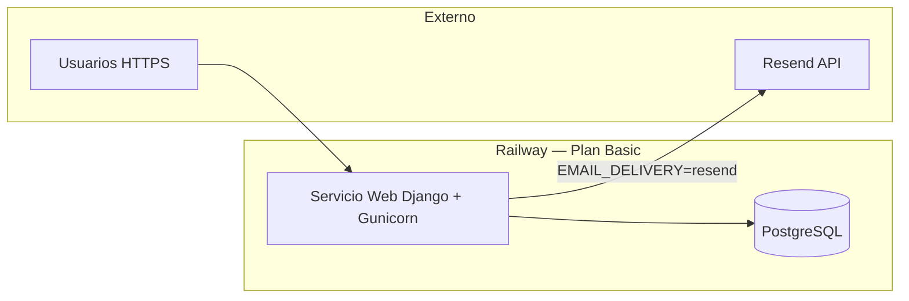

# Plan de tareas — Despliegue BAKEBUDGE en Railway + Resend

> **Plataforma:** [Railway](https://docs.railway.com/) — Plan **Basic**  
> **Correo producción:** [Resend](https://resend.com/docs/dashboard/emails/introduction)  
> **Última actualización:** 2026-06-16  
> **Estado:** **Pendiente de ejecución** (código aún sin artefactos de deploy)

Documento maestro de tareas para llevar BAKEBUDGE de entorno local a producción. Cada bloque tiene checklist verificable; no marcar **Hecho** hasta probar en Railway.

**Referencias oficiales:**

| Tema | Enlace |
|------|--------|
| Railway — guía Django | https://docs.railway.com/guides/django |
| Railway — variables entre servicios | https://docs.railway.com/guides/variables |
| Railway — dominios públicos | https://docs.railway.com/guides/public-networking |
| Resend — introducción | https://resend.com/docs/dashboard/emails/introduction |
| Resend — Django + Anymail | https://resend.com/docs/send-with-django |
| Resend — dominios | https://resend.com/docs/dashboard/domains/introduction |

**Docs internas:** [`setup.md`](setup.md) · [`arquitectura.md`](arquitectura.md) · [`BAKEBUDGE_SECURITY_PORTABLE_GUIDE.md`](BAKEBUDGE_SECURITY_PORTABLE_GUIDE.md) · [`roadmap.md`](roadmap.md)

---

## Resumen de arquitectura en Railway (v1)



| Servicio Railway | Rol v1 | Notas |
|------------------|--------|-------|
| **Web** | HTTP, Django, Gunicorn, WhiteNoise | Un solo servicio; sin Celery/Redis en v1 |
| **PostgreSQL** | BD persistente | Plugin Railway; `DATABASE_URL` automática |
| **Resend** | Correo transaccional (2FA, códigos) | Fuera de Railway; API HTTPS |

**Fuera de alcance v1 deploy:** Celery, Redis, workers, almacenamiento S3 para `media/` (ver bloque H).

---

## Estado actual del repo (gap analysis)

| Ítem | Local | Producción | Acción |
|------|-------|------------|--------|
| `gunicorn` | ✓ `requirements.txt` | Requerido | **Hecho** (Bloque B) |
| `whitenoise` | ✓ | Requerido (estáticos) | **Hecho** (Bloque B) |
| `django-anymail[resend]` | ✓ | Requerido | **Hecho** (B + C código) |
| `config/settings/production.py` | ✓ completo | WhiteNoise, CSRF, Anymail | **Hecho** (Bloque B) |
| `config/wsgi.py` | ✓ `production` por defecto | Railway | **Hecho** (Bloque B) |
| `apps/core/services/email_delivery.py` | `console` + `send_mail` | Anymail vía `EMAIL_DELIVERY=resend` | **Hecho** (sin cambio código) |
| `Procfile` / `railway.toml` | ✓ | Release migrate + collectstatic | **Hecho** (Bloque B) |
| `collectstatic` + migrate en deploy | Manual local | `preDeployCommand` en `railway.toml` | **Hecho** (Bloque B) |
| `CSRF_TRUSTED_ORIGINS` | Opcional local | Dominio Railway + custom | **Hecho** (Bloque B) |
| `ALLOWED_HOSTS` | localhost | Dominio producción | Configurar en Railway (Bloque D) |

---

## Bloque A — Cuentas y acceso (preparación)

**Responsable:** operador / dueño del proyecto  
**Depende de:** nada

- [x] **A1** Cuenta Railway activa con **Plan Basic** y método de pago configurado.
- [x] **A2** Repositorio Git: [IrvingSAP/BAKEBUDGE_Railway](https://github.com/IrvingSAP/BAKEBUDGE_Railway) — rama de deploy: **`main`** (pendiente: subir código desde `BAKEBUDGE/`).
- [ ] **A3** Conectar Railway ↔ repositorio (Deploy from GitHub repo) — [guía](https://docs.railway.com/guides/django#deploy-from-a-github-repo).
- [ ] **A4** Cuenta [Resend](https://resend.com/) creada; API key generada en Dashboard → API Keys.
- [ ] **A5** Dominio de envío decidido (ej. `tudominio.com` → remitente `noreply@tudominio.com`).
- [ ] **A6** (Opcional v1) Dominio público de la app (subdominio `app.tudominio.com` o dominio Railway `*.up.railway.app`).

**Criterio de cierre A:** proyecto Railway vacío creado + repo conectado + API key Resend en mano (no commitear la key).

---

## Bloque B — Preparar el código para Railway

**Responsable:** desarrollo  
**Depende de:** A  
**Referencia Railway:** [Deploy Django](https://docs.railway.com/guides/django)

### B.1 Dependencias

- [ ] **B1** Añadir a `requirements.txt`:
  - `gunicorn` — servidor WSGI producción
  - `whitenoise` — estáticos (`apps/*/static/`, DataTables, CSS modal)
  - `django-anymail[resend]` **o** `resend` (ver Bloque C; Anymail integra con `send_mail` existente)
- [ ] **B2** Verificar que `psycopg2-binary` y `django-environ` siguen pinneados.

### B.2 Settings producción

- [ ] **B3** Completar `config/settings/production.py`:
  - `DEBUG = False`
  - `EMAIL_BACKEND` según estrategia Resend (Bloque C)
  - `SECURE_*` ya presentes — mantener
  - `CSRF_TRUSTED_ORIGINS` = lista con URL HTTPS del servicio (dominio Railway + custom)
  - `SECURE_PROXY_SSL_HEADER = ("HTTP_X_FORWARDED_PROTO", "https")` (Railway termina TLS)
- [ ] **B4** `config/wsgi.py`: usar `config.settings.production` vía variable de entorno (no hardcodear `local`):
  ```python
  os.environ.setdefault("DJANGO_SETTINGS_MODULE", "config.settings.production")
  ```
- [ ] **B5** WhiteNoise en `base.py` o `production.py`:
  - Middleware tras `SecurityMiddleware`: `whitenoise.middleware.WhiteNoiseMiddleware`
  - Tras deploy: `python manage.py collectstatic --noinput`

### B.3 Comandos de arranque (Railway)

- [ ] **B6** Crear **`Procfile`** o configurar en Railway → Settings → Deploy:

  ```text
  web: gunicorn config.wsgi:application --bind 0.0.0.0:$PORT
  ```

- [ ] **B7** **Release command** (Railway → Deploy → Release / Pre-deploy):

  ```bash
  python manage.py migrate --noinput && python manage.py collectstatic --noinput
  ```

- [ ] **B8** (Opcional) `railway.toml` con `buildCommand` / `startCommand` si se prefiere config en repo.

### B.4 Variables documentadas

- [ ] **B9** Actualizar `.env.example` con bloque **producción Railway** (valores de ejemplo, sin secretos):

  ```env
  DJANGO_SETTINGS_MODULE=config.settings.production
  DEBUG=False
  SECRET_KEY=generar-clave-larga-unica
  DATABASE_URL=${{Postgres.DATABASE_URL}}
  ALLOWED_HOSTS=tu-app.up.railway.app,tudominio.com
  CSRF_TRUSTED_ORIGINS=https://tu-app.up.railway.app,https://tudominio.com
  EMAIL_DELIVERY=resend
  RESEND_API_KEY=re_xxxxxxxx
  DEFAULT_FROM_EMAIL=BAKEBUDGE <noreply@tudominio.com>
  ```

**Criterio de cierre B:** `manage.py check --settings=config.settings.production` OK en local con `.env` de prueba; `collectstatic` genera `staticfiles/` sin error.

---

## Bloque C — Integración Resend (correo 2FA)

**Responsable:** desarrollo + operador (dominio)  
**Depende de:** A4, A5  
**Referencia:** [Send with Django](https://resend.com/docs/send-with-django)

### C.1 Dominio y remitente

- [ ] **C1** En Resend Dashboard → **Domains** → añadir dominio de envío; configurar registros DNS (SPF, DKIM) — [guía dominios](https://resend.com/docs/dashboard/domains/introduction).
- [ ] **C2** Esperar estado **Verified** antes del go-live público.
- [ ] **C3** Modo prueba (solo desarrollo): remitente `onboarding@resend.dev` entrega **solo** al email de la cuenta Resend — no sirve para usuarios reales.

### C.2 Código correo

Estrategia recomendada (alineada con Resend + código actual):

- [ ] **C4** Instalar `django-anymail[resend]` y en `production.py`:
  ```python
  INSTALLED_APPS += ["anymail"]
  EMAIL_BACKEND = "anymail.backends.resend.EmailBackend"
  ANYMAIL = {"RESEND_API_KEY": env("RESEND_API_KEY")}
  ```
- [ ] **C5** Mantener `apps/core/services/email_delivery.py`:
  - `EMAIL_DELIVERY=console` → terminal (local)
  - `EMAIL_DELIVERY=resend` (o distinto de `console`) → `send_mail(...)` vía backend Anymail
- [ ] **C6** Flujos que deben probarse en staging:
  - Código correo registro / confirmación email (`apps/security/services/email_confirmation.py`)
  - Reenvío código (`resend` action en login)
  - Reset 2FA por correo (si aplica)

### C.3 Railway — variables Resend

- [ ] **C7** En servicio Web → Variables:
  - `EMAIL_DELIVERY` = `resend`
  - `RESEND_API_KEY` = `re_...` (secret)
  - `DEFAULT_FROM_EMAIL` = `BAKEBUDGE <noreply@tudominio.com>` (dominio verificado)

**Criterio de cierre C:** login de prueba recibe código 2FA en bandeja real (no consola); logs Railway sin error de Anymail/Resend.

---

## Bloque D — Servicios Railway

**Responsable:** operador  
**Depende de:** A, B  
**Referencia:** [Variables](https://docs.railway.com/guides/variables)

### D.1 PostgreSQL

- [ ] **D1** En el proyecto Railway: **Add PostgreSQL** (canvas → Create → Database).
- [ ] **D2** En servicio Web → Variables → referenciar BD:
  - `DATABASE_URL` = `${{Postgres.DATABASE_URL}}`  
  (django-environ ya parsea esta URL en `base.py`)

### D.2 Servicio Web

- [ ] **D3** Root directory del repo: carpeta `BAKEBUDGE/` si el monorepo incluye nivel superior; si el repo es solo Django, raíz con `manage.py`.
- [ ] **D4** Variables obligatorias (Raw Editor):

  | Variable | Valor / origen |
  |----------|----------------|
  | `DJANGO_SETTINGS_MODULE` | `config.settings.production` |
  | `SECRET_KEY` | Generar (`python -c "from django.core.management.utils import get_random_secret_key; print(get_random_secret_key())"`) |
  | `DEBUG` | `False` |
  | `DATABASE_URL` | `${{Postgres.DATABASE_URL}}` |
  | `ALLOWED_HOSTS` | dominio Railway + custom (comma-separated) |
  | `CSRF_TRUSTED_ORIGINS` | `https://...` (mismos hosts con esquema) |
  | `EMAIL_DELIVERY` | `resend` |
  | `RESEND_API_KEY` | secret Resend |
  | `DEFAULT_FROM_EMAIL` | remitente verificado |

- [ ] **D5** **Networking** → Generate Domain (URL `*.up.railway.app`) — [public networking](https://docs.railway.com/guides/public-networking).
- [ ] **D6** (Opcional) Custom domain + CNAME hacia Railway.

### D.3 Primer deploy

- [ ] **D7** Deploy manual o push a rama conectada; revisar **Build logs** y **Deploy logs**.
- [ ] **D8** Confirmar release: migraciones aplicadas (`django_migrations` en Postgres).
- [ ] **D9** Confirmar estáticos: CSS app, landing, modal, DataTables cargan (200 en Network tab).

**Criterio de cierre D:** URL pública responde `/`, `/ingresar/`, `/app/` (redirect login si no autenticado).

---

## Bloque E — Datos iniciales y smoke test

**Depende de:** D

- [ ] **E1** Crear superusuario / Master de prueba:
  ```bash
  railway run python manage.py createsuperuser
  ```
  (o Railway shell / one-off command)
- [ ] **E2** Verificar seeds existentes (`Moneda`, etc.) — migraciones `0002_seed_monedas` u otras.
- [ ] **E3** **Smoke test funcional** (checklist mínimo):

  | # | Prueba | OK |
  |---|--------|-----|
  | 1 | Landing `/` carga CSS pastel | ☐ |
  | 2 | `/contacto/` POST guarda `MensajeContacto` | ☐ |
  | 3 | `/ingresar/` → flujo correo → TOTP (Resend real) | ☐ |
  | 4 | `/app/` dashboard con sesión | ☐ |
  | 5 | CRUD producto + receta (happy path) | ☐ |
  | 6 | Idle timeout 40 min (opcional staging) | ☐ |
  | 7 | Admin Django `/admin/` solo si se expone (recomendado: restringir IP o desactivar) | ☐ |

- [ ] **E4** Ejecutar tests en CI local antes de cada deploy: `python manage.py test --verbosity=0`.

**Criterio de cierre E:** smoke test 1–5 en verde en URL de producción/staging.

---

## Bloque F — Seguridad y operación (Plan Basic)

**Depende de:** D

- [ ] **F1** `SECRET_KEY` único por entorno; **nunca** en git.
- [ ] **F2** Rotar `RESEND_API_KEY` si se expone; usar Railway **Secrets**.
- [ ] **F3** Revisar `ALLOWED_HOSTS` y `CSRF_TRUSTED_ORIGINS` tras cambiar dominio custom.
- [ ] **F4** Habilitar **HTTPS only** (ya en `production.py` con `SECURE_SSL_REDIRECT`).
- [ ] **F5** Railway → **Observability / Logs**: alertas básicas por crash loop (Plan Basic incluye más recursos — revisar límites en [Railway pricing](https://railway.com/pricing)).
- [ ] **F6** Backup Postgres: Railway snapshots / export periódico según política del plan.
- [ ] **F7** Documentar procedimiento de rollback: redeploy commit anterior en Railway.

---

## Bloque G — Dominio, correo y marca

**Depende de:** C, D

- [ ] **G1** DNS dominio app → Railway (si custom domain).
- [ ] **G2** DNS dominio correo → Resend (SPF/DKIM/DMARC recomendado).
- [ ] **G3** `DEFAULT_FROM_EMAIL` coherente con marca BAKEBUDGE.
- [ ] **G4** Probar entregabilidad (bandeja entrada, no spam) con Gmail/Outlook de prueba.

---

## Bloque H — Limitaciones v1 y backlog post-deploy

| Tema | v1 deploy | Backlog |
|------|-----------|---------|
| **Archivos `media/`** | Disco efímero del contenedor Railway | Volume Railway o S3/Cloudinary (Fase posterior) |
| **Email contacto visitante** | Solo persiste en BD | Acuse Resend al visitante (v2 — [`public-site-checklist-conforme.md`](public-site-checklist-conforme.md)) |
| **Gate `can_access_app`** | Parcial | Fase 1c — [`roadmap.md`](roadmap.md) |
| **Celery / crons** | No | Solo si se añaden tareas programadas |
| **SMTP puerto 587** | No usar en Railway | Resend API HTTPS obligatorio |

---

## Orden de ejecución recomendado

```text
A (cuentas)
  → B (código deploy)
  → C (Resend dominio + integración)
  → D (Railway PG + variables + deploy)
  → E (smoke test)
  → F + G (hardening + dominios)
```

**Paralelizable:** C1–C3 (DNS dominio correo) mientras se completa B.

---

## Registro de avance

| Fecha | Bloque | Notas |
|-------|--------|-------|
| 2026-06-16 | — | Plan creado; deploy no iniciado |
| 2026-06-16 | A1 | Railway Plan Basic — OK |
| 2026-06-16 | A2 | Repo GitHub [BAKEBUDGE_Railway](https://github.com/IrvingSAP/BAKEBUDGE_Railway) — push local pendiente |
| 2026-06-16 | B | Código: gunicorn, whitenoise, anymail, `production.py`, Procfile, `railway.toml` |
| | C | |
| | D | |
| | E | |
| | F | |
| | G | |

---

## Próximo paso inmediato

1. ~~Ejecutar **Bloque B** en el repo~~ **Hecho** (2026-06-16).  
2. **Bloque C** — dominio Resend verificado + variables `EMAIL_DELIVERY=resend` en Railway.  
3. **Bloque D** — PostgreSQL Railway + variables + primer deploy staging (`*.up.railway.app`).
