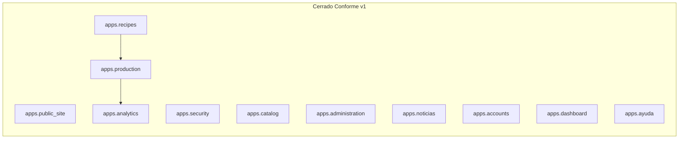

# Plan Fase 1b — Página pública + Dashboard

> **Nota Cursor — plan obsoleto (eliminado 2026-06-26):** El plan `Fase 1b Landing` del panel **Plans** de Cursor fue **eliminado** — la fase ya está **CERRADA Conforme v1**. Si aún ves “Review Plan”, cierra la tarjeta con **X** o recarga Cursor. Fuente vigente: este documento y [`fase-1b-checklist-conforme.md`](fase-1b-checklist-conforme.md). Trabajo activo: [`deploy-railway-plan.md`](deploy-railway-plan.md).

> Documento de seguimiento del desarrollo.  
> **Última actualización:** 2026-06-16  
> **Cierre Fase 1b:** [`fase-1b-checklist-conforme.md`](fase-1b-checklist-conforme.md) — **CERRADO Conforme v1** (Ayuda General incluida).
> **Modelos de referencia (Django):**  
> - Zona pública → `/` — `apps/public_site/templates/public_site/home.html`  
> - Zona privada → `/app/` — `apps/dashboard/templates/dashboard/home.html`

## Resumen

Fase 1b migró la UI de **zona pública** y **zona privada `/app/`** a Django, alineada a [`ui-ux.md`](ui-ux.md) y [`dashboard-reglas.md`](dashboard-reglas.md). Los HTML estáticos originales están **archivados fuera del repo** (ver [`prototype/README.md`](../prototype/README.md)).

**Fase del roadmap:** [1b — Pública + Dashboard](roadmap.md)

| Bloque | App Django | Estado v1 |
|--------|------------|-----------|
| Landing (index, servicios, contacto) | `apps.public_site` | **Conforme v1** |
| Acceso (login, correo, 2FA) | `apps.security` | **Conforme v1.2** |
| Dashboard + layout `/app/` | `apps.core` + `apps.dashboard` | **Conforme** |
| Catálogo base | `apps.catalog` | **Conforme v1** |
| Administración Master | `apps.administration` | **Conforme v1** (Monedas, Usuarios, Facturación, Noticias, Mensajes) |
| Noticias feed | `apps.noticias` | **Conforme v1.2** |
| Perfil + Seguridad cuenta | `apps.accounts` | **Conforme v1** |
| Modal global | `apps.core` | **Hecho** |
| Recetas | `apps.recipes` | **Conforme v1** |
| Producción | `apps.production` | **Conforme v1** |
| Estadísticas | `apps.analytics` | **Conforme v1** |
| Ayuda General | `apps.ayuda` | **Conforme v1** |

**Cierre Fase 1b:** [`fase-1b-checklist-conforme.md`](fase-1b-checklist-conforme.md) — **CERRADO Conforme v1 (2026-06-16)** · Ayuda General **Conforme v1**.

**Cierre zona pública:** [`public-site-checklist-conforme.md`](public-site-checklist-conforme.md) — **CERRADO Conforme v1 (2026-06-20)**.

---

## Tablero de tareas

| ID | Tarea | Estado | Notas |
|----|-------|--------|-------|
| review-index | Revisar landing (`index`, `servicios`, `contacto`) | **Hecho** | Conforme 2026-06-16 |
| unify-pages | Consistencia en páginas públicas | **Hecho** | Nav, footer, tokens |
| images-icons | Imágenes locales e iconografía | **Hecho** | Sin Pexels ni emojis |
| checklist-conforme | Marcar Conforme README landing | **Hecho** | |
| modal-global | Modal global de mensajes (ER/OK/AV/IN) | **Hecho** | [`ui-ux.md#modal-global-de-mensajes`](ui-ux.md#modal-global-de-mensajes) |
| dashboard-prototype | Layout `/app/` (dashboard + módulos) | **Conforme** | [`dashboard-checklist-conforme.md`](dashboard-checklist-conforme.md) |
| dashboard-reglas | Documentar layout, Usuario, Perfil, logout, datos por usuario | **Hecho** | [`dashboard-reglas.md`](dashboard-reglas.md) |
| public-site-django | Migrar landing + contacto POST + gestión Master | **Hecho** | [`public-site-checklist-conforme.md`](public-site-checklist-conforme.md) |
| security-django | Login, correo, TOTP, primer acceso → Noticias | **Hecho** | [`acceso-checklist-conforme.md`](acceso-checklist-conforme.md) v1.2 |
| noticias-design | Diseño app Noticias + pantalla demo | **Hecho** (HTML) | [`noticias-checklist-conforme.md`](noticias-checklist-conforme.md) |
| noticias-app | App `noticias`: modelo, feed, CRUD Master, copiar | **Hecho** | [`administracion-noticias-checklist-conforme.md`](administracion-noticias-checklist-conforme.md) v1.2 |
| accounts-perfil | Perfil + Seguridad de la cuenta | **Hecho** | [`perfil-checklist-conforme.md`](perfil-checklist-conforme.md) · [`cuenta-seguridad-checklist-conforme.md`](cuenta-seguridad-checklist-conforme.md) |
| catalog-django | Catálogo base (productos, categorías, conversiones, costos indirectos) | **Hecho** | [`catalog-checklist-conforme.md`](catalog-checklist-conforme.md) |
| recipes-django | Recetas + RecetaVersion (CRUD, formulación, costos, versionado) | **Hecho** | [`recetas-checklist-conforme.md`](recetas-checklist-conforme.md) · `apps.recipes` |
| production-django | Órdenes de producción (planificación, estados, detalle) | **Hecho** | [`produccion-checklist-conforme.md`](produccion-checklist-conforme.md) · `apps.production` |
| analytics-django | Estadísticas + snapshot al completar orden | **Hecho** | [`estadisticas-checklist-conforme.md`](estadisticas-checklist-conforme.md) · `apps.analytics` |
| dashboard-kpis | Dashboard home con KPIs reales y enlaces a módulos | **Hecho** | [`dashboard-checklist-conforme.md`](dashboard-checklist-conforme.md) · `get_dashboard_summary` |
| ayuda-general | Módulo **Ayuda General**: reglas + guía del ciclo | **Hecho** | [`ayuda-reglas.md`](ayuda-reglas.md) · `/app/ayuda/` |

---

## Reglas de diseño (Fase 1b)

Aplican a **todas** las pantallas de esta fase (pública y privada):

| Regla | Documento | Estado |
|-------|-----------|--------|
| Diseño responsivo obligatorio (375 / 768 / 1140 px) | [`ui-ux.md`](ui-ux.md) | Activa |
| Formularios solo HTML (sin `django.forms`) | [`ui-ux.md`](ui-ux.md), [`arquitectura.md`](arquitectura.md) | Activa |
| **Modal global** para errores, éxito, avisos e info | [`ui-ux.md#modal-global-de-mensajes`](ui-ux.md#modal-global-de-mensajes) | Implementada (Django) |
| Layout dashboard: sidebar, Usuario, UserProfile, logout | [`dashboard-reglas.md`](dashboard-reglas.md) | Documentada + Django |
| **Datos por usuario conectado** en toda `/app/` | [`dashboard-reglas.md`](dashboard-reglas.md#regla-fundamental-datos-del-usuario-conectado) | Documentada + activa en apps migradas |
| Tokens pastel + Nunito | [`ui-ux.md`](ui-ux.md) | Activa |
| DataTables en listados `/app/` (v2 + jQuery) | [`ui-ux.md`](ui-ux.md) | Activa en listados migrados |

### Modal global — resumen

| Recurso | Ubicación Django |
|---------|------------------|
| CSS | `apps/core/static/css/bakebudge-modal.css` |
| JS | `apps/core/static/js/bakebudge-modal.js` |
| Markup | `apps/core/templates/partials/modal_global.html` |

**Tipos:** `ER` (error), `OK` (éxito), `AV` (aviso), `IN` (info). Títulos en español.

**API (JavaScript):**

```javascript
BakeBudgeModal.showError("mensaje");
BakeBudgeModal.showSuccess("mensaje");
BakeBudgeModal.showWarning("mensaje");
BakeBudgeModal.showInfo("mensaje");
```

**Django:** atributos `data-modal-type` + `data-modal-message` en `<body>`; contexto `messages` + `BakeBudgeModal.show()`.

---

## Estado Django — zona pública

**CERRADO — Conforme v1.** Fuente runtime: **`apps.public_site`**.

| Pantalla | Template | URL |
|----------|----------|-----|
| Home | `public_site/home.html` | `/` |
| Servicios | `public_site/servicios.html` | `/servicios/` |
| Contacto | `public_site/contacto.html` | `/contacto/` |
| CSS landing | `public_site/static/…/bakebudge-home.css` | — |
| JS nav | `public_site/static/…/main.js` | — |

### Checklist zona pública — **CERRADO**

- [x] Imágenes locales en feature cards (sin Pexels ni emojis)
- [x] Tokens y tipografía Nunito
- [x] Responsivo — 375px, 768px, 1140px
- [x] Copy alineado a producto (costos, producción, analytics)
- [x] Nav activa (`data-page` + `main.js`)
- [x] Accesibilidad mínima: `alt`, `aria-label`, contraste hero
- [x] Meta description y `<title>` por página
- [x] Modal global incluido
- [x] Formulario contacto: `POST` Django con persistencia
- [x] Gestión Master MensajeContacto — [`mensajecontacto-checklist-conforme.md`](mensajecontacto-checklist-conforme.md)
- [x] Implementación Django — [`public-site-checklist-conforme.md`](public-site-checklist-conforme.md) **Conforme v1**

**Pendiente v2 (zona pública):** email al equipo/visitante, anti-spam, validación JS opcional.

---

## Estado Django — zona privada `/app/`

**Checklists:** [`dashboard-checklist-conforme.md`](dashboard-checklist-conforme.md) · [`recetas-checklist-conforme.md`](recetas-checklist-conforme.md) · [`produccion-checklist-conforme.md`](produccion-checklist-conforme.md) · [`estadisticas-checklist-conforme.md`](estadisticas-checklist-conforme.md) · [`catalog-checklist-conforme.md`](catalog-checklist-conforme.md)

| Pantalla | Template Django | URL |
|----------|-----------------|-----|
| Dashboard home | `dashboard/home.html` | `/app/` |
| Catálogo | `catalog/…` | `/app/productos/`, etc. |
| Recetas | `recipes/…` | `/app/recetas/` |
| Producción | `production/…` | `/app/produccion/` |
| Estadísticas | `analytics/estadisticas_home.html` | `/app/estadisticas/` |
| Noticias feed | `noticias/feed.html` | `/app/noticias/` |
| Administración | `administration/…` | `/app/administracion/…` |
| Perfil | `accounts/perfil.html` | `/app/perfil/` |
| Seguridad cuenta | `accounts/cuenta_seguridad.html` | `/app/seguridad/cuenta/` |
| Ayuda General | `ayuda/home.html` | `/app/ayuda/` |
| Layout CSS | `dashboard/static/…/bakebudge-app.css` | — |
| Scripts app | `dashboard/static/…/main.js` | — |

**Incluye:** sidebar completo (Dashboard → Ayuda General → Perfil), DataTables, formularios HTML puro, modal global.

**Vista previa local:**

```bash
cd BAKEBUDGE
python manage.py runserver
# http://127.0.0.1:8000/app/
```

**Fuente activa:** templates Django en `apps/`. Copia HTML histórica archivada fuera del repo ([`prototype/README.md`](../prototype/README.md)).

### Checklist revisión dashboard — **CERRADO (2026-06-16)**

Ver [`dashboard-checklist-conforme.md`](dashboard-checklist-conforme.md).

- [x] Layout sidebar + topbar Usuario según [`dashboard-reglas.md`](dashboard-reglas.md)
- [x] Datos de pantalla scoped a `request.user`
- [x] Pie sidebar: `nombre_negocio` + email + Cerrar sesión
- [x] Responsivo 375 / 768 / 1140 px
- [x] Modal global en pantallas `/app/`
- [x] DataTables funcional en listados con tabla
- [x] Formularios HTML puro (sin widgets Django)
- [x] Copy y CTAs coherentes con producto
- [x] Navegación entre pantallas enlazada correctamente
- [x] Documentación actualizada — [`prototype/README.md`](../prototype/README.md)

---

## Flujo de la fase



---

## Migración a Django

### Zona pública — **Conforme v1**

| Origen (histórico) | Destino Django | Estado |
|-----------|----------------|--------|
| Landing index | `apps/public_site/templates/public_site/home.html` | **Hecho** |
| Servicios | `public_site/servicios.html` | **Hecho** |
| Contacto | `public_site/contacto.html` | **Hecho** |
| Header/footer | `public_site/partials/header.html`, `footer.html` | **Hecho** |
| `bakebudge-home.css` | `apps/public_site/static/public_site/css/bakebudge-home.css` | **Hecho** |
| `main.js` | `apps/public_site/static/public_site/js/main.js` | **Hecho** |

### Zona privada — estado por módulo

| Pantalla | Destino Django | Estado |
|-----------|----------------|--------|
| Layout sidebar + topbar | `apps/core/templates/app_base.html` | **Hecho** |
| Dashboard home | `apps/dashboard/templates/dashboard/home.html` | **Hecho** |
| Catálogo | `apps/catalog/templates/catalog/…` | **Hecho** v1 |
| Administración usuarios | `apps/administration/templates/administration/usuarios/…` | **Hecho** v1 |
| Facturación | `apps/administration/templates/administration/facturacion/…` | **Hecho** v1.1 |
| Noticias (gestión) | `apps/administration/templates/administration/noticias/…` | **Hecho** v1.2 |
| Mensajes contacto | `apps/administration/templates/administration/mensajes_contacto/…` | **Hecho** v1 |
| Monedas | `apps/administration/templates/administration/monedas/…` | **Hecho** v1 |
| Noticias feed | `apps/noticias/templates/noticias/feed.html` | **Hecho** v1.2 |
| Perfil | `apps/accounts/templates/accounts/perfil.html` | **Hecho** v1 |
| Seguridad cuenta | `apps/accounts/templates/accounts/cuenta_seguridad.html` | **Hecho** v1 |
| Recetas | `apps/recipes/templates/recipes/…` | **Hecho** v1 |
| Producción | `apps/production/templates/production/…` | **Hecho** v1 |
| Estadísticas | `apps/analytics/templates/analytics/estadisticas_home.html` | **Hecho** v1 |
| Ayuda General | `apps/ayuda/templates/ayuda/home.html` | **Hecho** v1 |
| CSS app | `apps/dashboard/static/dashboard/css/bakebudge-app.css` | **Hecho** |
| JS app | `apps/dashboard/static/dashboard/js/main.js` | **Hecho** |

### Assets compartidos — **Hecho**

| Recurso | Destino Django |
|-----------|----------------|
| Modal CSS/JS | `apps/core/static/css/bakebudge-modal.css`, `…/js/bakebudge-modal.js` |
| Modal markup | `apps/core/templates/partials/modal_global.html` |
| DataTables | `apps/core/static/js/datatables-init.js`, theme CSS |

**Scaffold Django:** operativo (`config/`, `manage.py`, apps en `INSTALLED_APPS`).

**CTAs landing Django:** **Entrar** → `/ingresar/` · **Solicitar acceso** → `/contacto/` (sin registro público v1).

---

## Orden de trabajo

1. ~~Revisar y aprobar landing~~ **Hecho**
2. ~~Modal global + regla de diseño~~ **Hecho**
3. ~~Layout `/app/` (dashboard + módulos)~~ **Hecho**
4. ~~Scaffold Django + migrar zona pública~~ **Hecho** — [`public-site-checklist-conforme.md`](public-site-checklist-conforme.md)
5. ~~Acceso Django + primer acceso Noticias~~ **Hecho** — [`acceso-checklist-conforme.md`](acceso-checklist-conforme.md)
6. ~~App Noticias + administración Master~~ **Hecho** — [`administracion-noticias-checklist-conforme.md`](administracion-noticias-checklist-conforme.md)
7. ~~Catálogo base + Perfil + Seguridad cuenta~~ **Hecho**
6. ~~Migrar Recetas, Producción y Estadísticas a Django~~ **Hecho** (2026-06-16)
7. **Cierre formal Fase 1b** — [`fase-1b-checklist-conforme.md`](fase-1b-checklist-conforme.md) **Hecho**
8. ~~Ayuda General~~ **Hecho** — `/app/ayuda/`

---

## Fuera de alcance inmediato

- App `billing` / gate `can_access_app` avanzado — Fase 1c (facturación Master ya en Django).
- Email producción / Resend SMTP — v2 acceso.
- DataTables en landing pública.
- Bootstrap, `django.forms` en UI.
- Blog/recetas públicas SEO — Fase 5.

**Nota:** `apps.security` está **Conforme** en Django ([`acceso-reglas.md`](acceso-reglas.md)).

---

## Registro de avances

| Fecha | Cambio |
|-------|--------|
| 2026-06-16 | Imágenes locales en feature cards. Refactor `feature-card__img`. |
| 2026-06-16 | `recetas.jpg`, `acceso-seguro.jpg`. Galería local. CSS responsive (480/768/900/1024px). |
| 2026-06-16 | **Zona pública conforme:** `index.html`, `servicios.html`, `contacto.html` aprobados. |
| 2026-06-16 | Creada carpeta `prototype_app/` con dashboard + listados demo. |
| 2026-06-16 | Topbar **Usuario**; **Modal global** en pantallas. [`dashboard-reglas.md`](dashboard-reglas.md). |
| 2026-06-16 | Bloques Recetas, Producción, Estadísticas, Perfil, Usuarios, Facturación — **Conforme** (prototipo). |
| 2026-06-19 | Gestión Master MensajeContacto — prototipo + reglas **Conforme**. |
| 2026-06-20 | **Zona pública Django** (`apps.public_site`) — **Conforme v1** aprobado por usuario. |
| 2026-06-20 | **Acceso Django** + primer acceso → Noticias — **Conforme v1.2**. |
| 2026-06-20 | **Noticias** feed + CRUD Master + copiar — **Conforme v1.2**. |
| 2026-06-20 | **Catálogo base** Django — **Conforme v1**. |
| 2026-06-20 | **Perfil** + **Seguridad de la cuenta** — **Conforme v1** (validación manual OK). |
| 2026-06-20 | **Zona pública Django** (`apps.public_site`) — cierre Conforme v1 |
| 2026-06-16 | **Recetas Django** (`apps.recipes`) — CRUD, formulación, versionado, costos — **Conforme v1**. |
| 2026-06-16 | **Producción Django** (`apps.production`) — órdenes, estados, detalle escalado — **Conforme v1**. |
| 2026-06-16 | **Estadísticas Django** (`apps.analytics`) — snapshot + pantalla `/app/estadisticas/` — **Conforme v1**. |
| 2026-06-16 | **Dashboard** — KPIs reales, producción reciente, enlaces a módulos — **Conforme v1**. |
| 2026-06-16 | **Cierre formal Fase 1b** — [`fase-1b-checklist-conforme.md`](fase-1b-checklist-conforme.md) |
| 2026-06-16 | **Ayuda General Django** (`apps.ayuda`) — **Conforme v1** |
| 2026-06-16 | **Repo mínimo:** HTML estático retirado; docs apuntan solo a Django |

---

## Documentos relacionados

| Documento | Contenido |
|-----------|-----------|
| [`fase-1b-checklist-conforme.md`](fase-1b-checklist-conforme.md) | **Cierre formal Fase 1b** (checklist único) |
| [`public-site-checklist-conforme.md`](public-site-checklist-conforme.md) | Cierre zona pública Django v1 |
| [`ui-ux.md`](ui-ux.md) | Tokens, responsivo, modal global, DataTables |
| [`dashboard-reglas.md`](dashboard-reglas.md) | Layout `/app/`, Usuario, UserProfile, logout |
| [`BAKEBUDGE_NOTICIAS.md`](BAKEBUDGE_NOTICIAS.md) | App Noticias |
| [`ayuda-reglas.md`](ayuda-reglas.md) | Ayuda General — **Conforme v1** |
| [`arquitectura.md`](arquitectura.md) | Stack, static files, estructura apps |
| [`prototype/README.md`](../prototype/README.md) | Nota histórica: prototipos archivados fuera del repo |
| [`roadmap.md`](roadmap.md) | Fases del proyecto |
